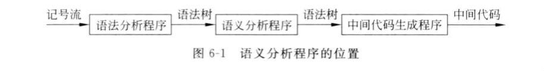
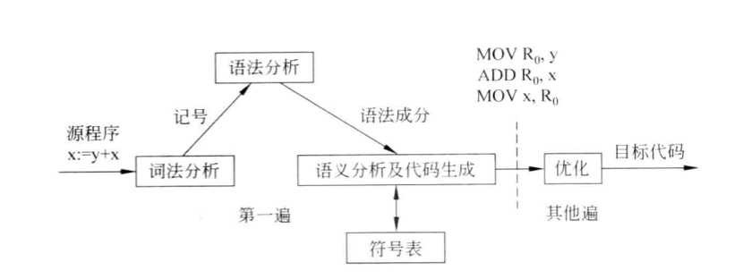
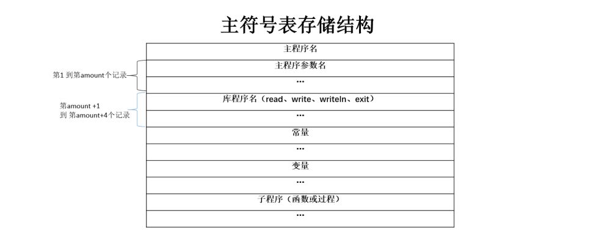
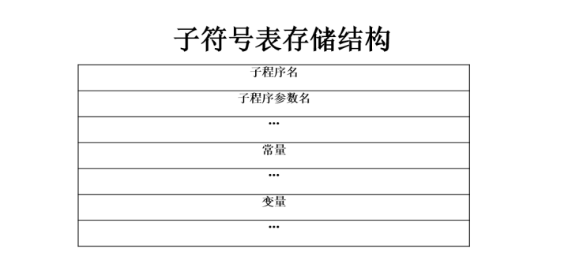
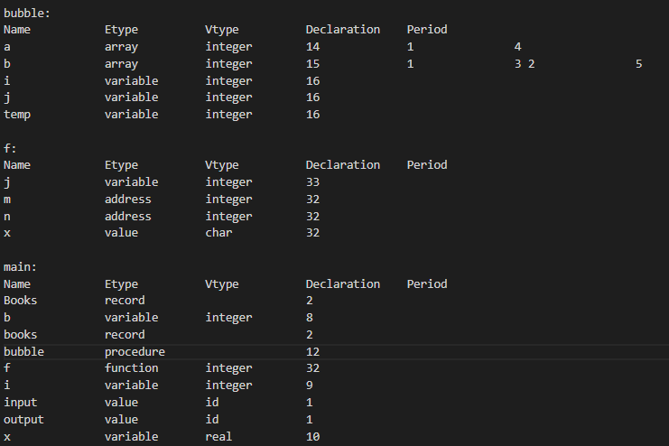

[TOC]

# 语义分析

## 语义分析的目标和要求
- 语义分析是编译程序的一个重要任务，由语义分析程序完成，通过检查名字的定义和引用是否合法来检查程序中各语法成分的含义是否正确，目的是保证程序各部分能够有机地结合在一起。
- 语义分析程序应该能够诊断出源程序中存在地与上下文有关的错误。解决此类问题的直接想法就是为程序设计语言构造一个上下文有关文法，这在理论上是可行的，但实际上并没有这么做。原因是为语言构造一个能够反映其上下文有关特性的文法并不是一件容易的事情，另外，上下文有关文法的分析程序不但很复杂，而且执行速度慢。我们所采用的方法是利用语法制导翻译技术实现对于源程序的语义分析，即根据源语言的语义设计专门的语义规则，扩充上下文无关文法的分析程序，在语法制导下完成语义分析。

## 需求分析
- 语义分析程序通过将变量的定义与变量的引用联系起来，对源程序的含义进行检查，即检查每一个语法成分是否具有正确的语义，如检査毎一个表达式是否具有正确的类型、检査毎一个名字的引用是否正确等。
- 通常为编译程序设计一个称作符号表的数据结构来保存上下文有关的信息。当分析声明语句时，收集所声明标识符的有关信息（如类型、存储位置、作用域等）并记录在符号表中，只要在编译期间控制处于声明该标识符的程序块中．就可以从符号表中查到它的记录，根据符号表中记录的信息检査对它的引用是否符合语言的上下文有关的特性，所以符号表的建立和管理是语义分析的一个主要任务。
- 语义分析的另一个重要任务是类型检査，如对表达式／赋值语句中出现的操作数进行类型一致性检查、检查if - then - else 语句中出现在 if 和 then 之间的表达式是否为布尔表达式等。强类型语言（如 Ada 语言）要求表达式中的各个操作数、赋值语句左部变量和右部表达式的类型应该相同，所以，其编译程序必须对源程序进行类型检査，若发现类型不相同，则要求程序员进行显式转换。对于无此严格要求的语言（如 C 语言）编译程序也要进行类型检查，当发现类型不一致但可相互转换时，就要作相应的类型转换，如当表达式中同时存在整型和实型操作数时，一般要将整型转换为实型。
- 语义分析的位置

- 语义分析的数据流图


### 符号表的定义
主符号表中记录的是标识符的属性，我们考虑记录以下属性：
- 表项类型
- 标识符名字
- 常量值
- 返回值
- 类型
- 引用行
- 声明行
- 参数个数/数组维数
- 参数集
- 链域

子符号表的表结构是主符号表的子集。由于不支持函数和过程的嵌套定义，所以子符号表相比于主符号表，少了函数/过程相关的域。子符号表要求记录：
- 表项类型
- 标识符名字
- 行号
- 类型
- 常量值
- 引用行
- 声明行
- 数组维数

下面对符号表中的各属性进行介绍：

**表项类型**：记录着标识符的符号种类。
- "value"表示传值参数
- "address"表示传引用参数
- "variable"表示普通变量
- "const"表示常量
- "array"表示数组
- "procedure"表示过程
- "function"表示函数。

**标识符名字**：作为语义分析部分识别标识符的主键，在进行添加、查找、修改等操作时发挥重要作用。

**声明行/引用行**：词法分析和语法分析时，在进行报错时可以很方便的获取出错的具体位置，但语义分析通常都是在更抽象的树结构上进行的，所以需要记录下每个符号的行号，以便报错包含位置信息。

**类型**：对于变量和常量来说，该域记录着变量或常量类型；对于数组来说，该域记录着数组元素的类型，取值为”integer”、”real”、”char”、”boolean”。

**返回值**：对于函数来说，该域记录着函数返回值类型，取值为”integer”、”real”、”char”、”boolean”。

**常量值**：需要将常量，如const的取值保存下来，以便后续计算常量表达式的值、进行常量定义时的常数传播、检查除0错误、检查数组下标越界。

**参数个数/数组维数**：在参数个数/数组维度部分，对于数组类型的变量，我们将存储其维数；对于函数类型，我们将存储其参数个数。

**参数集**：对于函数或者过程，我们存储该函数或过程所需的参数。-

**链域**：在该指针域中保存该符号表中指向函数/过程子符号表的指针，便于进行定位和重定位处理。

### 符号表的管理

- 建表操作：每进入一个新的程序块（包括record）需要新建立一个符号表，并且进行定位操作。

- 定位操作：在每个程序块的入口处我们需要执行定位操作来建立一个符号表的子表，将该块的声明的所有标识符属性记录到该表中。

- 重定位操作：在每个程序块的出口处我们需要返回到主符号表，实现重定位操作，保证已经执行完的块中声明的局部变量不能再次被引用。

### 类型检查与转化

我们的语义分析支持四种基本类型：**integer**、**real**、**boolean**、**char**，以及这四种基本类型声明的数组。

- **类型转化**：我们仅支持从integer类型到real类型的隐式类型转化。需要特别注意的是，传引用参数不支持隐式类型转化。

- **表达式类型检查**：每个运算符对于两边操作数的类型都有不同的要求，需要具体分析不同运算符的具体要求。例如mod运算符要求两个操作数均为**integer**类型，relop运算符要求两个操作数类型一致,addop中可以支持类型的隐式转换，如**integer**+**real**的操作是允许的，且结果类型为**real**。

- **语句类型检查**：以if语句为例，如果其条件表达式的类型为**bool**，那我们认为该语句的类型正确，否则我们认为该语句的类型错误。再比如赋值语句就要求左值和右值的类型一致。不同的语句有不同的要求，需要具体分析。

### 作用域识别
PASCAL-S不支持函数/过程的嵌套定义

- 定义在PASCAL程序一开始的常量、变量就可以是视作是全局作用域，不仅可以被主程序体引用，也可以被子程序引用（如果子程序没有定义同名标识符）。

- 每一个子函数/过程中定义的常量、变量的作用域就局限在当前函数/过程，属于局部作用域。

- 检测标识符未定义错误时，除了局部作用域（如果当前在局部作用域中），还需退回到全局作用域中。

- 检测标识符重定义错误时，只需要在局部作用域（如果当前在局部作用域中）中检查。

## 开发环境
在windows11下利用vscode以及vs2017完成开发 

## 总体设计说明
### 数据结构设计

`数据结构详细说明在详细设计中`

1. 符号表
```c++
/*符号表属性*/
class SymbolTable
{
    public:
        string tableName;
        string tableType;
        string returnType;
        vector<string> argString;
        SymbolTable* parentNode;
        map<string,Argument> argList;
        map<string,Argument> elementList;
};
/*符号表控制台，与语义分析对接*/
class SymbolTableController
{
    public:
        SymbolTable* currentTable = NULL;
        SymbolTable* temp = NULL;
        vector<SymbolTable> tableList;
        map<string,SymbolTable> nameTableMap;
        LPDebug lpDebug;
};
```
2. 符号表参数以及表项
```c++
class Argument		
{
    public:
        string type;       
        string name;       
        string value;                   
        string retType;                   
        string valueType;               
        vector<int> use;                  
        vector<Argument> argList;         
        vector<pair<int,int>> periodList; 
        bool isAddress;                   
        int row;                         
        int dimension;                    
};
```
3. 类型检查中的参数
```c++
/*所有参数*/
class parameters{
    public:
        string name;
        string type;             
        bool isArray;
        bool isAddress;
        arrayInfo info;
        int declaration;
};
/*数组信息*/
class arrayInfo{
    public:
        int arraySize;
        string arrayType;
        vector<pair<int,int>> period;
        int periodDimension;
};
/*常量信息*/
class consts{
    public:
        string value;
        string type;
};
```
4. 类型检查分析台
```c++
class SemanticAnalyzer{
    private:
        SyntaxTree myTree;
        LPDebug lpDebug;
        bool isSemanticRight = true;
        vector<parameters> recordList;
    public:
        SymbolTable symbolTable;
        SymbolTableController symbolTableController;
};
```
5. 语法树
```c++
class SyntaxTree
{
    public:
        vector<SyntaxNode> nodeList;               
        int nodeNum;                               
        int root;                                  
        SyntaxTree(){nodeList.clear();nodeNum=0;};  
        ~SyntaxTree(){};                            
        void insertNode(const SyntaxNode &node);  
        virtual void showTree(const string &path);  
        virtual void showTree();                  
    private:
        void dfsTravsersal(SyntaxNode &node,string &res,const int level);
};
```

6. 语法树节点
```c++
class SyntaxNode
{
    public:
        int id;             
        int father;        
        int line;           
        int col;            
        int isTerminal;    
        string value;      
        string type;
        string numType;     
        string stringValue; 
        vector<int> son;   
};
```
### 总体结构设计
语法分析分析生成抽象语法树,在抽象语法树上进行语义分析，建立和完善符号表，将建立好的符号表用于代码生成。
#### 功能模块划分
- 语法树的输入
- 类型检查
- 符号表操作
- 输出调试信息
#### 模块功能
- 语法树的输入：语法树在语法分析中建立，语义分析开始时，需要将语法树读入，并根据该语法树进行类型检查以及符号表操作。
- 类型检查：对语法树分析出的表达式，操作符等进行类型检查，主要完成的有类型转化，表达式类型检查，语句类型检查。如果检查到错误信息，将错误信息输出到调试信息中。
- 符号表操作：符号表操作包括符号表的建立，符号表定位，符号表的重定位，符号表中表项的插入，搜索，函数/过程符号表的参数匹配等，如果检查到错误信息，将错误信息输出到调试信息中。
- 输出调试信息：将以上两个模块中出现的错误信息进行分析，分类并输出到调试信息给用户。
#### 模块之间的关系
如下图所示：

#### 模块之间的接口
- 输入语法树与类型处理的接口：
```c++
/*声明*/
SemanticAnalyzer(SyntaxTree &tree);
```
- 类型检查和符号表操作的接口
```c++
/*建立符号表*/
SymbolTable* creatTable(string tabName,
                        string tableType,
                        vector<Argument> arglist,
                        string returnType,
                        int delaration);

/*符号表定位*/
SymbolTable* locate(string name);

/*符号表重定位*/
void relocation();

/*符号表查找表项*/
Argument* find(string name,string tabName);

/*符号表插入表项*/
bool insert(Argument arg,string tabName);

/*函数/过程参数类型检查*/
bool checkArg(string,vector<string>);


```
### 用户接口的设计
语义分析阶段不涉及到用户操作，故无用户接口的设计
## 详细设计说明

### 接口描述
- 输入语法树与类型处理的接口：</br>
该接口具体实现是通过在语义分析控制台中建立一临时变量tree，用语法分析中传入的语法树初始化该临时树，将该树用于语义分析。
```c++
/*声明*/
SemanticAnalyzer(SyntaxTree &tree);
/*实现*/
SemanticAnalyzer::SemanticAnalyzer(SyntaxTree &tree){
  this -> lpDebug << "Begin to semantic analysis...";
  this->myTree = tree;
  /*初始化语义分析的抽象树*/
  this->myTree.root = this->myTree.nodeList.back().id;
  /*开始进行语义分析*/
  if(this->myTree.nodeList[this->myTree.root].type == "program_struct"){
    program_struct();
  }
  else error(1,0,this->myTree.root);
}
```


- 类型检查和符号表操作的接口:</br>
1. 建立符号表</br>
在建立符号表中，需要用的参数有，符号表名，符号表类型（record，procedure，function，main），函数或者过程的参数集，以及函数或者过程的返回值，符号表的声明行。</br>
在建表过程中，首先要检查已建立的符号表中是否有重名的符号表，若重定义，则进行报错。若无，则将参数集中的每个参数作为表项插入当前符号表中，并将该表的链域进行处理（若为子表，则父表则是main表），最后将当前表定位为该表。
```c++
/*声明*/
SymbolTable* creatTable(string tabName,
                        string tableType,
                        vector<Argument> arglist,
                        string returnType,
                        int delaration);
/*实现*/
SymbolTable* SymbolTableController::creatTable(string tabName,
												string tableType,
												vector<Argument> argList,
												string returnType,
												int delaration){
	auto iter = nameTableMap.find(tabName);
    /*检查表的重定义*/
	if(iter == nameTableMap.end()){
		map<string,Argument> elementList;
		string subtableType = tableType;
		SymbolTable s(tabName,this->currentTable,tableType,argList,elementList,returnType);
        if(tableType == "record") s.parentNode = NULL;
		this->temp = &s;
		this->nameTableMap.insert(make_pair(tabName,s));
		this->tableList.push_back(s);
        /*将参数集中的参数作为表项插入*/
		if(argList.size() > 0){
			string addrOrVal;
			for(auto iter : argList){
				if(iter.isAddress){
					addrOrVal = "address";
				}
				else addrOrVal = "value";
				vector<pair<int,int>> periodLists;
        		vector<Argument> newArgList;
        		vector<int> newUse;
				Argument newElement(iter.name,addrOrVal,iter.type,"",iter.row,periodLists,newUse,newArgList);
				this->insert(newElement,tabName);
			}
		}
		vector<pair<int,int>> periodLists;
		vector<int> newUse;
        /*修改链域*/
		Argument newElement(tabName,subtableType,returnType,"",delaration,periodLists,newUse,argList,argList.size());
		if(tabName != "main") this->insert(newElement,"main");
        /*重定位表*/
		this->currentTable = locate(tabName);
		return temp;

	}
	else return NULL;
}
```
2. 符号表的定位操作</br>
将当前表定位到表名为name的符号表
```c++
/*声明*/
SymbolTable* locate(string name);
/*实现*/
SymbolTable* SymbolTableController::locate(string name){
	return &nameTableMap[name];
}

```
3. 符号表的重定位操作</br>
将当前表指针定位到当前表的父表
```c++
/*声明*/
void relocation();
/*实现*/
void SymbolTableController::relocation(){
	if (this->currentTable){
		this->currentTable = this->currentTable->parentNode;
	}
}
```
4. 符号表的查找表项操作</br>
该接口的参数有变量名name以及符号表名tabName，作用是在符号表中寻找变量名为name的变量，并返回其指针。具体实现中，若在当前表中未找到该变量，不代表一定错误，还需向其父表进行查询，由于Pascal语言不支持循环嵌套，故父表中未找到则代表该变量未被定义。</br>若找到，返回该变量的指针。若父表中都没有找到，则返回NULL
```c++
/*声明*/
Argument* find(string name,string tabName);
/*实现*/
Argument* SymbolTableController::find(string name,string tabName){
	auto p = &(this->nameTableMap[tabName]);
	Argument* res = nullptr;
	while (p->elementList.count(name)!= 0 || p->parentNode != nullptr){
		if (p->elementList.count(name) > 0){
			res =&( p->elementList[name]);
			break;
		}
		p = p->parentNode;
	}
	return res;
}
```
5. 符号表插入表项操作</br>
该接口的参数有变量名name以及符号表名tabName，作用是在符号表中插入变量名为name的变量，若表中没有名为name的变量，则可插入，若有则变量重定义，进行报错
```c++
/*声明*/
bool insert(Argument arg,string tabName);
/*实现*/
bool SymbolTable::insert(Argument arg)
{
	if (this->elementList.count(arg.name) > 0){
		throw("defined variable");
		return false;
	}
	else{
		elementList[arg.name] = arg;
	}
	return true;
}

```
6. 函数/过程参数与符号表中对照</br>
该接口的作用是对函数调用时实参与符号表中的形参进行类型匹配，比如function(1,2)，则会用一个字符串integer integer与符号表对应的函数表项的参数集进行匹配
```c++
/*声明*/
bool checkArg(string,vector<string>);
/*实现*/
bool SymbolTableController::checkArg(string fpName,vector<string> type){
	if(nameTableMap.find(fpName) != nameTableMap.end()){
		if(nameTableMap[fpName].argList.size() == type.size()){			
			if(nameTableMap[fpName].argString == type) return true;
			else return false;
		}
		else return false;
	}
	else {
		throw("table does not exsit");
		return false;
	}
}
```
### 所用数据结构说明

#### 符号表数据结构
- 符号表

主符号表示意图

子符号表示意图

符号表实例

```c++
/*符号表属性*/
class SymbolTable
{
    public:
        string tableName;
        /* 表名 */
        string tableType;
        /* 表类型 */
        string returnType;
        /* 函数或过程的返回值 */
        vector<string> argString;
        /* 函数或过程的参数集构造的参数串 */
        SymbolTable* parentNode;
        /* 链域 */
        map<string,Argument> argList;
        /* 函数或过程的参数集 */
        map<string,Argument> elementList;
        /* 符号表表项 */
};
```
- 符号表控制台
```c++
/*符号表控制台，与语义分析对接*/
class SymbolTableController
{
    public:
        SymbolTable* currentTable = NULL;
        /* 当前表指针 */
        SymbolTable* temp = NULL;
        /* 建表中利用的临时存放表 */
        vector<SymbolTable> tableList;
        /* 符号表容器 */
        map<string,SymbolTable> nameTableMap;
        /* 表名与表的对应哈希 */
        LPDebug lpDebug;
};
```
- 符号表参数以及表项

| 属性名 | 取值 | 描述 | 表项 | 主表 | 子表 |
|  ---:  | ---: | ---: | ---: | ---: | ---:|
|type|integer/char/boolean/real|取值为基本类型意味着该Argument作为函数或过程的参数|×|..|..|
|type|variable|该Argument为该模块中定义的普通变量|√|√|√|
|type|array|该Argument为该模块中定义的数组变量|√|√|√|
|type|const|该Argument为该模块中定义的常量|√|√|√|
|type|function|该Argument为该模块中定义的函数|√|√|×|
|type|procedure|该Argument为该模块中定义的过程|√|√|×|
|type|value|该Argument为该符号表对应主函数/函数/过程的传值参数|√|√|√|
|type|address|该Argument为该符号表对应主函数/函数/过程的传地址参数|√|√|√|
|type|record|该Argument为自定义结构|√|√|√|
|name|any|表项名或参数名|..|..|..|
|value|any|常量对应取值|√|√|√|
|retType|integer/char/boolean/real|函数对应的返回值|√|√|×|
|valueType|integer/char/boolean/real|具有基本类型的变量的类型|√|√|√|
|use|integer|该表项对应变量/常量/过程/函数/结构的引用行数组|√|√|√|
|argList|..|函数/过程的参数集|√|√|×|
|periodList|..|数组的上下界|√|√|√|
|isAdress|true/false|该参数是否为传地址引用|×|..|..|
|row|integer|该表项的声明行|√|√|√|
|dimension|integer|数组维数或函数/过程参数个数|√|√|√|


```c++
class Argument		
{
public:
	string type;       
    /* 作为参数，就是参数的type（integer，real..），作为表项，则为表项的类型（function,program,value,address...）*/
	string name;       
    /* 作为参数和表项都会用到，表项或参数名 */
	string value;                     
    /* 作为表项会用到，存储const常量值 */
	string retType;                   
    /* 作为表项会用到，存储函数或者过程的返回值 */
	string valueType;                 
    /* 作为表项会用到，存储表项的实际类型 */
	vector<int> use;                  
    /* 作为表项会用到，存储引用行数组 */
	vector<Argument> argList;         
    /* 作为表项会用到，存储过程或函数的参数集 */
	vector<pair<int,int>> periodList; 
    /* 作为表项会用到，存储数组的上下界 */
	bool isAddress;                   
    /* 作为参数用到，记录参数的传值引用或传地址引用 */
	int row;                          
    /* 作为参数和表项都会用到，存储声明行 */
	int dimension;                    
    /* 作为表项会用到，存储数组维数或函数/过程参数个数 */
};
```

#### 类型检查数据结构
- 语义分析控制台
```c++
class SemanticAnalyzer{
  private:
    SyntaxTree myTree;
    /* 抽象语法树 */
    LPDebug lpDebug;
    /* 调试信息 */
    bool isSemanticRight = true;
    /* 记录语义分析是否遇到错误 */
    vector<parameters> recordList;
    /* 记录record的变量名，进行特判 */
  public:
    SymbolTableController symbolTableController;
    /* 符号表控制台，用于连接类型检查和符号表操作 */
}
```
- 类型检查中的普通变量
```c++
class parameters{
  public:
    string name;
    /* 变量名 */
    string type;
    /* 变量类型 */             
    bool isArray;
    /* 变量是否为数组 */
    bool isAddress;
    /* 变量是否为传地址引用 */
    arrayInfo info;
    /* 变量若为数组，则对应数组信息 */
    int declaration;
    /* 变量声明行 */
};

```

- 类型检查中的数组
```c++
class arrayInfo{
  public:
    int arraySize;
    /* 数组容量 */
    string arrayType;
    /* 数组元素类型 */
    vector<pair<int,int>> period;
    /* 数组的上下维 */
    int periodDimension;
    /* 数组一共有几维 */
};
```

- 类型检查中的常量
```c++
class consts{
  public:
    string value;
    /* 常量值 */
    string type;
    /* 常量类型 */
};
```
#### 语法树数据结构

- 语法树
```c++
class SyntaxTree
{
    public:
        vector<SyntaxNode> nodeList;                // 节点集
        int nodeNum;                                // 总结点数
        int root;                                   // 根节点id
        SyntaxTree(){nodeList.clear();nodeNum=0;};  // 构造函数
        ~SyntaxTree(){};                            // 析构函数
        void insertNode(const SyntaxNode &node);    // 插入节点操作
        virtual void showTree(const string &path);  // 展示语法树
        virtual void showTree();                    // 输出语法树
    private:
        void dfsTravsersal(SyntaxNode &node,string &res,const int level);
                                                    // 遍历语法树
};
```

- 语法树节点
```c++
class SyntaxNode
{
    public:
        int id;             // 当前节点id
        int father;         // 父节点id
        int line;           // 行号
        int col;            // 列号
        int isTerminal;     // 是否为终结符
        string value;       // 携带值
        string stringValue; // only TSymbol，终结符名
        string type;        // 文法类型
        vector<int> son;    // 子节点集
        string numType;     // TSymbol
        SyntaxNode(const int &id,const int &line,const int &col,const string &value,const string &type,const string &numType);// NSymbol
        SyntaxNode(const int &id,const string &value,const string &type);
        string to_string();
};
```
- 语法树实例
```
[NSymbol]<id: 171   value: program_struct   type: program_struct>
	|--- [NSymbol]<id: 9   value: program_head   type: program_head>
		|--- [1,1]<id: 0   value: program   type: program    stringvalue: program>
		|--- [1,9]<id: 1   value: example   type: id    stringvalue: example>
		|--- [1,16]<id: 2   value: (   type: (    stringvalue: (>
		|--- [NSymbol]<id: 7   value: idlist   type: idlist>
			|--- [NSymbol]<id: 4   value: idlist   type: idlist>
				|--- [1,17]<id: 3   value: input   type: id    stringvalue: input>
			|--- [1,22]<id: 5   value: ,   type: ,    stringvalue: ,>
			|--- [1,23]<id: 6   value: output   type: id    stringvalue: output>
		|--- [1,29]<id: 8   value: )   type: )    stringvalue: )>
	|--- [1,30]<id: 10   value: ;   type: ;    stringvalue: ;>
	|--- [NSymbol]<id: 169   value: program_body   type: program_body>
		|--- [NSymbol]<id: 11   value: const_declarations   type: const_declarations>
		|--- [NSymbol]<id: 24   value: var_declarations   type: var_declarations>
			|--- [2,5]<id: 12   value: var   type: var    stringvalue: var>
			|--- [NSymbol]<id: 22   value: var_declaration   type: var_declaration>
				|--- [NSymbol]<id: 17   value: idlist   type: idlist>
					|--- [NSymbol]<id: 14   value: idlist   type: idlist>
						|--- [2,9]<id: 13   value: x   type: id    stringvalue: x>
					|--- [2,10]<id: 15   value: ,   type: ,    stringvalue: ,>
					|--- [2,11]<id: 16   value: y   type: id    stringvalue: y>
				|--- [2,12]<id: 18   value: :   type: :    stringvalue: :>
				|--- [NSymbol]<id: 21   value: type   type: type>
					|--- [NSymbol]<id: 20   value: basic_type   type: basic_type>
						|--- [2,13]<id: 19   value: integer   type: integer    stringvalue: integer>
			|--- [2,20]<id: 23   value: ;   type: ;    stringvalue: ;>
		|--- [NSymbol]<id: 120   value: subprogram_declarations   type: subprogram_declarations>
			|--- [NSymbol]<id: 25   value: subprogram_declarations   type: subprogram_declarations>
			|--- [NSymbol]<id: 118   value: subprogram   type: subprogram>
				|--- [NSymbol]<id: 45   value: subprogram_head   type: subprogram_head>
					|--- [3,5]<id: 26   value: function   type: function    stringvalue: function>
					|--- [3,14]<id: 27   value: gcd   type: id    stringvalue: gcd>
					|--- [NSymbol]<id: 41   value: formal_parameter   type: formal_parameter>
						|--- [3,17]<id: 28   value: (   type: (    stringvalue: (>
						|--- [NSymbol]<id: 39   value: parameter_list   type: parameter_list>
							|--- [NSymbol]<id: 38   value: parameter   type: parameter>
								|--- [NSymbol]<id: 37   value: value_parameter   type: value_parameter>
									|--- [NSymbol]<id: 33   value: idlist   type: idlist>
										|--- [NSymbol]<id: 30   value: idlist   type: idlist>
											|--- [3,18]<id: 29   value: a   type: id    stringvalue: a>
										|--- [3,19]<id: 31   value: ,   type: ,    stringvalue: ,>
										|--- [3,20]<id: 32   value: b   type: id    stringvalue: b>
									|--- [3,21]<id: 34   value: :   type: :    stringvalue: :>
									|--- [NSymbol]<id: 36   value: basic_type   type: basic_type>
										|--- [3,22]<id: 35   value: integer   type: integer    stringvalue: integer>
						|--- [3,29]<id: 40   value: )   type: )    stringvalue: )>
					|--- [3,30]<id: 42   value: :   type: :    stringvalue: :>
					|--- [NSymbol]<id: 44   value: basic_type   type: basic_type>
						|--- [3,31]<id: 43   value: integer   type: integer    stringvalue: integer>
				|--- [3,38]<id: 46   value: ;   type: ;    stringvalue: ;>
				|--- [NSymbol]<id: 117   value: subprogram_body   type: subprogram_body>
					|--- [NSymbol]<id: 47   value: const_declarations   type: const_declarations>
					|--- [NSymbol]<id: 48   value: var_declarations   type: var_declarations>
					|--- [NSymbol]<id: 116   value: compound_statement   type: compound_statement>
						|--- [4,9]<id: 49   value: begin   type: begin    stringvalue: begin>
						|--- [NSymbol]<id: 114   value: statement_list   type: statement_list>
							|--- [NSymbol]<id: 113   value: statement   type: statement>
								|--- [5,13]<id: 50   value: if   type: if    stringvalue: if>
								|--- [NSymbol]<id: 62   value: expression   type: expression>
									|--- [NSymbol]<id: 56   value: simple_expression   type: simple_expression>
										|--- [NSymbol]<id: 55   value: term   type: term>
											|--- [NSymbol]<id: 54   value: factor   type: factor>
												|--- [NSymbol]<id: 53   value: variable   type: variable>
													|--- [5,16]<id: 51   value: b   type: id    stringvalue: b>
													|--- [NSymbol]<id: 52   value: id_varpart   type: id_varpart>
									|--- [5,17]<id: 57   value: =   type: relop    stringvalue: =>
									|--- [NSymbol]<id: 61   value: simple_expression   type: simple_expression>
										|--- [NSymbol]<id: 60   value: term   type: term>
											|--- [NSymbol]<id: 59   value: factor   type: factor>
												|--- [5,18]<id: 58   value: 0   type: num    stringvalue: 0>
								|--- [5,20]<id: 63   value: then   type: then    stringvalue: then>
								|--- [NSymbol]<id: 75   value: statement   type: statement>
									|--- [NSymbol]<id: 66   value: variable   type: variable>
										|--- [5,25]<id: 64   value: gcd   type: id    stringvalue: gcd>
										|--- [NSymbol]<id: 65   value: id_varpart   type: id_varpart>
									|--- [5,28]<id: 67   value: :=   type: assignop    stringvalue: :=>
									|--- [NSymbol]<id: 74   value: expression   type: expression>
										|--- [NSymbol]<id: 73   value: simple_expression   type: simple_expression>
											|--- [NSymbol]<id: 72   value: term   type: term>
												|--- [NSymbol]<id: 71   value: factor   type: factor>
													|--- [NSymbol]<id: 70   value: variable   type: variable>
														|--- [5,30]<id: 68   value: a   type: id    stringvalue: a>
														|--- [NSymbol]<id: 69   value: id_varpart   type: id_varpart>
								|--- [NSymbol]<id: 112   value: else_part   type: else_part>
									|--- [6,13]<id: 76   value: else   type: else    stringvalue: else>
									|--- [NSymbol]<id: 111   value: statement   type: statement>
										|--- [NSymbol]<id: 79   value: variable   type: variable>
											|--- [6,18]<id: 77   value: gcd   type: id    stringvalue: gcd>
											|--- [NSymbol]<id: 78   value: id_varpart   type: id_varpart>
										|--- [6,21]<id: 80   value: :=   type: assignop    stringvalue: :=>
										|--- [NSymbol]<id: 110   value: expression   type: expression>
											|--- [NSymbol]<id: 109   value: simple_expression   type: simple_expression>
												|--- [NSymbol]<id: 108   value: term   type: term>
													|--- [NSymbol]<id: 107   value: factor   type: factor>
														|--- [6,23]<id: 81   value: gcd   type: id    stringvalue: gcd>
														|--- [6,26]<id: 82   value: (   type: (    stringvalue: (>
														|--- [NSymbol]<id: 105   value: expression_list   type: expression_list>
															|--- [NSymbol]<id: 90   value: expression_list   type: expression_list>
																|--- [NSymbol]<id: 89   value: expression   type: expression>
																	|--- [NSymbol]<id: 88   value: simple_expression   type: simple_expression>
																		|--- [NSymbol]<id: 87   value: term   type: term>
																			|--- [NSymbol]<id: 86   value: factor   type: factor>
																				|--- [NSymbol]<id: 85   value: variable   type: variable>
																					|--- [6,27]<id: 83   value: b   type: id    stringvalue: b>
																					|--- [NSymbol]<id: 84   value: id_varpart   type: id_varpart>
															|--- [6,28]<id: 91   value: ,   type: ,    stringvalue: ,>
															|--- [NSymbol]<id: 104   value: expression   type: expression>
																|--- [NSymbol]<id: 103   value: simple_expression   type: simple_expression>
																	|--- [NSymbol]<id: 102   value: term   type: term>
																		|--- [NSymbol]<id: 96   value: term   type: term>
																			|--- [NSymbol]<id: 95   value: factor   type: factor>
																				|--- [NSymbol]<id: 94   value: variable   type: variable>
																					|--- [6,30]<id: 92   value: a   type: id    stringvalue: a>
																					|--- [NSymbol]<id: 93   value: id_varpart   type: id_varpart>
																		|--- [6,32]<id: 97   value: mod   type: mulop    stringvalue: mod>
																		|--- [NSymbol]<id: 101   value: factor   type: factor>
																			|--- [NSymbol]<id: 100   value: variable   type: variable>
																				|--- [6,36]<id: 98   value: b   type: id    stringvalue: b>
																				|--- [NSymbol]<id: 99   value: id_varpart   type: id_varpart>
														|--- [6,37]<id: 106   value: )   type: )    stringvalue: )>
						|--- [7,9]<id: 115   value: end   type: end    stringvalue: end>
			|--- [7,12]<id: 119   value: ;   type: ;    stringvalue: ;>
		|--- [NSymbol]<id: 168   value: compound_statement   type: compound_statement>
			|--- [8,5]<id: 121   value: begin   type: begin    stringvalue: begin>
			|--- [NSymbol]<id: 166   value: statement_list   type: statement_list>
				|--- [NSymbol]<id: 135   value: statement_list   type: statement_list>
					|--- [NSymbol]<id: 134   value: statement   type: statement>
						|--- [9,9]<id: 122   value: read   type: read    stringvalue: read>
						|--- [9,13]<id: 123   value: (   type: (    stringvalue: (>
						|--- [NSymbol]<id: 132   value: variable_list   type: variable_list>
							|--- [NSymbol]<id: 127   value: variable_list   type: variable_list>
								|--- [NSymbol]<id: 126   value: variable   type: variable>
									|--- [9,14]<id: 124   value: x   type: id    stringvalue: x>
									|--- [NSymbol]<id: 125   value: id_varpart   type: id_varpart>
							|--- [9,15]<id: 128   value: ,   type: ,    stringvalue: ,>
							|--- [NSymbol]<id: 131   value: variable   type: variable>
								|--- [9,17]<id: 129   value: y   type: id    stringvalue: y>
								|--- [NSymbol]<id: 130   value: id_varpart   type: id_varpart>
						|--- [9,18]<id: 133   value: )   type: )    stringvalue: )>
				|--- [9,19]<id: 136   value: ;   type: ;    stringvalue: ;>
				|--- [NSymbol]<id: 165   value: statement   type: statement>
					|--- [10,9]<id: 137   value: write   type: write    stringvalue: write>
					|--- [10,14]<id: 138   value: (   type: (    stringvalue: (>
					|--- [NSymbol]<id: 163   value: expression_list   type: expression_list>
						|--- [NSymbol]<id: 162   value: expression   type: expression>
							|--- [NSymbol]<id: 161   value: simple_expression   type: simple_expression>
								|--- [NSymbol]<id: 160   value: term   type: term>
									|--- [NSymbol]<id: 159   value: factor   type: factor>
										|--- [10,15]<id: 139   value: gcd   type: id    stringvalue: gcd>
										|--- [10,18]<id: 140   value: (   type: (    stringvalue: (>
										|--- [NSymbol]<id: 157   value: expression_list   type: expression_list>
											|--- [NSymbol]<id: 148   value: expression_list   type: expression_list>
												|--- [NSymbol]<id: 147   value: expression   type: expression>
													|--- [NSymbol]<id: 146   value: simple_expression   type: simple_expression>
														|--- [NSymbol]<id: 145   value: term   type: term>
															|--- [NSymbol]<id: 144   value: factor   type: factor>
																|--- [NSymbol]<id: 143   value: variable   type: variable>
																	|--- [10,19]<id: 141   value: x   type: id    stringvalue: x>
																	|--- [NSymbol]<id: 142   value: id_varpart   type: id_varpart>
											|--- [10,20]<id: 149   value: ,   type: ,    stringvalue: ,>
											|--- [NSymbol]<id: 156   value: expression   type: expression>
												|--- [NSymbol]<id: 155   value: simple_expression   type: simple_expression>
													|--- [NSymbol]<id: 154   value: term   type: term>
														|--- [NSymbol]<id: 153   value: factor   type: factor>
															|--- [NSymbol]<id: 152   value: variable   type: variable>
																|--- [10,22]<id: 150   value: y   type: id    stringvalue: y>
																|--- [NSymbol]<id: 151   value: id_varpart   type: id_varpart>
										|--- [10,23]<id: 158   value: )   type: )    stringvalue: )>
					|--- [10,24]<id: 164   value: )   type: )    stringvalue: )>
			|--- [11,5]<id: 167   value: end   type: end    stringvalue: end>
	|--- [11,8]<id: 170   value: .   type: .    stringvalue: .>
```

### 功能描述
- 语义分析的主要功能可以分为： 
    - 符号表建立与管理
        - 符号表的建立
        - 符号表的定位
        - 符号表的重定位
        - 符号表表项的插入
        - 符号表表项的查找
        - 符号表中函数或过程的参数匹配 
    - 类型检查
        - 语法树节点类型检查
        - 语法树子节点数目检查
        - 检查常量/变量/函数/过程/自定义结构名是否重定义
        - 检查数组声明是否正确
        - 检查常量声明是否正确
        - 检查变量声明是否正确
        - 检查自定义结构声明是否正确
        - 检查数组引用是否正确
        - 检查常量引用是否正确
        - 检查自定义结构引用是否正确
        - 检查函数/过程调用是否正确
        - assignop操作符左右变/常量类型检查
        - relop操作符左右变/常量类型检查
        - addop操作符左右变/常量类型检查
        - mulop操作符左右变/常量类型检查
        - 语句类型检查
            - if语句条件类型检查
            - for语句上下界类型检查
            - while语句条件类型检查
    - 作用域检查
        - 普通变量作用域检查
        - record类型作用域检查

每个功能将会在算法描述中具体介绍实现细节
### 算法描述
1. 符号表的建立

|参数|实际意义|
| ---: | ---: |
|tabName|符号表名|
|tableType|符号表类型，如过程/函数/自定义结构|
|argList|作为函数或过程具有的参数集|
|returnType|作为函数的返回值|
|delaration|声明行|

<pre>
算法思想：首先按检查已有的符号表集中是否存在与新表相同名的符号表，若存在则返回报错，若不存在则建表，并将该表的表名和表建立hash映射，同时将对应参数集中的参数作为表项插入符号表表项集。若该表不是主表，则在主表的表项中添加该表的表项（修改链域），最后将当前表定位到该表。
</pre>

```c++
SymbolTable* SymbolTableController::creatTable(string tabName,
												string tableType,
												vector<Argument> argList,
												string returnType,
												int delaration){
	auto iter = nameTableMap.find(tabName);
    /*检查表的重定义*/
	if(iter == nameTableMap.end()){
		map<string,Argument> elementList;
		string subtableType = tableType;
		SymbolTable s(tabName,this->currentTable,tableType,argList,elementList,returnType);
        if(tableType == "record") s.parentNode = NULL;
		this->temp = &s;
		this->nameTableMap.insert(make_pair(tabName,s));
		this->tableList.push_back(s);
        /*将参数集中的参数作为表项插入*/
		if(argList.size() > 0){
			string addrOrVal;
			for(auto iter : argList){
				if(iter.isAddress){
					addrOrVal = "address";
				}
				else addrOrVal = "value";
				vector<pair<int,int>> periodLists;
        		vector<Argument> newArgList;
        		vector<int> newUse;
				Argument newElement(iter.name,addrOrVal,iter.type,"",iter.row,periodLists,newUse,newArgList);
				this->insert(newElement,tabName);
			}
		}
		vector<pair<int,int>> periodLists;
		vector<int> newUse;
        /*修改链域*/
		Argument newElement(tabName,subtableType,returnType,"",delaration,periodLists,newUse,argList,argList.size());
		if(tabName != "main") this->insert(newElement,"main");
        /*重定位表*/
		this->currentTable = locate(tabName);
		return temp;

	}
	else return NULL;
}
```

2. 符号表的定位

|参数|实际意义|
| ---: | ---: |
|name|符号表名|


<pre>
算法思想：返回表名为name的指针实现当前表的定位
</pre>

```c++
SymbolTable* SymbolTableController::locate(string name){
	string outstream = "Located to table ";
	outstream += name;
	this->lpDebug<<outstream;
	return &nameTableMap[name];
}
```

3. 符号表的重定位

<pre>
算法思想：将当前表的指针指向父表
</pre>

```c++
void SymbolTableController::relocation(){
	string outstream = "Relocated table from ";
	outstream += this->currentTable->tableName + " to " + this->currentTable->parentNode->tableName;
	lpDebug<<outstream;
	if (this->currentTable){
		this->currentTable = this->currentTable->parentNode;
	}
}
```

4. 符号表表项的插入

|参数|实际意义|
| ---: | ---: |
|arg|待插入表项|
|tabName|表名|

<pre>
算法思想：首先检查表名为tabName的表中是否存在和arg名字相同的变量，若存在则报错，若不存在则将该参数作为表项插入该符号表
</pre>

```c++
bool SymbolTableController::insert(Argument arg,string tabName){
	SymbolTable *table = &(this->nameTableMap[tabName]);
    cout<<arg.name<<" insert into ->"<<tabName<<endl;
	if (!table){
		throw("table does not exsit");
		return false;
	}
	try{
		cout << arg.name << " insert into ->" << tabName << endl;
	}
	catch (std::exception& e){
		throw(e);
	}
	return table->insert(arg);
}

bool SymbolTable::insert(Argument arg){
	if (this->elementList.count(arg.name) > 0){
		throw("defined variable");
		return false;
	}
	else{
		elementList[arg.name] = arg;
	}
	return true;
}
```

5. 符号表表项的查找

|参数|实际意义|
| ---: | ---: |
|name|待查表项名|
|tabName|表名|

<pre>
算法思想：首先检查表名为tabName的表中是否存在表项名为name的表项，若有则返回，若没有则在父表中进行查询，若有则返回，若无则报错，因为Pascal语言不支持重复嵌套。
</pre>

```c++
Argument* SymbolTableController::find(string name,string tabName){
	auto p = &(this->nameTableMap[tabName]);
	Argument* res = nullptr;
	while (p->elementList.count(name)!= 0 || p->parentNode != nullptr){
		if (p->elementList.count(name) > 0){
			res =&( p->elementList[name]);
			break;
		}
		p = p->parentNode;
	}
	return res;
}
```
6. 符号表中函数或过程的参数匹配 

|参数|实际意义|
| ---: | ---: |
|fpName|函数或者过程的名字|
|type|函数调用时的各个参数的类型|

<pre>
算法思想：在调用某个函数或者过程时，为了检查每个实参的类型是否和定义时参数类型相同，我们将每个实参的类型放入一个vector<string>中，与函数/过程对应表项中的argList中的参数类型一一比较，若相同则代表调用合法，若不同则代表调用不合法。
</pre>

```c++
bool SymbolTableController::checkArg(string fpName,vector<string> type){
	if(nameTableMap.find(fpName) != nameTableMap.end()){
		if(nameTableMap[fpName].argList.size() == type.size()){			
			if(nameTableMap[fpName].argString == type) return true;
			else return false;
		}
		else return false;
	}
	else {
		throw("table does not exsit");
		return false;
	}
}
```
7. 语法树节点类型检查


<pre>
算法思想：比如对于文法生成式：
program_body -> const_declarations var_declarations subprogram_declarations compound_statement
我们将对抽象语法树中program_body的子节点的类型一一进行对比，第一个节点的文法类型应该为const_declarations，同理之后，若有不对应的则进行报错
</pre>

```c++
    SyntaxNode curNode = this->myTree.nodeList[nodeId];
    if(this->myTree.nodeList[curNode.son[0]].type != "const_declarations"
    ||this->myTree.nodeList[curNode.son[1]].type != "var_declarations"
    ||this->myTree.nodeList[curNode.son[2]].type != "subprogram_declarations"
    ||this->myTree.nodeList[curNode.son[3]].type != "compound_statement"){
        error(1,this->myTree.nodeList[curNode.son[0]].line,curNode.id);
    }
```

8. 语法树子节点数目检查

<pre>
算法思想：比如对于文法生成式：
idlist -> idlist, id | id
我们将program_body节点的子节点个数进行检查，若不等于1或3则进行报错
</pre>

```c++
    SyntaxNode curNode = this->myTree.nodeList[nodeId];
    if(curNode.son.size() == 1){
        /*pass*/
    }
    else if(curNode.son.size() == 3){
        /*pass*/
    }
    else error(2,0,curNode.id);
```

9. 检查常量/变量/函数/过程/自定义结构名是否重定义


<pre>
算法思想：常量/变量/函数/过程/自定义结构在声明时，首先在对应符号表中进行搜索，若没有与其名字相同的表项，则允许声明，反之则报错。
</pre>


```c++
/*以常量为例子*/
    Argument newElement(idNode.stringValue,
                        "const",
                        constInfo.type,
                        constInfo.value,
                        idNode.line,
                        periodList,
                        use,
                        argList);
    if(!this->symbolTableController.insert(newElement,this->symbolTableController.currentTable->tableName)){
            error(12,idNode.line,curNode.id);
    }
```
10. 检查数组声明是否正确


|参数|实际意义|
| ---: | ---: |
|nodeId|当前节点的在语法树中的编号|

<pre>
算法思想：数组声明的过程中，主要要检查数组的每一维的上下界都是integer，且保证都大于0，且保证每一维数组上界大于数组下界。若有任意一条不符合则进行报错。每一维的上下界作为一个pair<int,int>存入一个vector<pair<int,int>>，作为一个数组的每一维的上下界容器。
</pre>

```c++
// period -> period , digits .. digits | digits .. digits
vector<pair<int,int>> SemanticAnalyzer::period(int nodeId){
    vector<pair<int,int>>  periodMap;
    SyntaxNode curNode = this->myTree.nodeList[nodeId];
    if(curNode.son.size() == 3){
        SyntaxNode digitNode1 = this->myTree.nodeList[curNode.son[0]];
        SyntaxNode digitNode2 = this->myTree.nodeList[curNode.son[2]];
        if( digitNode1.numType != "integer" || atof(digitNode1.value.c_str()) < 0
        || digitNode2.numType != "integer" || atof(digitNode2.value.c_str()) < 0
        || atof(digitNode2.value.c_str()) < atof(digitNode1.value.c_str()) ){
        error(5,digitNode1.line,curNode.id);
        return periodMap;
        }
        else{
        periodMap.push_back({atoi(digitNode1.value.c_str()),atoi(digitNode2.value.c_str())});
        }
    }
    else if(curNode.son.size() == 5 ){
        SyntaxNode digitNode1 = this->myTree.nodeList[curNode.son[2]];
        SyntaxNode digitNode2 = this->myTree.nodeList[curNode.son[4]];
        vector<pair<int,int>> subperiodMap = this->period(curNode.son[0]);
        for( auto &iter : subperiodMap ){
        periodMap.push_back(iter);
        }
        if( digitNode1.numType != "integer" || atoi(digitNode1.value.c_str()) < 0
        || digitNode2.numType != "integer" || atoi(digitNode2.value.c_str()) < 0
        || atoi(digitNode2.value.c_str()) < atoi(digitNode1.value.c_str()) ){
        error(5,digitNode1.line,curNode.id);
        return periodMap;
        }
        else{
        periodMap.push_back({atoi(digitNode1.value.c_str()),atoi(digitNode2.value.c_str())});
        }
    }
    else error(2,0,curNode.id);
    return periodMap;
}
```

11. 检查常量声明是否正确


|参数|实际意义|
| ---: | ---: |
|nodeId|当前节点的在语法树中的编号|

<pre>
算法思想：对于常量的声明过程，首先进入const_value计算模块，将该常量的具体值记录下，然后对于每个常量名id在对应符号表中检测，若id在符号表中不存在，则将该常量插入符号表，并将value初始化为const_value计算模块中记录的常量值。
</pre>

```c++
// const_declaration -> const_declaration ; id = const_value |  id = const_value
void SemanticAnalyzer::const_declaration(int nodeId){
    SyntaxNode curNode = this->myTree.nodeList[nodeId];
    if(curNode.son.size() == 3){
        if(this->myTree.nodeList[curNode.son[0]].type != "id"
      ||this->myTree.nodeList[curNode.son[1]].type != "="
      ||this->myTree.nodeList[curNode.son[2]].type != "const_value"){
          error(1,this->myTree.nodeList[curNode.son[2]].line,curNode.id);
      }
      else{
          SyntaxNode idNode = this->myTree.nodeList[curNode.son[0]];
          consts constInfo = this->const_value(curNode.son[2]);
          vector<pair<int,int>> periodList;
          vector<Argument> argList;
          vector<int> use;
          Argument newElement(idNode.stringValue,"const",constInfo.type,constInfo.value,idNode.line,periodList,use,argList);
          if(!this->symbolTableController.insert(newElement,this->symbolTableController.currentTable->tableName)){
            error(12,idNode.line,curNode.id);
          }
      }
    }
    else if(curNode.son.size() == 5){
      if(this->myTree.nodeList[curNode.son[0]].type != "const_declaration"
      ||this->myTree.nodeList[curNode.son[1]].type != ";"
      ||this->myTree.nodeList[curNode.son[2]].type != "id"
      ||this->myTree.nodeList[curNode.son[3]].type != "="
      ||this->myTree.nodeList[curNode.son[4]].type != "const_value"){
          error(1,this->myTree.nodeList[curNode.son[1]].line,curNode.id);
      }
      else{
        this->const_declaration(curNode.son[0]);
        SyntaxNode idNode = this->myTree.nodeList[curNode.son[2]];
        consts constInfo = this->const_value(curNode.son[4]);
        vector<pair<int,int>> periodList;
        vector<Argument> argList;
        vector<int> use;
        Argument newElement(idNode.stringValue,"const",constInfo.type,constInfo.value,idNode.line,periodList,use,argList);
        if(!this->symbolTableController.insert(newElement,this->symbolTableController.currentTable->tableName)){
            error(12,idNode.line,curNode.id);
        }
      }
    }
    else error(2,0,curNode.id);
}
// const_value ->  + num  |  - num  |  num |  ′ letter ′
consts SemanticAnalyzer::const_value(int nodeId){
    consts constInfo;
    SyntaxNode curNode = this->myTree.nodeList[nodeId];
    if(curNode.son.size() == 1){
        if(this->myTree.nodeList[curNode.son[0]].type != "num"){
            error(1,this->myTree.nodeList[curNode.son[0]].line,curNode.id);
        }
        else{
            SyntaxNode numNode = this->myTree.nodeList[curNode.son[0]];
            constInfo.type = numNode.numType;
            constInfo.value = numNode.value;
        }
    }
    else if(curNode.son.size() == 2){
        if(this->myTree.nodeList[curNode.son[1]].type != "num"){
            error(1,this->myTree.nodeList[curNode.son[1]].line,curNode.id);
        }
        else{
            SyntaxNode numNode = this->myTree.nodeList[curNode.son[1]];
            constInfo.type = numNode.numType;
            if(this->myTree.nodeList[curNode.son[0]].type == "+"){
                constInfo.value = numNode.value;
            }
            else if(this->myTree.nodeList[curNode.son[0]].type == "-"){
                constInfo.value = "-" + numNode.value;
            }
            else error(3,this->myTree.nodeList[curNode.son[0]].line,curNode.id);
        }
    }
    else if(curNode.son.size() == 3){
        if(this->myTree.nodeList[curNode.son[0]].type != "\'" 
        ||this->myTree.nodeList[curNode.son[2]].type != "\'" 
        ||this->myTree.nodeList[curNode.son[1]].type != "letter" ){
            error(4,this->myTree.nodeList[curNode.son[0]].line,curNode.id);
        }
        else{
            SyntaxNode letterNode = this->myTree.nodeList[curNode.son[1]];
            constInfo.type = "char";
            constInfo.value = letterNode.stringValue;
        }
    }
    else error(2,0,curNode.id);
    return constInfo;
}
```

12. 检查变量声明是否正确

|参数|实际意义|
| ---: | ---: |
|nodeId|当前节点的在语法树中的编号|

<pre>
算法思想：在变量声明的过程中，要首先对type进行搜索，若type为数组，则进入数组类型声明的检查模块，若为基本类型，则将idlist中的所有id构造成符号表的表项模式，与符号表中已有的表项进行名字对比，若不存在相同的变量名，则插入符号表中，若有则进行报错。
</pre>

```c++
// var_declaration -> var_declaration  ;  idlist  :  type |   idlist  :  type
void SemanticAnalyzer::var_declaration(int nodeId){    
    SyntaxNode curNode = this->myTree.nodeList[nodeId];
    if( curNode.son.size() == 5 ){
        this->var_declaration(curNode.son[0]);
        vector<parameters> params = this->idList(curNode.son[2]);
        this->recordList = params;
        parameters paramType = this->type(curNode.son[4]);
        string temp[2];
        if(paramType.isArray){
            temp[0] = "array";
            temp[1] = paramType.info.arrayType;
        }
        else{
            if(paramType.type == "record") return;
            else{
                temp[0] = "variable";
                temp[1] = paramType.type;
            }
        }
        for(auto &iter:params){
            vector<int> use;
            vector<Argument> argList;
            Argument newElement(iter.name,
                                temp[0],
                                temp[1],
                                to_string(iter.info.arraySize),
                                iter.declaration,
                                paramType.info.period,
                                use,
                                argList,
                                paramType.info.periodDimension);
            if(!this->symbolTableController.insert(newElement,this->symbolTableController.currentTable->tableName)){
                error(12,this->myTree.nodeList[curNode.son[1]].line,curNode.id);
            }
        }
    }
    //var_declaration -> idlist : type
    else if( curNode.son.size() == 3 ){
        vector<parameters> params = this->idList(curNode.son[0]);
        this->recordList = params;
        parameters paramType = this->type(curNode.son[2]);
        string temp[2];
        if(paramType.isArray){
            temp[0] = "array";
            temp[1] = paramType.info.arrayType;
        }
        else{
            if(paramType.type == "record") return;
            else{
                temp[0] = "variable";
                temp[1] = paramType.type;
            }
        }
        for(auto &iter:params){
            vector<int> use;
            vector<Argument> argList;
            Argument newElement(iter.name,
                                temp[0],
                                temp[1],
                                to_string(iter.info.arraySize),
                                iter.declaration,
                                paramType.info.period,
                                use,
                                argList,
                                paramType.info.periodDimension);
            if(!this->symbolTableController.insert(newElement,this->symbolTableController.currentTable->tableName)){
                error(12,this->myTree.nodeList[curNode.son[1]].line,curNode.id);
            }
        }
    }
    else error(2,0,curNode.id);
}
```

13. 检查自定义结构声明是否正确

|参数|实际意义|
| ---: | ---: |
|nodeId|当前节点的在语法树中的编号|

<pre>
算法思想：每个自定义结构声明时，首先对该自定义结构建立一个符号表，若符号表中不存在与结构名相同的表项，则允许创建，否则报错。自定义结构中包含多个变量，类似于多个变量声明的集合，对每个变量声明进行检查，此时用于检查的符号表是该结构体的符号表。
</pre>

```c++
// record_type -> record field_list end
void SemanticAnalyzer::record_type(int nodeId){
    SyntaxNode curNode = this->myTree.nodeList[nodeId];
    if(curNode.son.size() != 3) error(2,0,curNode.id);
    else{
        for(auto &iter:this->recordList){
            vector<Argument> argList;
            if(!this->symbolTableController.creatTable(iter.name,
                                                        "record",
                                                        argList,
                                                        "",this->myTree.nodeList[curNode.son[0]].line)){
                error(15,this->myTree.nodeList[curNode.son[0]].line,curNode.id);
            }
            this->symbolTableController.relocation();
        }
        this->field_list(curNode.son[1]);
    }
}
```

14. 检查数组引用是否正确

|参数|实际意义|
| ---: | ---: |
|nodeId|当前节点的在语法树中的编号|

<pre>
算法思想：数组引用时首先检查引用时的维数和声明时的维数是否相等，若不相等则直接报错，若相等则对每一维进行检查，若某一维超出对应维上下界，则进行报错。
</pre>

```c++
// id_varpart -> [ expression_list ]   |   #
void SemanticAnalyzer::id_varpart(int nodeId){
    SyntaxNode curNode = this->myTree.nodeList[nodeId];
    if(curNode.son.size() == 3){
        int cnt = 0;
        vector<parameters> expVec = this->expression_list(curNode.son[1]);
        for(auto &iter:expVec){
            cnt++;
            if(iter.type != "integer"){
                error(4,this->myTree.nodeList[curNode.son[1]].line,curNode.id);
            }
            else{
                SyntaxNode ID = this->myTree.nodeList[this->myTree.nodeList[curNode.father].son[0]];
                /*判断数组下标是否超出范围*/
                Argument *searchElement = this->symbolTableController.find(ID.stringValue, this->symbolTableController.currentTable->tableName);
                int dimension = 0;
                for( auto period:searchElement->periodList) {
                    dimension++;
                    if(dimension == cnt){
                        if(iter.info.periodDimension == -1 && ( iter.info.arraySize < period.first || iter.info.arraySize > period.second )){
                        error(5,this->myTree.nodeList[curNode.son[0]].line,curNode.id);
                        }
                    }
                }
            }
        }
    }
    else if(curNode.son.size() != 0 ) error(2,0,curNode.id);
}
```


15. 检查常量引用是否正确

<pre>
算法思想：常量在定义后不允许修改，若常量出现在assignop左值，则进行报错
</pre>

```c++
    Argument *searchElement  = this->symbolTableController.find(idNode.stringValue,this->symbolTableController.currentTable->tableName);
    this->id_varpart(curNode.son[1]);
    if(searchElement){
        if(searchElement->type == "function" || 
            searchElement->type == "procedure" ||
            searchElement->type == "const" ||
            searchElement->type == "record"){
            error(14,this->myTree.nodeList[curNode.son[0]].line,curNode.id);
        }
        else{
            /* pass */
        }
    }
    else {
        /* pass */
    }
}
```


16. 检查自定义结构引用是否正确

<pre>
算法思想：
1. 自定义结构可以利用"."符号访问结构体中的变量，此时仅在该结构符号表中寻找变量，若未找到，则直接报错。同时，也不允许自定义结构单独出现在assignop左值，结构体内部属性值可以修改，但不支持整体赋值。
2. 若出现不是自定义结构体的变量进行"."操作，进行报错。
</pre>

```c++
    Argument *searchElement  = this->symbolTableController.find(idNode.stringValue,this->symbolTableController.currentTable->tableName);
    this->id_varpart(curNode.son[1]);
    if(searchElement){
        if(searchElement->type == "function" || 
            searchElement->type == "procedure" ||
            searchElement->type == "const" ||
            searchElement->type == "record" ){
            error(14,this->myTree.nodeList[curNode.son[0]].line,curNode.id);
        }
        else{
            /* pass */
        }
    }
    else {
        /* pass */
    }

    // variable -> id . variable
    else if(curNode.son.size() == 3){
        Argument *searchElement  = this->symbolTableController.find(idNode.stringValue,this->symbolTableController.currentTable->tableName);
        if(searchElement){
            if(searchElement->type != "record") error(16,this->myTree.nodeList[curNode.son[1]].line,nodeId);
            else{
                searchElement->use.push_back(this->myTree.nodeList[curNode.son[1]].line);
                this->symbolTableController.currentTable = this->symbolTableController.locate(searchElement->name);
                variableRet = this->variable(curNode.son[2]);
                this->symbolTableController.relocation();
            }
        } 
        else error(7,this->myTree.nodeList[curNode.son[0]].line,curNode.id);
    }
}
```

17. 检查函数/过程调用是否正确

|参数|实际意义|
| ---: | ---: |
|fpName|函数或者过程的名字|
|type|函数调用时的各个参数的类型|

<pre>
算法思想：函数过程在调用时需要将参数和声明时进行一一对比，首先对比个数，若个数不相等直接报错，若相等则将每个参数的类型按照声明顺序一一进行对比，其中存在不相同的则进行报错。
</pre>

```c++
bool SymbolTableController::checkArg(string fpName,vector<string> type){
	if(nameTableMap.find(fpName) != nameTableMap.end()){
		if(nameTableMap[fpName].argList.size() == type.size()){			
			if(nameTableMap[fpName].argString == type) return true;
			else return false;
		}
		else return false;
	}
	else {
		throw("table does not exsit");
		return false;
	}
}
```

18. assignop操作符左右变/常量类型检查

<pre>
算法思想：assignop在使用时需注意：
1. 左值必须是可以修改的值，const/record/function/procedure等不可以进行修改。
2. 左右值的类型必须相同，除非是隐式转换允许的，如左值类型为real而右值类型为integer。
</pre>

```c++
    //statement -> variable  assignop  expression 
    else if(curNode.son.size() == 3){
        parameters varParam = this->variable(curNode.son[0]);
        parameters expParam = this->expression(curNode.son[2]);
        /*在符号表中寻找varParam，若找到*/
        if(varParam.type != expParam.type) {
          if(varParam.type != "real" || expParam.type != "integer"){
            error(6,this->myTree.nodeList[curNode.son[1]].line,curNode.id);
          }
        }
    }
```

19. relop操作符左右变/常量类型检查

|参数|实际意义|
| ---: | ---: |
|nodeId|当前节点的在语法树中的编号|


<pre>
算法思想：relop在使用时需注意：
1. 左右类型必须相同
2. 返回类型为boolean
</pre>

```c++
// expression -> simple_expression  relop  simple_expression | simple_expression
parameters SemanticAnalyzer::expression(int nodeId){
    SyntaxNode curNode = this->myTree.nodeList[nodeId];
    parameters expression;
    if(curNode.son.size() == 1){
        expression = this->simple_expression(curNode.son[0]);
    }
    else if(curNode.son.size() == 3){
        parameters sipExp1 = this->simple_expression(curNode.son[0]);
        parameters sipExp2 = this->simple_expression(curNode.son[2]);
            if(sipExp1.type == sipExp2.type){
                if(sipExp1.type == "integer" || sipExp2.type == "real"){
                    expression.name = "Expression";
                    expression.type = "boolean";
                }
                else error(4,this->myTree.nodeList[curNode.son[0]].line,curNode.id);
        }
        else error(8,this->myTree.nodeList[curNode.son[0]].line,curNode.id);
    }
    return expression;
}
```


21. addop操作符左右变/常量类型检查

|参数|实际意义|
| ---: | ---: |
|nodeId|当前节点的在语法树中的编号|


<pre>
算法思想：addop在使用时需注意：
1. 若addop左右两边类型相同时，or只允许左右都为boolean类型或integer类型，+/-只允许两边都为integer/real类型，且返回类型为boolean。
2. 若addop左右两边类型不同时，or进行报错，+/-仅允许左右两边为integer、real和real、integer两种情况，且返回类型为real。
</pre>

```c++
// simple_expression -> simple_expression  addop term |  term
parameters SemanticAnalyzer::simple_expression(int nodeId){
    SyntaxNode curNode = this->myTree.nodeList[nodeId];
    parameters expression;
    if(curNode.son.size() == 1){
        expression = this->term(curNode.son[0]);
    }
    else if(curNode.son.size() == 3){
        parameters subsimExp = this->simple_expression(curNode.son[0]);
        parameters subTerm = this->term(curNode.son[2]);
        if(subsimExp.type == subTerm.type){
            if(this->myTree.nodeList[curNode.son[1]].stringValue == "or"){
                if(subsimExp.type == "integer" || subsimExp.type == "boolean"){
                    expression.name = "Expression";
                    expression.type = subsimExp.type;
                    expression.declaration = subsimExp.declaration;
                }
                else error(4,this->myTree.nodeList[curNode.son[1]].line,curNode.id);
            }
            else if(this->myTree.nodeList[curNode.son[1]].stringValue == "+"
            || this->myTree.nodeList[curNode.son[1]].stringValue == "-"){
                if(subsimExp.type != "boolean" && subsimExp.type != "char"){
                    expression.name = "Expression";
                    expression.type = subsimExp.type;
                    expression.declaration = subsimExp.declaration;
                }
                else error(4,this->myTree.nodeList[curNode.son[1]].line,curNode.id);
            }
            else error(9,this->myTree.nodeList[curNode.son[1]].line,curNode.id);
        }
        else{
            if(this->myTree.nodeList[curNode.son[1]].stringValue == "or") error(9,this->myTree.nodeList[curNode.son[0]].line,curNode.id);
            else if( (subsimExp.type == "integer" && subTerm.type == "real")
            || (subTerm.type == "real" && subsimExp.type == "integer") ){
                expression.name = "Expression";
                expression.type = "real";
                expression.declaration = subsimExp.declaration;
            }
            else error(4,this->myTree.nodeList[curNode.son[1]].line,curNode.id);
        }
    }
    else error(2,0,curNode.id);
    return expression;
}
```


21. mulop操作符左右变/常量类型检查

|参数|实际意义|
| ---: | ---: |
|nodeId|当前节点的在语法树中的编号|


<pre>
算法思想：mulop在使用时需注意：
1. 若mulop左右两边类型相同时，左右为boolean类型时仅允许进行and操作，返回类型为boolean；左右为integer类型时，允许进行and，*，div，mod，/操作，返回类型为integer或real；左右为real类型时允许*，/操作，返回类型为real。其余类型进行报错
2. 若addop左右两边类型不同时，只允许左integer右real或左real右integer进行*、/操作，返回类型为real
</pre>

```c++
// term -> term  mulop  factor   |   factor
parameters SemanticAnalyzer::term(int nodeId){
    SyntaxNode curNode = this->myTree.nodeList[nodeId];
    parameters termParam;
    if(curNode.son.size() == 1){
        termParam = this->factor(curNode.son[0]);
    }
    else if(curNode.son.size() == 3){
        parameters subTerm = this->term(curNode.son[0]);
        parameters subFac = this->factor(curNode.son[2]);
        if(subTerm.type == subFac.type){
        if(subTerm.type == "boolean"){
            if(this->myTree.nodeList[curNode.son[1]].stringValue != "and") error(4,this->myTree.nodeList[curNode.son[1]].line,curNode.id);
            else{
                termParam.name = "Expression";
                termParam.type = "boolean";
                termParam.declaration = subTerm.declaration;
            }
        }
        else if(subTerm.type == "integer"){
            if(this->myTree.nodeList[curNode.son[1]].stringValue == "and"
            ||this->myTree.nodeList[curNode.son[1]].stringValue == "*"
            ||this->myTree.nodeList[curNode.son[1]].stringValue == "div"
            ||this->myTree.nodeList[curNode.son[1]].stringValue == "mod"){
                termParam.name = "Expression";
                termParam.type = "integer";
                termParam.declaration = subTerm.declaration;
            }
            else if(this->myTree.nodeList[curNode.son[1]].stringValue == "/"){
                termParam.name = "Expression";
                termParam.type = "real";
                termParam.declaration = subTerm.declaration;
            }
            else error(10,this->myTree.nodeList[curNode.son[1]].line,curNode.id);
        }
        else if(subTerm.type == "real"){
            if(this->myTree.nodeList[curNode.son[1]].stringValue == "*"
            ||this->myTree.nodeList[curNode.son[1]].stringValue == "/"){
                termParam.name = "Expression";
                termParam.type = "real";
                termParam.declaration = subTerm.declaration;
            }
            else error(10,this->myTree.nodeList[curNode.son[1]].line,curNode.id);
        }
        else error(4,this->myTree.nodeList[curNode.son[1]].line,curNode.id);
        }
        else{
        if(subTerm.type =="integer" && subFac.type =="real"){
            if(this->myTree.nodeList[curNode.son[1]].stringValue == "*"
            ||this->myTree.nodeList[curNode.son[1]].stringValue == "/"){
                termParam.name = "Expression";
                termParam.type = "real";
                termParam.declaration = subTerm.declaration;
            }
            else error(10,this->myTree.nodeList[curNode.son[1]].line,curNode.id);
        }
        else if(subTerm.type =="real" && subFac.type =="integer"){
            if(this->myTree.nodeList[curNode.son[1]].stringValue == "*"
            ||this->myTree.nodeList[curNode.son[1]].stringValue == "mod"
            ||this->myTree.nodeList[curNode.son[1]].stringValue == "/"){
                termParam.name = "Expression";
                termParam.type = "real";
                termParam.declaration = subTerm.declaration;
            }
            else error(10,this->myTree.nodeList[curNode.son[1]].line,curNode.id);
        }
        else error(4,this->myTree.nodeList[curNode.son[1]].line,curNode.id);
        }
    }
    else error(2,0,curNode.id);
    return termParam;
}
```

22. if语句条件类型检查


<pre>
算法思想：if条件语句中，需要检查条件的类型是否为boolean类型，若不为boolean类型则进行报错
</pre>

```c++
//statement -> if  expression  then statement  else_part
    else if(curNode.son.size() == 5 ){
        parameters expParam = this->expression(curNode.son[1]);
        if(expParam.type != "boolean") error(4,this->myTree.nodeList[curNode.son[1]].line,curNode.id);
        else{
            this->statement(curNode.son[3]);
            this->else_part(curNode.son[4]);
        }
    }
```

23. for语句上下界类型检查


<pre>
算法思想：for语句中，首先在符号表中对id进行搜索，若符号表中无该id，直接进行报错，若存在该id，则检查其类型，若其类型不为integer，进行报错，最后检查for循环上下界是否为integer，不为则报错。
</pre>

```c++
//statement -> for id assignop expression to expression do statement
    else if(curNode.son.size() == 8 ){
        //在符号表找id，找不到报错
        SyntaxNode idNode = this->myTree.nodeList[curNode.son[1]];
        Argument *searchElement  = this->symbolTableController.find(idNode.stringValue,this->symbolTableController.currentTable->tableName);
        parameters expParam1 = this->expression(curNode.son[3]);
        parameters expParam2 = this->expression(curNode.son[5]);
        if(searchElement){
          if(expParam1.type == "integer" && expParam2.type == "integer" && searchElement->valueType == "integer"){
              this->statement(curNode.son[7]);
          }
          else error(4,this->myTree.nodeList[curNode.son[0]].line,curNode.id);
        }
        else error(7,this->myTree.nodeList[curNode.son[0]].line,curNode.id);
    }
```


24. while语句条件类型检查


<pre>
算法思想：while语句中，只需检查循环条件是否为boolean类型，若不为boolean类型则进行报错。
</pre>

```c++
// statement -> while expression do statement
    else if(this->myTree.nodeList[curNode.son[0]].type == "while"){
            parameters expression =  this->expression(curNode.son[1]);
            if(expression.type != "boolean") error(4,this->myTree.nodeList[curNode.son[0]].line,curNode.id);
            this->statement(curNode.son[3]);
        }
```

## 测试报告

### 测试环境
- win11
- vscode
- vs 2017
- 紧接语法分析产生语法树后进行测试
### 测试计划

- 对上述所有功能进行分点测试
- 对大型Pascal代码进行综合测试

### 每个功能的测试

#### 数组测试


- 数组声明测试
    - 测试用例
    ```pascal
    program test(input,output);
    var a:array[10..5] of integer;  //下界比上界大
        b:array[5..10] of integer;  //正确
        c:array[5..5] of integer;   //正确
    begin
    end.
    ```
    - 预期结果
    ```
    a数组声明报错
    b，c数组声明正确
    ```
    - 实际结果
    ```
    [2022/5/5	22:49:54]	Begin to semantic analysis...
    [2022/5/5	22:49:54]	Located to table main
    [2022/5/5	22:49:54]	Error occured on line 2  <NodeID:21>  < Array subscript error ! >

    main:
    Name           Etype          Vtype          Declaration    Period         
    a              array          integer        2              
    b              array          integer        3              5               10 
    c              array          integer        4              5               5 
    input          value          id             1              
    output         value          id             1              
    ```
    - 分析</br>
    程序检测到第二行a数组声明有误，数组下标下界大于上界错误。


end.
- 数组不带下标引用
    - 测试用例
    ```pascal
    program test(input,output);
    var a:array[1..6] of integer;
        b:integer;
    begin
        a:=1;//左值不带下标引用数组
        b:=a;//右值不带下标引用数组
    end.
    ```
    - 预期结果
    ```
    第五行对数组名赋值错误
    第六行数组引用错误
    ```
    - 实际结果
    ```
    [2022/5/5	22:54:15]	Begin to semantic analysis...
    [2022/5/5	22:54:15]	Located to table main
    [2022/5/5	22:54:15]	Error occured on line 5  <NodeID:42>  < Array subscript error ! >
    [2022/5/5	22:54:15]	Error occured on line 5  <NodeID:49>  < Assignop type mismatch ! >
    [2022/5/5	22:54:15]	Error occured on line 6  <NodeID:58>  < Array subscript error ! >
    [2022/5/5	22:54:15]	Error occured on line 6  <NodeID:63>  < Assignop type mismatch ! >

    main:
    Name           Etype          Vtype          Declaration    Period         
    a              array          integer        2              1               6 
    b              variable       integer        3              
    input          value          id             1              
    output         value          id             1              
    ```
    - 分析</br>
    语义分析程序成功对数组不带下标的错误进行报错


- 非数组变量的数组方式引用
    - 测试用例
    ```pascal
    program test(input,output);
    var a:integer;
        b:array[0..5] of integer;
    function fun:integer;
    begin
        a:=fun[1]; //错把函数名当数组
        fun[1]:=a; //错把函数名当数组
    end;
    procedure pro;
    begin
        a:=pro[1]; //错把过程名当数组
        pro[1]:=a; //错把过程名当数组
    end;
    procedure pro2(var d:integer;e:char);
    begin
        a:=d[1];    //错把引用参数当数组
        a:=e[1];    //错把传值参数当数组
        a:=pro2[1]; //错把过程名当数组
        d[1]:=a;    //错把引用参数当数组
        e[1]:=a;    //错把传值参数当数组
        pro2[1]:=a; //错把过程名当数组
    end;
    begin
        a:=fun[1]; //错把函数名当数组
        a:=pro[1]; //错把过程名当数组
        a:=b[1];   //正确的数组引用
        fun[1]:=a; //错把函数名当数组
        pro[1]:=a; //错把过程名当数组
        b[1]:=a; 
    end.
    ```
    - 预期结果
    ```
    第6，7，27行fun不是array报错
    第11，12，28行pro不是array报错
    第16，19行d不是array报错
    第17，21行e不是array报错
    第18，21行pro2不是array报错
    ```
    - 实际结果
    ```
    [2022/5/5	23:14:31]	Begin to semantic analysis...
    [2022/5/5	23:14:31]	Located to table main
    [2022/5/5	23:14:31]	Located to table fun
    [2022/5/5	23:14:31]	Error occured on line 6  <NodeID:64>  < This id is not a array ! >
    [2022/5/5	23:14:31]	Error occured on line 6  <NodeID:69>  < Assignop type mismatch ! >
    [2022/5/5	23:14:31]	Error occured on line 7  <NodeID:82>  < This id is not a array ! >
    [2022/5/5	23:14:31]	Error occured on line 7  <NodeID:91>  < Assignop type mismatch ! >
    [2022/5/5	23:14:31]	Relocated table from fun to main
    [2022/5/5	23:14:31]	Located to table pro
    [2022/5/5	23:14:31]	Error occured on line 11  <NodeID:124>  < This id is not a array ! >
    [2022/5/5	23:14:31]	Error occured on line 11  <NodeID:124>  < This id can be modify ! >
    [2022/5/5	23:14:31]	Error occured on line 11  <NodeID:129>  < Assignop type mismatch ! >
    [2022/5/5	23:14:31]	Error occured on line 12  <NodeID:142>  < This id is not a array ! >
    [2022/5/5	23:14:31]	Error occured on line 12  <NodeID:142>  < This id can be modify ! >
    [2022/5/5	23:14:31]	Error occured on line 12  <NodeID:151>  < Assignop type mismatch ! >
    [2022/5/5	23:14:31]	Relocated table from pro to main
    [2022/5/5	23:14:31]	Located to table pro2
    [2022/5/5	23:14:31]	Error occured on line 16  <NodeID:205>  < This id is not a array ! >
    [2022/5/5	23:14:31]	Error occured on line 17  <NodeID:227>  < This id is not a array ! >
    [2022/5/5	23:14:31]	Error occured on line 17  <NodeID:232>  < Assignop type mismatch ! >
    [2022/5/5	23:14:31]	Error occured on line 18  <NodeID:249>  < This id is not a array ! >
    [2022/5/5	23:14:31]	Error occured on line 18  <NodeID:249>  < This id can be modify ! >
    [2022/5/5	23:14:31]	Error occured on line 18  <NodeID:254>  < Assignop type mismatch ! >
    [2022/5/5	23:14:31]	Error occured on line 19  <NodeID:267>  < This id is not a array ! >
    [2022/5/5	23:14:31]	Error occured on line 20  <NodeID:289>  < This id is not a array ! >
    [2022/5/5	23:14:31]	Error occured on line 20  <NodeID:298>  < Assignop type mismatch ! >
    [2022/5/5	23:14:31]	Error occured on line 21  <NodeID:311>  < This id is not a array ! >
    [2022/5/5	23:14:31]	Error occured on line 21  <NodeID:311>  < This id can be modify ! >
    [2022/5/5	23:14:31]	Error occured on line 21  <NodeID:320>  < Assignop type mismatch ! >
    [2022/5/5	23:14:31]	Relocated table from pro2 to main
    [2022/5/5	23:14:31]	Error occured on line 24  <NodeID:346>  < This id is not a array ! >
    [2022/5/5	23:14:31]	Error occured on line 24  <NodeID:346>  < This id can be modify ! >
    [2022/5/5	23:14:31]	Error occured on line 24  <NodeID:351>  < Assignop type mismatch ! >
    [2022/5/5	23:14:31]	Error occured on line 25  <NodeID:368>  < This id is not a array ! >
    [2022/5/5	23:14:31]	Error occured on line 25  <NodeID:368>  < This id can be modify ! >
    [2022/5/5	23:14:31]	Error occured on line 25  <NodeID:373>  < Assignop type mismatch ! >
    [2022/5/5	23:14:31]	Error occured on line 27  <NodeID:408>  < This id is not a array ! >
    [2022/5/5	23:14:31]	Error occured on line 27  <NodeID:408>  < This id can be modify ! >
    [2022/5/5	23:14:31]	Error occured on line 27  <NodeID:417>  < Assignop type mismatch ! >
    [2022/5/5	23:14:31]	Error occured on line 28  <NodeID:430>  < This id is not a array ! >
    [2022/5/5	23:14:31]	Error occured on line 28  <NodeID:430>  < This id can be modify ! >
    [2022/5/5	23:14:31]	Error occured on line 28  <NodeID:439>  < Assignop type mismatch ! >

    fun:
    Name           Etype          Vtype          Declaration    Period         

    main:
    Name           Etype          Vtype          Declaration    Period         
    a              variable       integer        2              
    b              array          integer        3              0               5 
    fun            function       integer        4              
    input          value          id             1              
    output         value          id             1              
    pro            procedure                     9              
    pro2           procedure                     14             

    pro:
    Name           Etype          Vtype          Declaration    Period         

    pro2:
    Name           Etype          Vtype          Declaration    Period         
    d              address        integer        14             
    e              value          char           14      
    ```
    - 分析</br>
    语义分析程序成功对非数组元素的数组引用实现报错

- 数组下标维数错误引用
    - 测试用例
    ```pascal
    program test(input,output);
    var a: array[0..5,6..10,11..15] of integer;
        b: integer;
    begin
        a[0]:=b;              //数组下标维数错误引用
        b:=a[0, 6];           //数组下标维数错误引用
        a[0, 6, 11]:=b;   
        b:=a[0, 6, 11, 16];   //数组下标维数错误引用
    end.
    ```
    - 预期结果
    ```
    第5行，数组引用下标错误
    第6行，数组引用下标错误
    第8行，数组引用下标错误
    ```
    - 实际结果
    ```
    [2022/5/5	23:26:22]	Begin to semantic analysis...
    [2022/5/5	23:26:22]	Located to table main
    [2022/5/5	23:26:22]	Error occured on line 5  <NodeID:59>  < Array subscript error ! >
    [2022/5/5	23:26:22]	Error occured on line 6  <NodeID:92>  < Array subscript error ! >
    [2022/5/5	23:26:22]	Error occured on line 8  <NodeID:171>  < Array subscript error ! >

    main:
    Name           Etype          Vtype          Declaration    Period         
    a              array          integer        2              0               5 6               10 11              15 
    b              variable       integer        3              
    input          value          id             1              
    output         value          id             1            
    ```
    - 分析</br>
    语义分析程序成功对数组下标的错误引用实现报错

- 数组下标越界检查
    - 测试用例
    ```pascal
    program test(input,output);
    var a: array[0..5,6..10,11..15] of integer;
        b: integer;
    begin
        a[0, 15, 10]:=b;    //数组下标越界
        a[0, 6, 11]:=b;   
    end.
    ```
    - 预期结果
    ```
    第5行，数组下标越界
    ```
    - 实际结果
    ```
    2022/5/5	23:27:59]	Begin to semantic analysis...
    [2022/5/5	23:27:59]	Located to table main
    [2022/5/5	23:27:59]	Error occured on line 5  <NodeID:73>  < Array subscript error ! >
    [2022/5/5	23:27:59]	Error occured on line 5  <NodeID:73>  < Array subscript error ! >

    main:
    Name           Etype          Vtype          Declaration    Period         
    a              array          integer        2              0               5 6               10 11              15 
    b              variable       integer        3              
    input          value          id             1              
    output         value          id             1      
    ```
    - 分析</br>
    语义分析程序成功对数组下标越界进行报错


#### 过程/函数测试
- 过程作为左值或右值
    - 测试用例
    ```Pascal
    program test(input,output); 
    var a:integer;
    procedure pro;
    begin
        pro:=a; //在子过程的定义中错误地引用了该子过程名
        a:=pro; //在子过程的定义中错误地引用了该子过程名
    end;
    begin
        pro;
    end.
    ```
    - 预期结果
    ```
    第5行，过程不能作为左值
    第6行，过程没有返回值
    ```
    - 实际结果
    ```
    [2022/5/6	10:41:42]	Begin to semantic analysis...
    [2022/5/6	10:41:42]	Located to table main
    [2022/5/6	10:41:42]	Located to table pro
    [2022/5/6	10:41:42]	Error occured on line 5  <NodeID:33>  < This id can be modify ! >
    [2022/5/6	10:41:42]	Error occured on line 5  <NodeID:42>  < Assignop type mismatch ! >
    [2022/5/6	10:41:42]	Error occured on line 6  <NodeID:51>  < This id can be modify ! >
    [2022/5/6	10:41:42]	Error occured on line 6  <NodeID:56>  < Assignop type mismatch ! >
    [2022/5/6	10:41:42]	Relocated table from pro to main

    main:
    Name           Etype          Vtype          Declaration    Period         
    a              variable       integer        2              
    input          value          id             1              
    output         value          id             1              
    pro            procedure                     3              

    pro:
    Name           Etype          Vtype          Declaration    Period         
    ```
    - 分析</br>
    语义分析程序成功对过程作为左值或右值进行报错

- 函数调用缺少实参
    - 测试用例
    ```Pascal
    program test(input,output);
    var a:integer;
    function fib(i:integer):integer;
    begin
        if i=0 then
            fib:=1
        else
        begin
        if i=1 then
            fib:=1
        else
            fib:=fib(i-1)+fib;   //缺少实参
        end;
    end;
    begin
        write(fib(5));
    end.
    ```
    - 预期结果
    ```
    第12行，函数缺少实参报错
    ```
    - 实际结果
    ```
    [2022/5/6	11:40:53]	Begin to semantic analysis...
    [2022/5/6	11:40:53]	Located to table main
    [2022/5/6	11:40:53]	Located to table fib
    [2022/5/6	11:40:53]	Error occured on line 12  <NodeID:122>  < Parameter does not match in symbol table ! >
    [2022/5/6	11:40:53]	Error occured on line 12  <NodeID:124>  < Terminator type error ! >
    [2022/5/6	11:40:53]	Error occured on line 12  <NodeID:126>  < Assignop type mismatch ! >
    [2022/5/6	11:40:53]	Relocated table from fib to main

    fib:
    Name           Etype          Vtype          Declaration    Period         
    i              value          integer        3              

    main:
    Name           Etype          Vtype          Declaration    Period         
    a              variable       integer        2              
    fib            function       integer        3              
    input          value          id             1              
    output         value          id             1             
    ```
    - 分析</br>
    语义分析程序成功函数缺少实参进行报错

- 过程调用缺少实参
    - 测试用例
    ```Pascal
    program test(input,output);
    var a,b:integer;
    e:char;
    procedure pro(var c:integer;d:char);
    begin
        write(c);
        write(d);
    end;
    begin
        pro;        //缺少实参
        pro(a);     //缺少实参
        pro(a,e);   //正确
        pro(a,b);   //第二个实参类型不匹配
    end.
    ```
    - 预期结果
    ```
    第10行，调用缺少实参错误
    第11行，调用缺少实参错误
    第13行，参数类型不匹配错误
    ```
    - 实际结果
    ```
    [2022/5/6	12:26:35]	Begin to semantic analysis...
    [2022/5/6	12:26:35]	Located to table main
    [2022/5/6	12:26:35]	Located to table pro
    [2022/5/6	12:26:35]	Relocated table from pro to main
    [2022/5/6	12:26:35]	Error occured on line 10  <NodeID:101>  < Parameter does not match in symbol table ! >
    [2022/5/6	12:26:35]	Error occured on line 11  <NodeID:116>  < Parameter does not match in symbol table ! >
    [2022/5/6	12:26:35]	Error occured on line 13  <NodeID:164>  < Parameter does not match in symbol table ! >

    main:
    Name           Etype          Vtype          Declaration    Period         
    a              variable       integer        2              
    b              variable       integer        2              
    e              variable       char           3              
    input          value          id             1              
    output         value          id             1              
    pro            procedure                     4              

    pro:
    Name           Etype          Vtype          Declaration    Period         
    c              address        integer        4              
    d              value          char           4              
    ```
    - 分析</br>
    语义分析程序成功过程缺少实参进行报错

- 函数/过程复杂实参调用
    - 测试用例
    ```Pascal
    program test(input,output);
    var a,b,c:integer;
    d:array[1..5] of integer;
    function fun:integer;
    begin

    end;
    procedure pro(a,b,c:integer);
    begin
        if a<=b then
            if b<=c then
                write(1)
            else
                write(0)
        else
            write(0);
    end;
    begin
        pro(a,b,c);      //正确
        pro(fun,b,c);    //正确
        pro(k,b,c);      //错误，k未定义
        pro(d,b,c);      //错误，d是数组
        pro(1,b,c);      //正确
        pro(d[1],b,c);   //正确
    end.
    ```
    - 预期结果
    ```
    第21行，k未定义错误
    第22行，参数不匹配错误
    ```
    - 实际结果
    ```
    [2022/5/6	12:35:26]	Begin to semantic analysis...
    [2022/5/6	12:35:26]	Located to table main
    [2022/5/6	12:35:26]	Located to table fun
    [2022/5/6	12:35:26]	Relocated table from fun to main
    [2022/5/6	12:35:26]	Located to table pro
    [2022/5/6	12:35:26]	Relocated table from pro to main
    [2022/5/6	12:35:26]	Error occured on line 21  <NodeID:237>  < Variable not declared in symbol table ! >
    [2022/5/6	12:35:26]	Error occured on line 21  <NodeID:262>  < Parameter does not match in symbol table ! >
    [2022/5/6	12:35:26]	Error occured on line 22  <NodeID:270>  < Array subscript error ! >
    [2022/5/6	12:35:26]	Error occured on line 22  <NodeID:295>  < Parameter does not match in symbol table ! >

    fun:
    Name           Etype          Vtype          Declaration    Period         

    main:
    Name           Etype          Vtype          Declaration    Period         
    a              variable       integer        2              
    b              variable       integer        2              
    c              variable       integer        2              
    d              array          integer        3              1               5 
    fun            function       integer        4              
    input          value          id             1              
    output         value          id             1              
    pro            procedure                     8              

    pro:
    Name           Etype          Vtype          Declaration    Period         
    a              value          integer        8              
    b              value          integer        8              
    c              value          integer        8              
    ```
    - 分析</br>
    语义分析程序成功对函数/过程复杂实参调用进行报错


- 在子函数外出现对函数名的左值引用
    - 测试用例
    ```Pascal
	program test(input,output);
    var a:integer;  
    function fib(i:integer):integer;
    begin
        if i=0 then
            fib:=1
        else
        begin
            if i=1 then
                fib:=1
            else
            fib:=fib(i-1)+fib(i-2);
        end;
    end;
    begin
        fib:=a; //在子函数外出现对函数名的左值引用
    end.
    ```
    - 预期结果
    ```
    第16行，fib在子函数外进行左值引用
    ```
    - 实际结果
    ```
    [2022/5/6	12:39:41]	Error occured on line 16  <NodeID:164>  < This id can be modify ! >
    [2022/5/6	12:39:41]	Error occured on line 16  <NodeID:173>  < Assignop type mismatch ! >

    fib:
    Name           Etype          Vtype          Declaration    Period         
    i              value          integer        3              

    main:
    Name           Etype          Vtype          Declaration    Period         
    a              variable       integer        2              
    fib            function       integer        3              
    input          value          id             1              
    output         value          id             1              
    ```
    - 分析</br>
    语义分析程序成功在子函数外出现对函数名的左值引用对进行报错

- 函数/过程混淆调用
    - 测试用例
    ```Pascal
    program test(input,output);
    var a,b:integer;
        c:char;
        f:array[1..5] of integer;
    function fun:integer;
    begin
        fun:=1;
    end;
    procedure pro(var d:real; e:boolean);
    begin
        d; //错把引用参数当成函数调用
        e; //错把传值参数当成函数调用
        pro(d,e); //正确
    end;
    begin
        pro1;        //错误，过程未定义
        pro(a, a>b); //错误，参数类型不匹配
        a;           //错误，将integer变量错当成过程调用
        c;           //错误，将char变量错当成过程调用
        fun;         //错误，将函数错当成过程调用
        f;           //错误，将数组错当成过程调用
    end.
    ```
    - 预期结果
    ```
    第11行，d不是过程
    第12行，e不是过程
    第16行，pro1过程未定义
    第17行，过程参数匹配错误
    第18行，a不是过程
    第19行，c不是过程
    第20行，fun不是过程
    第21行，f不是过程
    ```
    - 实际结果
    ```
    [2022/5/6	14:32:13]	Begin to semantic analysis...
    [2022/5/6	14:32:13]	Located to table main
    [2022/5/6	14:32:13]	Located to table fun
    [2022/5/6	14:32:13]	Relocated table from fun to main
    [2022/5/6	14:32:13]	Located to table pro
    [2022/5/6	14:32:13]	Error occured on line 11  <NodeID:111>  < The id is not a procedure ! >
    [2022/5/6	14:32:13]	Error occured on line 12  <NodeID:116>  < The id is not a procedure ! >
    [2022/5/6	14:32:13]	Relocated table from pro to main
    [2022/5/6	14:32:13]	Error occured on line 16  <NodeID:154>  < Variable not declared in symbol table ! >
    [2022/5/6	14:32:13]	Error occured on line 17  <NodeID:185>  < Parameter does not match in symbol table ! >
    [2022/5/6	14:32:13]	Error occured on line 18  <NodeID:190>  < The id is not a procedure ! >
    [2022/5/6	14:32:13]	Error occured on line 19  <NodeID:195>  < The id is not a procedure ! >
    [2022/5/6	14:32:13]	Error occured on line 20  <NodeID:200>  < The id is not a procedure ! >
    [2022/5/6	14:32:13]	Error occured on line 21  <NodeID:205>  < The id is not a procedure ! >

    fun:
    Name           Etype          Vtype          Declaration    Period         

    main:
    Name           Etype          Vtype          Declaration    Period         
    a              variable       integer        2              
    b              variable       integer        2              
    c              variable       char           3              
    f              array          integer        4              1               5 
    fun            function       integer        5              
    input          value          id             1              
    output         value          id             1              
    pro            procedure                     9              

    pro:
    Name           Etype          Vtype          Declaration    Period         
    d              address        real           9              
    e              value          boolean        9     
    ```
    - 分析</br>  
    语义分析程序成功对函数/过程混淆调用进行报错

- 函数/过程调用不支持隐式转换
    - 测试用例
    ```pascal
    program test(input,output);
    var a,b,c:integer;
        e,f,g:real;
        d:array[1..5] of integer;
    procedure pro(a,b,c:real);
    begin
        if a <= b then
            if b <= c then
                write(1)
            else
                write(0)
        else
            write(0);
    end;
    begin
        pro(a,b,c);      //函数/过程调用不支持隐式转换
        pro(e,f,g)       //正确
    end.
    ```
    - 预期结果
    ```
    第16行，函数参数匹配错误
    ```
    - 实际结果
    ```
    [2022/5/6	14:35:30]	Begin to semantic analysis...
    [2022/5/6	14:35:30]	Located to table main
    [2022/5/6	14:35:30]	Located to table pro
    [2022/5/6	14:35:30]	Relocated table from pro to main
    [2022/5/6	14:35:30]	Error occured on line 16  <NodeID:191>  < Parameter does not match in symbol table ! >

    main:
    Name           Etype          Vtype          Declaration    Period         
    a              variable       integer        2              
    b              variable       integer        2              
    c              variable       integer        2              
    d              array          integer        4              1               5 
    e              variable       real           3              
    f              variable       real           3              
    g              variable       real           3              
    input          value          id             1              
    output         value          id             1              
    pro            procedure                     5              

    pro:
    Name           Etype          Vtype          Declaration    Period         
    a              value          real           5              
    b              value          real           5              
    c              value          real           5            
    ```
    - 分析</br>  
    语义分析程序成功对函数/过程调用不支持隐式转换进行报错


- 函数的正确调用
    - 测试用例
    ```Pascal
    program test(input,output); //正确的函数调用
    var a:integer;
        d:char;
        e:boolean;
    function fun(b:integer;c:boolean):char;
    begin
        if c then
            begin
                write(b);
                fun:='y'
            end
        else
            begin
                fun:='n';
            end;
    end;
    begin
        read(a);
        e:=a>1;
        d:=fun(a,e);
        write(d);
    end.
    ```
    - 预期结果
    ```
    无错误信息
    ```
    - 实际结果
    ```
    [2022/5/6	14:49:15]	Begin to semantic analysis...
    [2022/5/6	14:49:15]	Located to table main
    [2022/5/6	14:49:15]	Located to table fun
    [2022/5/6	14:49:15]	Relocated table from fun to main

    fun:
    Name           Etype          Vtype          Declaration    Period         
    b              value          integer        5              
    c              value          boolean        5              

    main:
    Name           Etype          Vtype          Declaration    Period         
    a              variable       integer        2              
    d              variable       char           3              
    e              variable       boolean        4              
    fun            function       char           5              
    input          value          id             1              
    output         value          id             1              
    [2022/5/6	14:49:15]	Finish semantic analysis.
    [2022/5/6	14:49:15]	Semantic right.
    ```
    - 分析</br>
    语义分析程序成功对正确程序进行分析通过  


#### 语句类型检查测试

- while条件表达式类型检查
    - 测试用例
    ```Pascal
    program test(input,output);
    var a,b:integer;
        c:boolean;
        d:real;
        e:char;
    begin
        while e do //条件表达式类型错误
            begin
                write(a);
                a:=a+1
            end;
    end.
    ```
    - 预期结果
    ```
    第七行：e不为boolean报错
    ```
    - 实际结果
    ```
    [2022/5/6	21:19:56]	Begin to semantic analysis...
    [2022/5/6	21:19:56]	Located to table main
    [2022/5/6	21:19:56]	Error occured on line 7  <NodeID:96>  < Terminator type error ! >

    main:
    Name           Etype          Vtype          Declaration    Period         
    a              variable       integer        2              
    b              variable       integer        2              
    c              variable       boolean        3              
    d              variable       real           4              
    e              variable       char           5              
    input          value          id             1              
    output         value          id             1              
    ```
    - 分析</br>
    语义分析程序成功对while条件表达式类型检查报错


- if条件表达式类型检查
    - 测试用例
    ```Pascal
    program test(input,output);
    var a,b:integer;
        c:boolean;
        d:real;
        e:char;
    begin
    if a+b then //条件表达式类型错误
        begin
            a:=a+1;
            write(a)
        end
    end.
    ```
    - 预期结果
    ```
    第7行，if条件不为Boolean报错
    ```
    - 实际结果
    ```
    [2022/5/6	21:21:38]	Begin to semantic analysis...
    [2022/5/6	21:21:38]	Located to table main
    [2022/5/6	21:21:38]	Error occured on line 7  <NodeID:104>  < Terminator type error ! >

    main:
    Name           Etype          Vtype          Declaration    Period         
    a              variable       integer        2              
    b              variable       integer        2              
    c              variable       boolean        3              
    d              variable       real           4              
    e              variable       char           5              
    input          value          id             1              
    output         value          id             1          
    ```
    - 分析</br>
    语义分析程序成功对if条件表达式类型检查进行报错

- for条件表达式类型检查(I)
    - 测试用例
    ```Pascal
    program test(input,output);
    var a,b:integer;
        c:char;
    begin
    for a:= 6 to 1+3 do
        write(b);
    for a:= c to a+b do // 下界表达式不是integer类型
        write(a);
    for b:= b to a>b do // 上界表达式不是integer类型
        write(a+b)
    end.
    ```
    - 预期结果
    ```
    第7行，下界不为integer报错
    第9行，上界不为integer报错
    ```
    - 实际结果
    ```
    [2022/5/6	21:25:4]	Begin to semantic analysis...
    [2022/5/6	21:25:4]	Located to table main
    [2022/5/6	21:25:4]	Error occured on line 7  <NodeID:108>  < Terminator type error ! >
    [2022/5/6	21:25:4]	Error occured on line 9  <NodeID:156>  < Terminator type error ! >

    main:
    Name           Etype          Vtype          Declaration    Period         
    a              variable       integer        2              
    b              variable       integer        2              
    c              variable       char           3              
    input          value          id             1              
    output         value          id             1              
    [2022/5/6	21:25:4]	Finish semantic analysis.
    ```
    - 分析</br>
    语义分析程序成功对for上下界类型错误进行报错

- for条件表达式类型检查(II)
    - 测试用例
    ```Pascal
    program test(input,output);
    var a,b:integer;
        c:char;
    begin
    for a:= 6 to 1+3 do
        write(b);
    for c:= 1 to a+b do // 循环变量不是integer类型
        write(a);
    end.
    ```
    - 预期结果
    ```
    第七行，循环变量不为integer报错
    ```
    - 实际结果
    ```
    [2022/5/6	21:26:57]	Begin to semantic analysis...
    [2022/5/6	21:26:57]	Located to table main
    [2022/5/6	21:26:57]	Error occured on line 7  <NodeID:106>  < Terminator type error ! >

    main:
    Name           Etype          Vtype          Declaration    Period         
    a              variable       integer        2              
    b              variable       integer        2              
    c              variable       char           3              
    input          value          id             1              
    output         value          id             1        
    ```
    - 分析</br>
    语义分析程序成功对循环变量不为integer报错

- for条件表达式类型检查(III)
    - 测试用例
    ```Pascal
    program test(input,output);
    var a,b:integer;
        c:char;
    function fun:integer;
    begin
        for fun:=1 to 3 do //错把函数名当循环变量，虽然类型是integer
            write('y')
    end;
    begin
        for a:= 6 to 1+3 do
            write(b);
    end.
    ```
    - 预期结果
    ```
    第6行，循环变量为函数报错
    ```
    - 实际结果
    ```
    [2022/5/6	21:31:12]	Begin to semantic analysis...
    [2022/5/6	21:31:12]	Located to table main
    [2022/5/6	21:31:12]	Located to table fun
    [2022/5/6	21:31:12]	Error occured on line 6  <NodeID:72>  < Terminator type error ! >
    [2022/5/6	21:31:12]	Relocated table from fun to main

    fun:
    Name           Etype          Vtype          Declaration    Period         

    main:
    Name           Etype          Vtype          Declaration    Period         
    a              variable       integer        2              
    b              variable       integer        2              
    c              variable       char           3              
    fun            function       integer        4              
    input          value          id             1              
    output         value          id             1    
    ```
    - 分析</br>
    语音分析程序成功对循环变量为函数报错

- read语句类型检查
    - 测试用例
    ```Pascal
    program test(input,output);
    var a,b:integer;
        c:char;
        e:real;
        f:array[1..5] of integer;
    function fun:integer;
    begin
        fun:=1;
    end;
    procedure pro(var d:integer;h:char);
    var i:real;
        j:boolean;
    begin
        read(d,h,i,j);    //正确
        read(a,c,e,f[1]); //正确
        read(f);          //错误，数组名不能作为read的参数
        read(pro);        //错误，过程名不能作为read的参数
        read(fun);        //错误，函数名不能作为read的参数
    end;
    begin
        read(a,b,c,e,f[1]); //正确
    end.
    ```
    - 预期结果
    ```
    第16行，数组名不能作为read参数
    第17行，过程不能作为read参数
    第18行，函数不能作为read参数
    ```
    - 实际结果
    ```
    [2022/5/6	21:43:33]	Error occured on line 16  <NodeID:197>  < Array subscript error ! >
    [2022/5/6	21:43:33]	Error occured on line 16  <NodeID:200>  < Variable not declared in symbol table ! >
    [2022/5/6	21:43:33]	Error occured on line 17  <NodeID:207>  < This id can be modify ! >
    [2022/5/6	21:43:33]	Error occured on line 17  <NodeID:210>  < Variable not declared in symbol table ! >
    [2022/5/6	21:43:33]	Error occured on line 18  <NodeID:220>  < read arguments can't be function ! >
    [2022/5/6	21:43:33]	Relocated table from pro to main

    fun:
    Name           Etype          Vtype          Declaration    Period         

    main:
    Name           Etype          Vtype          Declaration    Period         
    a              variable       integer        2              
    b              variable       integer        2              
    c              variable       char           3              
    e              variable       real           4              
    f              array          integer        5              1               5 
    fun            function       integer        6              
    input          value          id             1              
    output         value          id             1              
    pro            procedure                     10             

    pro:
    Name           Etype          Vtype          Declaration    Period         
    d              address        integer        10             
    h              value          char           10             
    i              variable       real           11             
    j              variable       boolean        12         
    ```
    - 分析</br>
    语义分析程序成功对read语句类型检查进行报错


#### 赋值语句类型检查测试

- 变量赋值语句类型检查
    - 测试用例
    ```Pascal
    program test(input,output);
    var a:integer;
        b:real;
        c:boolean;
        d:char;
    begin
        a:=a*2; //正确
        a:=b; //左值类型为integer，右值类型为real，错误
        b:=a; //左值类型为real, 右值类型为integer，正确
        a:=a+b; //左值类型为integer，右值类型为real，错误
        b:=a+b; //左值类型为real，右值类型为integer，正确
        a:=c; //左值类型为integer，右值类型为boolean，错误
        c:=a; //左值类型为boolean，右值类型为integer，错误
        a:=d; //左值类型为integer，右值类型为char，错误
        d:=a; //左值类型为char，右值类型为integer，错误
        b:=c; //左值类型为real，右值类型为boolean，错误
        c:=b; //左值类型为boolean，右值类型为real，错误
        b:=d; //左值类型为real，右值类型为char，错误
        d:=b; //左值类型为char，右值类型为real，错误
        c:=d; //左值类型为boolean，右值类型为char，错误
        d:=c; //左值类型为char，右值类型为boolean，错误
    end.
    ```
    - 预期结果
    ```
    第8行，类型匹配错误
    第10行，类型匹配错误
    第11行，类型匹配错误
    第12行，类型匹配错误
    第13行，类型匹配错误
    第14行，类型匹配错误
    第15行，类型匹配错误
    第16行，类型匹配错误
    第17行，类型匹配错误
    第18行，类型匹配错误
    第19行，类型匹配错误
    第20行，类型匹配错误
    第21行，类型匹配错误
    ```
    - 实际结果
    ```
    [2022/5/6	22:1:1]	Error occured on line 8  <NodeID:77>  < Assignop type mismatch ! >
    [2022/5/6	22:1:1]	Error occured on line 10  <NodeID:112>  < Assignop type mismatch ! >
    [2022/5/6	22:1:1]	Error occured on line 12  <NodeID:147>  < Assignop type mismatch ! >
    [2022/5/6	22:1:1]	Error occured on line 13  <NodeID:161>  < Assignop type mismatch ! >
    [2022/5/6	22:1:1]	Error occured on line 14  <NodeID:175>  < Assignop type mismatch ! >
    [2022/5/6	22:1:1]	Error occured on line 15  <NodeID:189>  < Assignop type mismatch ! >
    [2022/5/6	22:1:1]	Error occured on line 16  <NodeID:203>  < Assignop type mismatch ! >
    [2022/5/6	22:1:1]	Error occured on line 17  <NodeID:217>  < Assignop type mismatch ! >
    [2022/5/6	22:1:1]	Error occured on line 18  <NodeID:231>  < Assignop type mismatch ! >
    [2022/5/6	22:1:1]	Error occured on line 19  <NodeID:245>  < Assignop type mismatch ! >
    [2022/5/6	22:1:1]	Error occured on line 20  <NodeID:259>  < Assignop type mismatch ! >
    [2022/5/6	22:1:1]	Error occured on line 21  <NodeID:273>  < Assignop type mismatch ! >

    main:
    Name           Etype          Vtype          Declaration    Period         
    a              variable       integer        2              
    b              variable       real           3              
    c              variable       boolean        4              
    d              variable       char           5              
    input          value          id             1              
    output         value          id             1      
    ```
    - 分析</br>
    语义分析程序对变量赋值语句类型检查成功进行报错

- 常量赋值语句类型检查
    - 测试用例
    ```Pascal
    program test(input,output);
    const a = 1.5;
        b = 3;
        e = 2;
        f = 5;
    var c:integer;
    begin
        a := 3;   //常量不能作为左值
        e := 6-3; //常量不能作为左值
        c := b;   //正确
    end.
    ```
    - 预期结果
    ```
    第5行，常量不能作为左值
    第6行，常量不能作为左值
    ```
    - 实际结果
    ```
    [2022/5/6	22:54:45]	Begin to semantic analysis...
    [2022/5/6	22:54:45]	Located to table main
    [2022/5/6	22:54:45]	Error occured on line 5  <NodeID:58>  < This id can be modify ! >
    [2022/5/6	22:54:45]	Error occured on line 6  <NodeID:75>  < This id can be modify ! >

    main:
    Name           Etype          Vtype          Declaration    Period         
    a              const          real           2              
    b              const          integer        2              
    c              variable       integer        3              
    e              const          integer        2              
    f              const          integer        2              
    input          value          id             1              
    output         value          id             1             
    ```
    - 分析</br>
    语义分析程序成功对常量赋值语句类型检查进行报错


- 关系运算符类型检查
    - 测试用例
    ```Pascal
    program test(input,output);
    const m = 100;
    var a,b,c:integer;
        d,e,f:real;
        g,h,i:char;
        j,k,l:boolean;

    function fun:real;
    begin
        fun:=1;
    end;

    begin
        j := a>=b;  //正确
        j := d>e;   //正确
        j := g<=h;  //正确
        j := j<k;   //错误
        j := a<>d;  //错误，关系运算符不支持隐式类型转化
        j := a=m;   //正确
        j := d=fun; //正确
        j := a=g;   //错误，a和g类型不匹配
        k := a>=j;  //错误，a和j类型不匹配
        k := d>g;   //错误，d和g类型不匹配
        k := d<=j;  //错误，d和j类型不匹配
        k := g<j;   //错误，g和j类型不匹配
    end.
    ```
    - 预期结果
    ```
    第17行，boolean进行rolop，报错
    第18行，a，d关系运算不支持转化
    第21行，a和g类型不匹配
    第22行，a和j类型不匹配
    第23行，d和g类型不匹配
    第24行，d和j类型不匹配
    第25行，g和j类型不匹配
    ```
    - 实际结果
    ```
    [2022/5/6	22:39:51]	Begin to semantic analysis...
    [2022/5/6	22:39:51]	Located to table main
    [2022/5/6	22:39:51]	Located to table fun
    [2022/5/6	22:39:51]	Relocated table from fun to main
    [2022/5/6	22:39:51]	Error occured on line 17  <NodeID:190>  < Terminator type error ! >
    [2022/5/6	22:39:51]	Error occured on line 17  <NodeID:191>  < Assignop type mismatch ! >
    [2022/5/6	22:39:51]	Error occured on line 18  <NodeID:211>  < Relop type mismatch ! >
    [2022/5/6	22:39:51]	Error occured on line 18  <NodeID:212>  < Assignop type mismatch ! >
    [2022/5/6	22:39:51]	Error occured on line 21  <NodeID:274>  < Relop type mismatch ! >
    [2022/5/6	22:39:51]	Error occured on line 21  <NodeID:275>  < Assignop type mismatch ! >
    [2022/5/6	22:39:51]	Error occured on line 22  <NodeID:295>  < Relop type mismatch ! >
    [2022/5/6	22:39:51]	Error occured on line 22  <NodeID:296>  < Assignop type mismatch ! >
    [2022/5/6	22:39:51]	Error occured on line 23  <NodeID:316>  < Relop type mismatch ! >
    [2022/5/6	22:39:51]	Error occured on line 23  <NodeID:317>  < Assignop type mismatch ! >
    [2022/5/6	22:39:51]	Error occured on line 24  <NodeID:337>  < Relop type mismatch ! >
    [2022/5/6	22:39:51]	Error occured on line 24  <NodeID:338>  < Assignop type mismatch ! >
    [2022/5/6	22:39:51]	Error occured on line 25  <NodeID:358>  < Relop type mismatch ! >
    [2022/5/6	22:39:51]	Error occured on line 25  <NodeID:359>  < Assignop type mismatch ! >

    fun:
    Name           Etype          Vtype          Declaration    Period         

    main:
    Name           Etype          Vtype          Declaration    Period         
    a              variable       integer        3              
    b              variable       integer        3              
    c              variable       integer        3              
    d              variable       real           4              
    e              variable       real           4              
    f              variable       real           4              
    fun            function       real           8              
    g              variable       char           5              
    h              variable       char           5              
    i              variable       char           5              
    input          value          id             1              
    j              variable       boolean        6              
    k              variable       boolean        6              
    l              variable       boolean        6              
    m              const          integer        2              
    output         value          id             1              
    ```
    - 分析</br>
    语义分析程序成功对关系运算符类型检查进行报错

- not、and、or运算符检查
    - 测试用例
    ```Pascal
    program test(input,output);
    var a,b,c:integer;
        d,e,f:real;
        g,h,i:char;
        j,k,l:boolean;

    function fun1:integer;
    begin
        fun1:=1;
    end;

    function fun2:boolean;
    begin
        fun2:=2>1;
    end;

    begin
        j := not a;    //错误，a是integer而不是boolean
        j := not d;    //错误，d是real而不是boolean
        j := not g;    //错误，g是char而不是boolean
        j := not j;    //正确
        j := not fun1; //错误，fun1是integer而不是boolean
        j := not fun2; //正确
        j := j and k;  //正确
        j := a and l;  //错误，a是integer而不是boolean
        j := g and h;  //错误，g是char而不是boolean，h是char而不是boolean
        j := j or k;   //正确
        j := a or l;   //错误，a是integer而不是boolean
        j := g or h;   //错误 g是char而不是boolean，h是char而不是boolean
        j := ((a+b)>c) or k; //正确
    end.
    ```
    - 预期结果
    ```
    第18行，a是integer而不是boolean，报错
    第19行，d是real而不是boolean，报错
    第20行，g是char而不是boolean，报错
    第21行，fun1是integer而不是boolean，报错
    第24行，a是integer而不是boolean，报错
    第25行，g是char而不是boolean，h是char而不是boolean，报错
    第27行，a是integer而不是boolean，报错
    第28行，g是char而不是boolean，h是char而不是boolean，报错
    ```
    - 实际结果
    ```
    [2022/5/6	23:10:16]	Begin to semantic analysis...
    [2022/5/6	23:10:16]	Located to table main
    [2022/5/6	23:10:16]	Located to table fun1
    [2022/5/6	23:10:16]	Relocated table from fun1 to main
    [2022/5/6	23:10:16]	Located to table fun2
    [2022/5/6	23:10:16]	Relocated table from fun2 to main
    [2022/5/6	23:10:16]	Error occured on line 18  <NodeID:152>  < Assignop type mismatch ! >
    [2022/5/6	23:10:16]	Error occured on line 19  <NodeID:164>  < Terminator type error ! >
    [2022/5/6	23:10:16]	Error occured on line 19  <NodeID:168>  < Assignop type mismatch ! >
    [2022/5/6	23:10:16]	Error occured on line 20  <NodeID:180>  < Terminator type error ! >
    [2022/5/6	23:10:16]	Error occured on line 20  <NodeID:184>  < Assignop type mismatch ! >
    [2022/5/6	23:10:16]	Error occured on line 21  <NodeID:200>  < Assignop type mismatch ! >
    [2022/5/6	23:10:16]	Error occured on line 22  <NodeID:216>  < Assignop type mismatch ! >
    [2022/5/6	23:10:16]	Error occured on line 23  <NodeID:232>  < Assignop type mismatch ! >
    [2022/5/6	23:10:16]	Error occured on line 25  <NodeID:269>  < Terminator type error ! >
    [2022/5/6	23:10:16]	Error occured on line 25  <NodeID:272>  < Assignop type mismatch ! >
    [2022/5/6	23:10:16]	Error occured on line 26  <NodeID:289>  < Terminator type error ! >
    [2022/5/6	23:10:16]	Error occured on line 26  <NodeID:292>  < Assignop type mismatch ! >
    [2022/5/6	23:10:16]	Error occured on line 28  <NodeID:332>  < Addop type mismatch ! >
    [2022/5/6	23:10:16]	Error occured on line 28  <NodeID:334>  < Assignop type mismatch ! >
    [2022/5/6	23:10:16]	Error occured on line 29  <NodeID:353>  < Terminator type error ! >
    [2022/5/6	23:10:16]	Error occured on line 29  <NodeID:355>  < Assignop type mismatch ! >

    fun1:
    Name           Etype          Vtype          Declaration    Period         

    fun2:
    Name           Etype          Vtype          Declaration    Period         

    main:
    Name           Etype          Vtype          Declaration    Period         
    a              variable       integer        2              
    b              variable       integer        2              
    c              variable       integer        2              
    d              variable       real           3              
    e              variable       real           3              
    f              variable       real           3              
    fun1           function       integer        7              
    fun2           function       boolean        12             
    g              variable       char           4              
    h              variable       char           4              
    i              variable       char           4              
    input          value          id             1              
    j              variable       boolean        5              
    k              variable       boolean        5              
    l              variable       boolean        5              
    output         value          id             1              
    ```
    - 分析</br>
    语义分析程序对not、and、or运算符检查成功进行报错


- +、-、*、/、minus运算符检查
    - 测试用例
    ```pascal
    program test(input,output);
    var a,b,c:integer;
        d,e,f:real;
        g,h,i:char;
        j,k,l:boolean;
    begin
        a:=b+c; //正确
        d:=d+e; //正确
        a:=b+f; //错误，左值为integer，右值为real
        d:=e+c; //正确


        a:=b/c; //正确
        d:=d/e; //正确
        a:=b/f; //错误，左值为integer，右值为real
        d:=e/c; //正确
        
        a:=g-h; //错误，g和h均为char
        d:=j-k; //错误，j和k均为boolean
        a:=b-g; //错误，g为char
        d:=c-j; //错误，j为boolean
        a:=d-g; //错误，a为int，d为real，g为char
        d:=d-l; //错误，l为boolean
        a:=g-k; //错误，a为integer，g为char，k为boolean
        
        a:=g*h; //错误，g和h均为char
        d:=j*k; //错误，j和k均为boolean
        a:=b*g; //错误，g为char
        d:=c*j; //错误，j为boolean
        a:=d*g; //错误，a为int，d为real，g为char
        d:=d*l; //错误，l为boolean
        a:=g*k; //错误，a为integer，g为char，k为boolean
        
        a:=-b; //正确
        d:=-b; //正确
        a:=-d; //错误，a为integer，d为real
        d:=-d; //正确
        a:=-g; //错误，a为integer，g为char
        d:=-g; //错误，d为real，g为char
        a:=-j; //错误，a为integer，j为boolean
        d:=-j; //错误，d为real，j为boolean

    end.
    ```
    - 预期结果
    ```
    第9行，左右不符合转换，报错
    第15行，左右不符合转换，报错
    第18行，左右不符合-规则，报错
    第19行，左右不符合-规则，报错
    第20行，左右不符合-规则，报错
    第21行，左右不符合-规则，报错
    第22行，左右不符合-规则，报错
    第23行，左右不符合-规则，报错
    第24行，左右不符合-规则，报错
    第26行，左右不符合*规则，报错
    第27行，左右不符合*规则，报错
    第28行，左右不符合*规则，报错
    第29行，左右不符合*规则，报错
    第30行，左右不符合*规则，报错
    第31行，左右不符合*规则，报错
    第32行，左右不符合*规则，报错
    第36行，不符合minus规则，报错
    第38行，不符合minus规则，报错
    第39行，不符合minus规则，报错
    第40行，不符合minus规则，报错
    第41行，不符合minus规则，报错
    ```
    - 实际结果
    ```
    [2022/5/6	23:38:31]	Begin to semantic analysis...
    [2022/5/6	23:38:31]	Located to table main
    [2022/5/6	23:38:31]	Error occured on line 9  <NodeID:132>  < Assignop type mismatch ! >
    [2022/5/6	23:38:31]	Error occured on line 15  <NodeID:213>  < Assignop type mismatch ! >
    [2022/5/6	23:38:31]	Error occured on line 18  <NodeID:252>  < Terminator type error ! >
    [2022/5/6	23:38:31]	Error occured on line 18  <NodeID:254>  < Assignop type mismatch ! >
    [2022/5/6	23:38:31]	Error occured on line 19  <NodeID:273>  < Terminator type error ! >
    [2022/5/6	23:38:31]	Error occured on line 19  <NodeID:275>  < Assignop type mismatch ! >
    [2022/5/6	23:38:31]	Error occured on line 20  <NodeID:294>  < Terminator type error ! >
    [2022/5/6	23:38:31]	Error occured on line 20  <NodeID:296>  < Assignop type mismatch ! >
    [2022/5/6	23:38:31]	Error occured on line 21  <NodeID:315>  < Terminator type error ! >
    [2022/5/6	23:38:31]	Error occured on line 21  <NodeID:317>  < Assignop type mismatch ! >
    [2022/5/6	23:38:31]	Error occured on line 22  <NodeID:336>  < Terminator type error ! >
    [2022/5/6	23:38:31]	Error occured on line 22  <NodeID:338>  < Assignop type mismatch ! >
    [2022/5/6	23:38:31]	Error occured on line 23  <NodeID:357>  < Terminator type error ! >
    [2022/5/6	23:38:31]	Error occured on line 23  <NodeID:359>  < Assignop type mismatch ! >
    [2022/5/6	23:38:31]	Error occured on line 24  <NodeID:378>  < Terminator type error ! >
    [2022/5/6	23:38:31]	Error occured on line 24  <NodeID:380>  < Assignop type mismatch ! >
    [2022/5/6	23:38:31]	Error occured on line 26  <NodeID:397>  < Terminator type error ! >
    [2022/5/6	23:38:31]	Error occured on line 26  <NodeID:400>  < Assignop type mismatch ! >
    [2022/5/6	23:38:31]	Error occured on line 27  <NodeID:417>  < Terminator type error ! >
    [2022/5/6	23:38:31]	Error occured on line 27  <NodeID:420>  < Assignop type mismatch ! >
    [2022/5/6	23:38:31]	Error occured on line 28  <NodeID:437>  < Terminator type error ! >
    [2022/5/6	23:38:31]	Error occured on line 28  <NodeID:440>  < Assignop type mismatch ! >
    [2022/5/6	23:38:31]	Error occured on line 29  <NodeID:457>  < Terminator type error ! >
    [2022/5/6	23:38:31]	Error occured on line 29  <NodeID:460>  < Assignop type mismatch ! >
    [2022/5/6	23:38:31]	Error occured on line 30  <NodeID:477>  < Terminator type error ! >
    [2022/5/6	23:38:31]	Error occured on line 30  <NodeID:480>  < Assignop type mismatch ! >
    [2022/5/6	23:38:31]	Error occured on line 31  <NodeID:497>  < Terminator type error ! >
    [2022/5/6	23:38:31]	Error occured on line 31  <NodeID:500>  < Assignop type mismatch ! >
    [2022/5/6	23:38:31]	Error occured on line 32  <NodeID:517>  < Terminator type error ! >
    [2022/5/6	23:38:31]	Error occured on line 32  <NodeID:520>  < Assignop type mismatch ! >
    [2022/5/6	23:38:31]	Error occured on line 36  <NodeID:568>  < Assignop type mismatch ! >
    [2022/5/6	23:38:31]	Error occured on line 38  <NodeID:596>  < Terminator type error ! >
    [2022/5/6	23:38:31]	Error occured on line 38  <NodeID:600>  < Assignop type mismatch ! >
    [2022/5/6	23:38:31]	Error occured on line 39  <NodeID:612>  < Terminator type error ! >
    [2022/5/6	23:38:31]	Error occured on line 39  <NodeID:616>  < Assignop type mismatch ! >
    [2022/5/6	23:38:31]	Error occured on line 40  <NodeID:628>  < Terminator type error ! >
    [2022/5/6	23:38:31]	Error occured on line 40  <NodeID:632>  < Assignop type mismatch ! >
    [2022/5/6	23:38:31]	Error occured on line 41  <NodeID:644>  < Terminator type error ! >
    [2022/5/6	23:38:31]	Error occured on line 41  <NodeID:648>  < Assignop type mismatch ! >

    main:
    Name           Etype          Vtype          Declaration    Period         
    a              variable       integer        2              
    b              variable       integer        2              
    c              variable       integer        2              
    d              variable       real           3              
    e              variable       real           3              
    f              variable       real           3              
    g              variable       char           4              
    h              variable       char           4              
    i              variable       char           4              
    input          value          id             1              
    j              variable       boolean        5              
    k              variable       boolean        5              
    l              variable       boolean        5              
    output         value          id             1    
    ```
    - 分析</br>
    语义分析程序成功对+、-、*、/、minus运算符检查进行报错


- div、mod运算符检查
    - 测试用例
    ```pascal
    program test(input,output);
    var a,b,c:integer;
        d,e,f:real;
        g,h,i:char;
        j,k,l:boolean;
    begin
        a:= a div b; //正确
        a:= a div d; //错误，d为real
        a:= a div g; //错误，g为char
        a:= a div j; //错误，j为boolean
        a:= d div g; //错误，d为real，g为char
        a:= d div j; //错误，d为real，j为boolean
        a:= g div j; //错误，g为char，j为boolean


        a:= a mod b; //正确
        a:= a mod d; //错误，d为real
        a:= a mod g; //错误，g为char
        a:= a mod j; //错误，j为boolean
        a:= d mod g; //错误，d为real，g为char
        a:= d mod j; //错误，d为real，j为boolean
        a:= g mod j; //错误，g为char，j为boolean

    end.
    ```
    - 预期结果
    ```
    第8行，d为real，报错
    第9行，g为char，报错
    第10行，j为boolean，报错
    第11行，d为real，g为char，报错
    第12行，d为real，j为boolean，报错
    第13行，g为char，j为boolean，报错
    第17行，d为real，报错
    第18行，g为char，报错
    第19行，j为boolean，报错
    第20行，d为real，g为char，报错
    第21行，d为real，j为boolean，报错
    第22行，g为char，j为boolean，报错
    ```
    - 实际结果
    ```
    [2022/5/6	23:44:10]	Begin to semantic analysis...
    [2022/5/6	23:44:10]	Located to table main
    [2022/5/6	23:44:10]	Error occured on line 8  <NodeID:106>  < Mulop type mismatch ! >
    [2022/5/6	23:44:10]	Error occured on line 8  <NodeID:109>  < Assignop type mismatch ! >
    [2022/5/6	23:44:10]	Error occured on line 9  <NodeID:126>  < Terminator type error ! >
    [2022/5/6	23:44:10]	Error occured on line 9  <NodeID:129>  < Assignop type mismatch ! >
    [2022/5/6	23:44:10]	Error occured on line 10  <NodeID:146>  < Terminator type error ! >
    [2022/5/6	23:44:10]	Error occured on line 10  <NodeID:149>  < Assignop type mismatch ! >
    [2022/5/6	23:44:10]	Error occured on line 11  <NodeID:166>  < Terminator type error ! >
    [2022/5/6	23:44:10]	Error occured on line 11  <NodeID:169>  < Assignop type mismatch ! >
    [2022/5/6	23:44:10]	Error occured on line 12  <NodeID:186>  < Terminator type error ! >
    [2022/5/6	23:44:10]	Error occured on line 12  <NodeID:189>  < Assignop type mismatch ! >
    [2022/5/6	23:44:10]	Error occured on line 13  <NodeID:206>  < Terminator type error ! >
    [2022/5/6	23:44:10]	Error occured on line 13  <NodeID:209>  < Assignop type mismatch ! >
    [2022/5/6	23:44:10]	Error occured on line 17  <NodeID:246>  < Mulop type mismatch ! >
    [2022/5/6	23:44:10]	Error occured on line 17  <NodeID:249>  < Assignop type mismatch ! >
    [2022/5/6	23:44:10]	Error occured on line 18  <NodeID:266>  < Terminator type error ! >
    [2022/5/6	23:44:10]	Error occured on line 18  <NodeID:269>  < Assignop type mismatch ! >
    [2022/5/6	23:44:10]	Error occured on line 19  <NodeID:286>  < Terminator type error ! >
    [2022/5/6	23:44:10]	Error occured on line 19  <NodeID:289>  < Assignop type mismatch ! >
    [2022/5/6	23:44:10]	Error occured on line 20  <NodeID:306>  < Terminator type error ! >
    [2022/5/6	23:44:10]	Error occured on line 20  <NodeID:309>  < Assignop type mismatch ! >
    [2022/5/6	23:44:10]	Error occured on line 21  <NodeID:326>  < Terminator type error ! >
    [2022/5/6	23:44:10]	Error occured on line 21  <NodeID:329>  < Assignop type mismatch ! >
    [2022/5/6	23:44:10]	Error occured on line 22  <NodeID:346>  < Terminator type error ! >
    [2022/5/6	23:44:10]	Error occured on line 22  <NodeID:349>  < Assignop type mismatch ! >

    main:
    Name           Etype          Vtype          Declaration    Period         
    a              variable       integer        2              
    b              variable       integer        2              
    c              variable       integer        2              
    d              variable       real           3              
    e              variable       real           3              
    f              variable       real           3              
    g              variable       char           4              
    h              variable       char           4              
    i              variable       char           4              
    input          value          id             1              
    j              variable       boolean        5              
    k              variable       boolean        5              
    l              variable       boolean        5              
    output         value          id             1              
    ```
    - 分析</br>
    语义分析成功对div、mod运算符检查进行报错


#### 变/常量定义/重定义/检查

- 变量未定义测试
    - 测试用例
    ```pascal
    program test(input,output); 
    begin
        a:= 1; // 变量未定义
    end.
    ```
    - 预期结果
    ```
    第3行，变量未定义报错
    ```
    - 实际结果
    ```
    [2022/5/6	23:48:18]	Begin to semantic analysis...
    [2022/5/6	23:48:18]	Located to table main
    [2022/5/6	23:48:18]	Error occured on line 3  <NodeID:17>  < Variable not declared in symbol table ! >
    [2022/5/6	23:48:18]	Error occured on line 3  <NodeID:24>  < Assignop type mismatch ! >

    main:
    Name           Etype          Vtype          Declaration    Period         
    input          value          id             1              
    output         value          id             1          
    ```
    - 分析</br>
    语义分析程序成功对变量未定义进行报错

- 函数/过程重定义检查测试
    - 测试用例
    ```Pascal
    program test(input,output);
    var a:integer;
        b:array[1..5] of integer;
    function fun:integer;
    begin
    end;
    procedure pro;
    begin
    end;

    function fun:char;    //已被定义为函数
    begin
    end;

    procedure pro;        //已被定义为过程
    begin
    end;


    procedure a;          //已被定义为变量
    begin
    end;

    procedure b;          //已被定义为数组
    begin
    end;

    begin

    end.
    ```
    - 预期结果
    ```
    第11行，fun已定义为函数，报错
    第15行，pro已定义为过程，报错
    第20行，a已定位为变量，报错
    第24行，b已定位为数组，报错
    ```
    - 实际结果
    ```
    [2022/5/7	0:6:33]	Begin to semantic analysis...
    [2022/5/7	0:6:33]	Located to table main
    [2022/5/7	0:6:33]	Located to table fun
    [2022/5/7	0:6:33]	Relocated table from fun to main
    [2022/5/7	0:6:33]	Located to table pro
    [2022/5/7	0:6:33]	Relocated table from pro to main
    [2022/5/7	0:6:33]	Error occured on line 11  <NodeID:80>  < Symbol table redefinition ! >
    [2022/5/7	0:6:33]	Error occured on line 15  <NodeID:96>  < Symbol table redefinition ! >
    [2022/5/7	0:6:33]	Error occured on line 20  <NodeID:112>  < Symbol table redefinition ! >
    [2022/5/7	0:6:33]	Error occured on line 24  <NodeID:128>  < Symbol table redefinition ! >

    fun:
    Name           Etype          Vtype          Declaration    Period         

    main:
    Name           Etype          Vtype          Declaration    Period         
    a              variable       integer        2              
    b              array          integer        3              1               5 
    fun            function       integer        4              
    input          value          id             1              
    output         value          id             1              
    pro            procedure                     7              

    pro:
    Name           Etype          Vtype          Declaration    Period         
    ```
    - 分析</br>
    语义分析程序成功对函数/过程重定义检查测试报错


- 变量重定义检查
    - 测试用例
    ```pascal
    program test(input,output);
    var a:real;                   //正确
        b:boolean;                //正确
        c:array[1..5] of integer; //正确
        a:char;                   //a已定义为变量
        c:real;                   //c已定义为数组

    function fun(var a:integer;b:char):integer;
    var fun:integer;              //fun已定义为当前所在的函数名
        a:real;                   //a已定义为当前所在函数的引用参数
        b:boolean;                //b已定义为当前所在函数的传值参数
    begin

    end;

    procedure pro(var a:integer;b:char);
    var fun:integer;      //正确
        pro:char;         //pro已定义为当前所在的过程名
        a:real;           //a已定义为当前所在过程的引用参数
        b:boolean;        //b已定义为当前所在过程的传值参数
    begin

    end;

    begin
        
    end.
    ```
    - 预期结果
    ```
    第5行，变量重定义错误
    第6行，变量重定义错误
    第9，10，11行，变量重定义错误
    第18，19，20行，变量重定义错误

    ```
    - 实际结果
    ```
    [2022/5/7	0:20:43]	Begin to semantic analysis...
    [2022/5/7	0:20:43]	Located to table main
    [2022/5/7	0:20:43]	Error occured on line 5  <NodeID:51>  < The item is redefined ! >
    [2022/5/7	0:20:43]	Error occured on line 6  <NodeID:59>  < The item is redefined ! >
    [2022/5/7	0:20:43]	Located to table fun
    [2022/5/7	0:20:43]	Error occured on line 9  <NodeID:100>  < The item is redefined ! >
    [2022/5/7	0:20:43]	Error occured on line 10  <NodeID:108>  < The item is redefined ! >
    [2022/5/7	0:20:43]	Error occured on line 11  <NodeID:116>  < The item is redefined ! >
    [2022/5/7	0:20:43]	Relocated table from fun to main
    [2022/5/7	0:20:43]	Located to table pro
    [2022/5/7	0:20:43]	Error occured on line 18  <NodeID:170>  < The item is redefined ! >
    [2022/5/7	0:20:43]	Error occured on line 19  <NodeID:178>  < The item is redefined ! >
    [2022/5/7	0:20:43]	Error occured on line 20  <NodeID:186>  < The item is redefined ! >
    [2022/5/7	0:20:43]	Relocated table from pro to main

    fun:
    Name           Etype          Vtype          Declaration    Period         
    a              address        integer        8              
    b              value          char           8              
    fun            function       integer        8              

    main:
    Name           Etype          Vtype          Declaration    Period         
    a              variable       real           2              
    b              variable       boolean        3              
    c              array          integer        4              1               5 
    fun            function       integer        8              
    input          value          id             1              
    output         value          id             1              
    pro            procedure                     16             

    pro:
    Name           Etype          Vtype          Declaration    Period         
    a              address        integer        16             
    b              value          char           16             
    fun            variable       integer        17             
    pro            procedure                     16   
    ```
    - 分析</br>
    语义分析程序成功对变量重定义检查进行报错

- 常量重定义检查
    - 测试用例
    ```pascal
    program test(input,output);
    const c=3;c='y';
    function fun(var a:integer;b:char):integer;
    const fun=-5;a=-10;          
    begin

    end;
    procedure pro(var a:integer;b:char);
    const fun=3;pro=-6;       
    begin

    end;

    begin
        
    end.
    ```
    - 预期结果
    ```
    第2行，常量重定义错误
    第4行，常量重定义错误
    第9行，常量重定义错误
    ```
    - 实际结果
    ```
    [2022/5/7	0:27:8]	Begin to semantic analysis...
    [2022/5/7	0:27:8]	Located to table main
    [2022/5/7	0:27:8]	Error occured on line 2  <NodeID:24>  < The item is redefined ! >
    [2022/5/7	0:27:8]	Located to table fun
    [2022/5/7	0:27:8]	Error occured on line 4  <NodeID:64>  < The item is redefined ! >
    [2022/5/7	0:27:8]	Error occured on line 4  <NodeID:71>  < The item is redefined ! >
    [2022/5/7	0:27:8]	Relocated table from fun to main
    [2022/5/7	0:27:8]	Located to table pro
    [2022/5/7	0:27:8]	Error occured on line 9  <NodeID:122>  < The item is redefined ! >
    [2022/5/7	0:27:8]	Relocated table from pro to main

    fun:
    Name           Etype          Vtype          Declaration    Period         
    a              address        integer        3              
    b              value          char           3              
    fun            function       integer        3              

    main:
    Name           Etype          Vtype          Declaration    Period         
    c              const          integer        2              
    fun            function       integer        3              
    input          value          id             1              
    output         value          id             1              
    pro            procedure                     8              

    pro:
    Name           Etype          Vtype          Declaration    Period         
    a              address        integer        8              
    b              value          char           8              
    fun            const          integer        9              
    pro            procedure                     8              
    ```
    - 分析</br>
    语义分析程序成功对常量重定义检查报错

#### 结构体相关检查

- 结构体相关检查
    - 测试用例
    ```Pascal
    program example(input, output);
    var books1,books2 : record
        title: array [1..50] of char;
        author: array [1..50] of char;
        subject: array [1..100] of char;
        bookid: integer;
    end;
    b : integer;
    begin
        books1.bookid := 1;
        books1.content := 2; //对结构体内不存在的变量访问错误
        bookid := 5；        //对结构体内的变量直接访问错误
    end.

    ```
    - 预期结果
    ```
    第11行，对结构体内不存在的变量访问错误，报错
    第12行，对结构体内的变量直接访问错误，报错
    ```
    - 实际结果
    ```
    [2022/5/7	13:35:2]	Begin to semantic analysis...
    [2022/5/7	13:35:2]	Located to table main
    [2022/5/7	13:35:2]	Located to table books1
    [2022/5/7	13:35:2]	Located to table books2
    [2022/5/7	13:35:2]	Relocated table from books2 to main
    [2022/5/7	13:35:2]	Located to table main
    [2022/5/7	13:35:2]	Located to table books1
    [2022/5/7	13:35:2]	Relocated table from books1 to main
    [2022/5/7	13:35:2]	Located to table main
    [2022/5/7	13:35:2]	Located to table books1
    [2022/5/7	13:35:2]	Error occured on line 11  <NodeID:112>  < Variable not declared in symbol table ! >
    [2022/5/7	13:35:2]	Relocated table from books1 to main
    [2022/5/7	13:35:2]	Located to table main
    [2022/5/7	13:35:2]	Error occured on line 11  <NodeID:120>  < Assignop type mismatch ! >
    [2022/5/7	13:35:2]	Error occured on line 12  <NodeID:125>  < Variable not declared in symbol table ! >
    [2022/5/7	13:35:2]	Error occured on line 12  <NodeID:132>  < Assignop type mismatch ! >

    books1:
    Name           Etype          Vtype          Declaration    Period         
    author         array          char           4              1               50 
    bookid         variable       integer        6              
    books1         record                        2              
    subject        array          char           5              1               100 
    title          array          char           3              1               50 

    books2:
    Name           Etype          Vtype          Declaration    Period         
    author         array          char           4              1               50 
    bookid         variable       integer        6              
    books2         record                        2              
    subject        array          char           5              1               100 
    title          array          char           3              1               50 

    main:
    Name           Etype          Vtype          Declaration    Period         
    b              variable       integer        8              
    books1         record                        2              
    books2         record                        2              
    input          value          id             1              
    output         value          id             1              
    ```
    - 分析</br>
    语义分析程序成功对结构体测试报错

### 综合测试

- 综合测试(I)
    - 测试用例
    ```
    program example(input, output);
    var Books,books : record
    title: array [1..50] of char;
    author: array [1..50] of char;
    subject: array [1..100] of char;
    bookid: integer;
    end;
    b : integer;
    i : integer;
    x : real;

    procedure bubble;
    var
    a:array [1..4] of integer;
    b:array [1..3,2..5] of integer;
    i,j,temp:integer;
    begin
    for i:=1 to 4 do read (a[i]);
    for i:=1 to 4 do
    for j:=1 to 4-i do
        if a[j]>a[j+1] then
        begin
        temp:=a[j];
        a[j]:=a[j+1];
        a[j+1]:=temp;
        end;
    for i:=1 to 4 do write (a[i]);
    end;
    function f(var m,n: integer ; x : char ): integer;
    var j : integer;
    begin
    j := f(n,m mod n,x);             //错误，第二个参数不为地址
    end;

    begin
    books.bookid := 1;
    b := 5;
    bubble;
    while i < 5 do 
        x := x * i;
    end.
    ```
    - 预期结果
    ```
    第35行，参数不匹配
    ```
    - 实际结果
    ```
    [2022/5/7	14:4:48]	Begin to semantic analysis...
    [2022/5/7	14:4:48]	Located to table main
    [2022/5/7	14:4:48]	Located to table Books
    [2022/5/7	14:4:48]	Located to table books
    [2022/5/7	14:4:48]	Relocated table from books to main
    [2022/5/7	14:4:48]	Located to table main
    [2022/5/7	14:4:48]	Located to table bubble
    [2022/5/7	14:4:48]	Relocated table from bubble to main
    [2022/5/7	14:4:48]	Located to table f
    [2022/5/7	14:4:48]	Error occured on line 35  <NodeID:517>  < Parameter does not match in symbol table ! >
    [2022/5/7	14:4:48]	Error occured on line 35  <NodeID:521>  < Assignop type mismatch ! >
    [2022/5/7	14:4:48]	Relocated table from f to main
    [2022/5/7	14:4:48]	Located to table books
    [2022/5/7	14:4:48]	Relocated table from books to main
    [2022/5/7	14:4:48]	Located to table main
    [2022/5/7	14:4:48]	Located to table books
    [2022/5/7	14:4:48]	Relocated table from books to main
    [2022/5/7	14:4:48]	Located to table main

    Books:
    Name           Etype          Vtype          Declaration    Period         
    Books          record                        2              
    author         array          char           4              1               50 
    bookid         variable       integer        6              
    subject        array          char           5              1               100 
    title          array          char           3              1               50 

    books:
    Name           Etype          Vtype          Declaration    Period         
    author         array          char           4              1               50 
    bookid         variable       integer        6              
    books          record                        2              
    subject        array          char           5              1               100 
    title          array          char           3              1               50 

    bubble:
    Name           Etype          Vtype          Declaration    Period         
    a              array          integer        14             1               4 
    b              array          integer        15             1               3 2               5 
    bubble         procedure                     12             
    i              variable       integer        16             
    j              variable       integer        16             
    temp           variable       integer        16             

    f:
    Name           Etype          Vtype          Declaration    Period         
    f              function       integer        32             
    j              variable       integer        33             
    m              address        integer        32             
    n              address        integer        32             
    x              value          char           32             

    main:
    Name           Etype          Vtype          Declaration    Period         
    Books          record                        2              
    b              variable       integer        8              
    books          record                        2              
    bubble         procedure                     12             
    f              function       integer        32             
    i              variable       integer        9              
    input          value          id             1              
    output         value          id             1              
    x              variable       real           10             
    [2022/5/7	14:4:48]	Finish semantic analysis.
    [2022/5/7	14:4:48]	Semantic error.
    ```
    - 分析</br>
    该语义分析程序成功对综合测试(I)报错
- 综合测试(II)
    - 测试用例
    ```pascal
    program example(input,output);
    var x,y:integer;
    function gcd(a,b:integer):integer;
        begin 
            if b=0 then gcd:=a
            else gcd:=gcd(b, a mod b)
        end;
    begin
        read(x, y);
        write(gcd(x, y))
    end.
    ```
    - 预期结果
    ```
    完全正确
    ```
    - 实际结果
    ```
    [2022/5/7	15:35:27]	Begin to semantic analysis...
    [2022/5/7	15:35:27]	Located to table main
    [2022/5/7	15:35:27]	Located to table gcd
    [2022/5/7	15:35:27]	Relocated table from gcd to main

    gcd:
    Name           Etype          Vtype          Declaration    Period         
    a              value          integer        3              
    b              value          integer        3              
    gcd            function       integer        3              

    main:
    Name           Etype          Vtype          Declaration    Period         
    gcd            function       integer        3              
    input          value          id             1              
    output         value          id             1              
    x              variable       integer        2              
    y              variable       integer        2              
    [2022/5/7	15:35:27]	Finish semantic analysis.
    [2022/5/7	15:35:27]	Semantic right.
    ```
    - 分析</br>
    语义分析程序成功对正确pascal程序进行分析
## 实验总结

### 实验中遇到的问题

在语义分析实验阶段遇到了不少的问题，其中举几个比较显著的例子进行说明

- (I)变量作用域检查的混淆问题
    - 问题描述 
    ```
    由于该程序大量复用，无论是当前表为function，preceded，还是main，record，我们所提供的重定义检测函数都希望能通过一个函数解决所有问题。故在实际操作中发现，在非record类型的变量作用域检查时，都应该先查找本表，再查找父表，而record类型不同，若在record的符号表中没有找到待查变量，将直接进行报错。
    ```
    - 解决方案
    ```
    对record类型的符号表进行特判，将其链域的父表指针指向空，从而不会进行在父表中查询变量。
    ```
- 由(I)引发的链域相关问题
    - 问题描述
    ```
    由于将record父表链域修改为空之后，表的重定位操作将不能正常执行，因为对record符号表的重定位将会指向空表。
    ``` 
    - 解决方案
    ```
    考虑在record类型的符号表重定位时进行特判，因为我们的pascal语言不支持多重嵌套，故record的符号表的上层表一定为main表，故考虑特判，将当前表直接定位主表。
    ```
- 函数/过程传参过程中的参数匹配问题

    - 问题描述
    ```
    参数匹配时，最开始我们仅考虑了参数的类型匹配，但在实际的pascal语言中，还要考虑实参和形参之间的引用和传值匹配问题，如函数定义时某一个参数是传引用的，那在引用时，对应实参一定是具有地址的变量，而不是一个表达式。
    ```
    - 解决方案
    ```
    考虑在参数匹配时，对每一个实参进行命名，若该实参的是一个表达式（不具有地址），则将其名字定义为expression，反之则定义为该变量本身的名字。在函数/过程定义时，按顺序记录每一个参数的类型以及传参方式，在参数匹配时进行对应检测。若某一参数的名字为expression，但在函数/过程定义时确实传引用的，则进行报错。
    ```

- 参数重定义问题

    - 问题描述
    ```
    一个参数在定义时，不仅要考虑是否有相同的名字的参数定义，还要考虑是否与形参/函数名/过程名相同，如一个名为fun的函数内部不允许有名为fun的参数定义
    ```
    - 解决方案
    ```
    将形参/函数名/过程名都作为表项保存到相应表中，在插入表项时进行检测便可以避免此类重定义
    ```


### 改进意见

- 每个功能模块的复用度过大，在后续的改进中希望能减少模块的复用度，对于不同类型的操作提供不同的处理模块

- 由于类型检查和符号表操作是由小组内两名同学共同完成，在某些共同的类上后续可以改进统一，如parameter和Argument

- 当然，我们所做的语义分析程序不可能做到尽善尽美，在一些细节部分还有所欠缺，比如：
    - 对于一个函数，在没有总体返回值的情况下需要在其各个分支中都具备返回值。这个功能在我们所考虑的模块分割下极难实现，希望在以后的改进过程中能够重视这个问题。
    - 常数传播的优化问题，我们没有做到很好，比如复杂的除0操作并不能在本程序中检测到，如 "6/(3*3-9)"这种隐式除0操作，希望在以后的改进过程中能够重视这个问题。

### 实验收获
```
    古人学问无遗力，少壮工夫老始成。纸上得来终觉浅，绝知此事要躬行。在上学期我们全面系统地学习了编译原理的相关知识，并且课程配套实验中完成了词法分析，语法分析相关程序的编写，这为我们完成这一次课设做了良好的准备。但是即使如此，我们在编写程序，调试代码过程中仍然遇到了不少的问题，这些问题又指引我们重新去反复学习课堂上的知识，加深巩固了我们对编译原理中语法制导翻译技术、语义分析，代码优化等内容的理论知识理解。
    学习的过程中我们都太过理想，以至于纸上谈兵，甚至在某些章节内容并没有学习完善便自以为是，按照自己错误的理论便开始编写程序，最终导致第一版的程序就是“屎山”（最初对语法制导翻译技术理解不深刻，符号表与类型检查沟通不足）。后来补习理论知识，明白了如何编写翻译方案，然后类型检查和符号表的同学积极沟通，集思广益，才最终能比较顺畅地进行代码编写并结合。可谓知识用于实践，实践又重新反哺知识，完善了我们的知识体系。
    虽然后续代码编写过程比较顺利，但在测试的过程在也发现了大量在编写程序时没有注意到的bug，在测试中也不断加深了我的pascal语言的理解，让我感到我所知的只不过是冰山一角，真正完美的语义分析程序还需我们更加努力地学习，不断改善才能完成。
    本次课设，我们受益匪浅，它帮助我们明白了计算机进行编译时较为底层的逻辑，帮助我们在以后的计算机科学与技术相关课程学习中，能够更深层次地剖析、理解计算机程序运行中遇到的问题，帮助我们能够更好更高效、更迅捷地解决实际遇到的问题。
    同时，也是最重要的，个人的力量是有限的，在以后的实际工作中，协作开发，共同完成一个项目是家常便饭，所以这便要求我们培养合作开发，团队协作的能力。在本次课设中，我们小组合理安排，明确分工，各司其职，同时又互相帮助，提高了整个项目开展的进度，高效完成了本次实验课程。我们每周按时进行组会交流，每个人都参与到各个部分的积极讨论中，形成你中有我，我中有你的格局。本次实验，使得我们积累了丰富的计算机项目开发的经验，对我们团队来说受益匪浅。
    另外，我们非常感谢刘辰老师对我们团队的指导，感谢学院以及学校提供实践的机会，我们一定会学以致用，服务社会，在以后的实际工作中大放异彩。
    最后，受疫情影响，这学期我们很有可能不会在学校交流，并验收这个实验了，但这并不代表疫情降低了我们小组的合作效率与合作热情，相反，我们同舟共济，共克时艰，高效地完成了我们地课程设计。可谓疫情无情人有情，可以相信，在不久的未来，这段艰苦的时间一定会过去，一往无前战疫行，拨开云雾见光明，愿北京加油，上海加油，全国人民加油。
    
```
## 程序清单

- SyntaxTree.hpp
```c++
    #ifndef _SYNTAXTREE_HPP_
    #define _SYNTAXTREE_HPP_
    #include "Symbol.hpp"
    #include <fstream>
    #include <vector>
    using namespace std;

    class SyntaxNode
    {
        public:
            int id;             // 当前节点id
            int father;         // 父节点id
            int line;           // 行号
            int col;            // 列号
            int isTerminal;     // 是否为终结符
            string value;       // 携带值
            string stringValue; // only TSymbol，终结符名
            string type;        // 文法类型
            vector<int> son;    // 子节点集
            string numType;     // TSymbol
            SyntaxNode(const int &id,const int &line,const int &col,const string &value,const string &type,const string &numType);// NSymbol
            SyntaxNode(const int &id,const string &value,const string &type);
            string to_string();
    };

    typedef vector<SyntaxNode> SyntaxNodeStack;
    class SyntaxTree
    {
        public:
            vector<SyntaxNode> nodeList;                // 节点集
            int nodeNum;                                // 总结点数
            int root;                                   // 根节点id
            SyntaxTree(){nodeList.clear();nodeNum=0;};  // 构造函数
            ~SyntaxTree(){};                            // 析构函数
            void insertNode(const SyntaxNode &node);    // 插入节点操作
            virtual void showTree(const string &path);  // 展示语法树
            virtual void showTree();                    // 输出语法树
        private:
            void dfsTravsersal(SyntaxNode &node,string &res,const int level);
                                                        // 遍历语法树
    };
    #endif
```

- SymbolTable.hpp
```c++
    #ifndef _SYMBOLTABLE_HPP_
    #define _SYMBOLTABLE_HPP_

    #pragma once
    #include<map>
    #include<string>
    #include<vector>
    #include "LPDebug.hpp"
    using namespace std;
    class Argument		
    {
    public:
        string type;       //作为参数，就是参数的type（integer，real..），作为表项，则为表项的类型（function,program,value,address...）
        string name;       //作为参数和表项都会用到
        string value;                     // 作为表项会用到
        string retType;                   // 作为表项会用到
        string valueType;                 // 作为表项会用到
        vector<int> use;                  // 作为表项会用到
        vector<Argument> argList;         // 作为表项会用到
        vector<pair<int,int>> periodList; // 作为表项会用到
        bool isAddress;                   // 作为参数用到
        int row;                          // 作为参数和表项都会用到
        int dimension;                    // 作为表项会用到，数组维数或函数/过程参数个数
        Argument()                        // 无参构造函数
        {
            this->name = "";
        }
        /*作为参数的构造函数*/
        Argument(string _type, string _name, int _row, bool _isAddress = false) 
        {
            this->retType = "";
            this->row = _row;
            this->name = _name;
            this->type = _type;
            this->isAddress = _isAddress;
        }
        /*作为表项的构造函数*/
        Argument(string _name,string _type,
                string _valueType,string _value,
                int _declaration,vector<pair<int,int>> _periodList,
                vector<int> _use,vector<Argument> _argList,
                int _dimension = 0){
                    this->name = _name;
                    this->type = _type;
                    this->valueType = _valueType;
                    this->value = _value;
                    this->row = _declaration;
                    this->periodList = _periodList;
                    this->use = _use;
                    this->argList = _argList;
                    this->dimension = _dimension;
                }
    };

    class SymbolTable
    {
    public:
        string tableName;                          // 表名
        string tableType;                          // 表类型
        string returnType;                         // 作为函数的返回值 
        vector<string> argString;                  // 用于参数匹配
        vector<bool> addressVec;                   // 用于参数匹配 
        SymbolTable* parentNode;                   // 父节点
        map<string,Argument> argList;              // 参数集
        map<string,Argument> elementList;          // 表项集
        SymbolTable(){}                            // 构造函数
        SymbolTable(string _name, 
                    SymbolTable* _par,
                    string _tableType, 
                    vector<Argument> _argList,
                    map<string,Argument> _elementList,
                    string _returnType){
            vector<string> _argTypes;
            if(_argList.size()){
                for (auto i = _argList.begin(); i != _argList.end(); i++)
                {
                    addressVec.push_back(i->isAddress);
                    _argTypes.push_back(i->type);
                    this->argList[i->name] = *i;
                }
            }
            
            this->parentNode = _par;
            this->tableName = _name;
            this->argString = _argTypes;
            this->tableType = _tableType;
            this->returnType = _returnType;
            this->elementList = _elementList;
        } 
        bool insert(Argument arg);
    };


    class SymbolTableController
    {
    public:
        SymbolTable* currentTable = NULL;            // 当前表指针
        SymbolTable* temp = NULL;                    // 作为构造表的临时表
        vector<SymbolTable> tableList;               // 总表集
        map<string,SymbolTable> nameTableMap;        // 表名和表的hash对应
        LPDebug lpDebug;                             // 调试信息

        /* 符号表定位 */
        SymbolTable* locate(string name);
        /* 符号表建表 */           
        SymbolTable* creatTable(string tabName,string tableType,vector<Argument> arglist,string returnType,int delaration);
        /* 符号表中查找表项 */
        Argument* find(string name,string tabName);
        /* 符号表中插入表项 */
        bool insert(Argument arg,string tabName);
        /* 检查参数匹配 */
        bool checkArg(string,vector<string>,vector<string>);
        /* 符号表重定位 */
        void relocation();
        /* 符号表初始化 */ 
        void init(vector<Argument> arglist);
        /* 符号表展示 */
        void showTable();
    };

    #endif

```

- Semantic.hpp
```c++
    #ifndef _SEMANTIC_HPP_
    #define _SEMANTIC_HPP_

    #include <iostream>
    #include <windows.h>
    #include <cstdio>
    #include <unordered_map>

    #include "SyntaxTree.hpp"
    #include "SymbolTable.hpp"

    // 数组信息
    class arrayInfo{
    public:
        int arraySize;                   // 数组大小
        string arrayType;                // 数组元素类型
        vector<pair<int,int>> period;    // 数组上下维集
        int periodDimension;             // 数组维数
    };

    // 参数信息
    class parameters{
    public:
        parameters(){                   // 构造函数
        this->isArray = false; 
        this->isAddress = false;
        };
        string name;                    // 参数名 
        string type;                    // 参数类型
        bool isArray;                   // 是否为数组
        bool isAddress;                 // 是否为传引用
        arrayInfo info;                 // 作为数组的信息或其他信息
        int declaration;                // 声明行
    };

    // 常量信息
    class consts{
    public:
        string value;                   // 常量值 
        string type;                    // 常量类型
    };

    // 语义分析控制台
    class SemanticAnalyzer{
    private:
        SyntaxTree myTree;                            // 语法树
        LPDebug lpDebug;                              // 调试信息
        bool isSemanticRight = true;                  // 语义分析结果
        vector<parameters> recordList;                // 自定义结构集
    public:
        SymbolTableController symbolTableController;  // 符号表与类型检查的接口控制台
        SemanticAnalyzer(SyntaxTree &tree);           // 构造函数
        void program_struct();
        void program_head(int );
        void program_body(int );
        vector<parameters> idList(int );
        void const_declarations(int);
        void const_declaration(int);
        consts const_value(int);
        void var_declarations(int);
        void var_declaration(int);
        parameters type(int);
        void record_type(int );
        void field_list(int );
        void fixed_fields(int );
        string basic_type(int);
        vector<pair<int,int>>  period(int);
        void subprogram_declarations(int);
        void subprogram(int);
        void subprogram_head(int);
        vector<parameters> formal_parameter(int);
        vector<parameters> parameter_list(int);
        vector<parameters> parameter(int);
        vector<parameters> var_parameter(int);
        vector<parameters> value_parameter(int);
        void subprogram_body(int);
        void compound_statement(int);
        void statement_list(int);
        void statement(int);
        vector<parameters> variable_list(int);
        parameters variable(int);
        void id_varpart(int);
        void procedure_call(int);
        void else_part(int);
        vector<parameters> expression_list(int);
        parameters expression(int);
        parameters simple_expression(int);
        parameters term(int);
        parameters factor(int);
        void error(int,int,int);
        ~SemanticAnalyzer(){
        this->lpDebug<<"Finish semantic analysis.";
        if(!this->isSemanticRight) this->lpDebug<<"Semantic error.";
        else this->lpDebug<<"Semantic right.";
        }
    };

    #endif
```

- SyntaxTree.cpp
```c++
    #include "SyntaxTree.hpp"
    #include <iostream>
    #include <string>
    // TSymbol
    /* 终结符节点构造函数 */
    SyntaxNode::SyntaxNode(const int &id,const int &line,const int &col,const string &value,const string &type,const string &numType)
    {
        this->son.clear();
        this->id=id;
        this->line=line;
        this->col=col;
        this->value=value;
        this->type=type;
        this->isTerminal=1;
        this->numType=numType;
        this->stringValue=value;
    }

    // NSymbol
    /* 非终结符节点构造函数 */
    SyntaxNode::SyntaxNode(const int &id,const string &value,const string &type)
    {
        this->son.clear();
        this->id=id;
        this->isTerminal=0;
        this->value=value;
        this->type=type;
        this->line=-1;
        this->col=-1;
    }

    /* 将节点转为字符串方便打印 */
    string SyntaxNode::to_string()
    {
        if(this->isTerminal)
        {
            return "["+std::to_string(this->line)+","+std::to_string(this->col)+"]"
                +"<id: "+std::to_string(this->id)+"   value: "+this->value+"   type: "+this->type+"    stringvalue: "+this->stringValue+">";
        }
        return std::string("[NSymbol]")+std::string("<id: ")+std::to_string(this->id)+"   value: "+this->value+"   type: "+this->type+">";
    }

    /* 向树中插入节点 */
    void SyntaxTree::insertNode(const SyntaxNode &node)
    {
        this->nodeList.push_back(node);
        this->nodeNum++;
    }


    /* 深度优先遍历树 */
    void SyntaxTree::dfsTravsersal(SyntaxNode &node,string &res,const int level)
    {
        res.append(node.to_string());
        if(node.son.size()==0)
        {
            return ;
        }
        for(int i=0;i<node.son.size();i++)
        {
            res.append("\n");
            for(int k=0;k<=level;k++)
            {
                res.append("\t");
            }
            res.append("|--- ");
            SyntaxNode child=this->nodeList[node.son[i]];
            dfsTravsersal(child,res,level+1);
        }
        return ;
    }

    /* 对指定路径展示树结构 */
    void SyntaxTree::showTree(const string &path)
    {
        ofstream fout(path);
        string res;
        res.append(this->nodeList.back().to_string());
        for(int i=0;i<this->nodeList.back().son.size();i++)
        {
            res.append("\n\t|--- ");
            dfsTravsersal(this->nodeList[this->nodeList.back().son[i]],res,1);
        }
        fout << res;
    }

    /* 非指定路径展示树结构 */
    void SyntaxTree::showTree()
    {
        string res;
        res.append(this->nodeList.back().to_string());
        for(int i=0;i<this->nodeList.back().son.size();i++)
        {
            res.append("\n\t|--- ");
            dfsTravsersal(this->nodeList[this->nodeList.back().son[i]],res,1);
        }
        cout << res;
    }

```

- SymbolTable.cpp
```c++
    #include"SymbolTable.hpp"
    #include <iostream>
    #include <fstream>
    #include <iomanip>
    using namespace std;
    /* 对符号表的初始化 */
    void SymbolTableController::init(vector<Argument> argList)
    {
        auto p = this->creatTable("main","program",argList,"",0);
        this->currentTable = p;
    }

    /* 建表 */
    SymbolTable* SymbolTableController::creatTable(string tabName,
                                                    string tableType,
                                                    vector<Argument> argList,
                                                    string returnType,
                                                    int delaration){
        /* 查找表是否重定义 */
        auto iter = nameTableMap.find(tabName);
        if(tabName != "main") {
            auto iiter = this->currentTable->elementList.find(tabName);
            if(iiter != this->currentTable->elementList.end()){
                return NULL;
            }
        } 
        
        if(iter == nameTableMap.end()){
            map<string,Argument> elementList;
            string subtableType = tableType;
            SymbolTable s(tabName,this->currentTable,tableType,argList,elementList,returnType);
            if(tableType == "record") s.parentNode = NULL;
            this->temp = &s;
            this->nameTableMap.insert(make_pair(tabName,s));
            this->tableList.push_back(s);
            /* 表参数作为表项插入 */
            if(argList.size() > 0){
                string addrOrVal;
                for(auto iter : argList){
                    if(iter.isAddress){
                        addrOrVal = "address";
                    }
                    else addrOrVal = "value";
                    vector<pair<int,int>> periodLists;
                    vector<Argument> newArgList;
                    vector<int> newUse;
                    Argument newElement(iter.name,addrOrVal,iter.type,"",iter.row,periodLists,newUse,newArgList);
                    this->insert(newElement,tabName);
                }
            }
            /*炼狱修改操作*/
            vector<pair<int,int>> periodLists;
            vector<int> newUse;
            Argument newElement(tabName,subtableType,returnType,"",delaration,periodLists,newUse,argList,argList.size());
            if(tabName != "main") {
                this->insert(newElement,"main");
                this->insert(newElement,tabName);
            }
            this->currentTable = locate(tabName);
            return temp;

        }
        else return NULL;
    }

    /* 在某一符号表中寻找表项 */
    Argument* SymbolTableController::find(string name,string tabName){
        cout<<"<find var "<<name<<" in table "<<tabName<<">"<<endl;
        auto p = &(this->nameTableMap[tabName]);
        Argument* res = nullptr;
        /* 按照链域查询 */
        while (p->elementList.count(name)!= 0 || p->parentNode != nullptr)
        {
            if (p->elementList.count(name) > 0)
            {
                res =&( p->elementList[name]);
                break;
            }
            p = p->parentNode;
        }
        return res;
    }

    /* 在某一符号表中插入表项 */
    bool SymbolTableController::insert(Argument arg,string tabName)
    {
        SymbolTable *table = &(this->nameTableMap[tabName]);
        cout<<arg.name<<" insert into ->"<<tabName<<endl;
        if (!table){
            //throw("table does not exsit");
            return false;
        }
        // try{
        // 	cout << arg.name << " insert into ->" << tabName << endl;
        // }
        // catch (std::exception& e){
        // 	throw(e);
        // }
        return table->insert(arg);
    }

    /* 判断是否可以进行插入 */
    bool SymbolTable::insert(Argument arg)
    {
        if (this->elementList.count(arg.name) > 0)
        {
            //throw("defined variable");
            return false;
        }
        else
        {
            elementList[arg.name] = arg;
        }
        return true;
    }

    /* 符号表重定位 */
    void SymbolTableController::relocation(){
        /* 对于record符号表进行特判 */
        string parentTable;
        if( !this->currentTable->parentNode ){
            parentTable = "main";
        }
        else parentTable = this->currentTable->parentNode->tableName;
        string outstream = "Relocated table from ";
        outstream += this->currentTable->tableName + " to " + parentTable;
        lpDebug<<outstream;
        if(this->currentTable->tableType == "record" ) this->currentTable = locate("main");
        else if (this->currentTable){
            this->currentTable = this->currentTable->parentNode;
        }
    }

    /* 符号表定位 */
    SymbolTable* SymbolTableController::locate(string name){
        string outstream = "Located to table ";
        outstream += name;
        this->lpDebug<<outstream;
        return &nameTableMap[name];
    }

    /* 函数/过程参数匹配 */
    bool SymbolTableController::checkArg(string fpName,vector<string> nameList,vector<string> type){
        /* 不仅匹配类型，同时匹配传值/传地址 */
        bool flag = true;
        if(nameTableMap.find(fpName) != nameTableMap.end()){
            if(nameTableMap[fpName].argList.size() == type.size()){			
                if(nameTableMap[fpName].argString == type) {
                    for(int i=0;i<int(nameList.size());i++){
                        if(nameTableMap[fpName].addressVec[i] && nameList[i] == "Expression"){
                            return false;
                        }
                    }
                    return true;
                }
                
                else return false;
            }
            else return false;
        }
        else {
            //throw("table does not exsit");
            return false;
        }
    }

    /* 展示符号表 */
    void SymbolTableController::showTable()
    {
        fstream file;
        vector<string> text;
        text.push_back("Name");
        text.push_back("Etype");
        text.push_back("Vtype");
        text.push_back("Declaration");
        text.push_back("Period");
        file.open("debug.txt",ios::app);
        for(auto iter:this->nameTableMap){
            file<<endl;
            file<<iter.second.tableName<<":"<<endl;
            for(auto iter:text){
                file<<setw(15)<<left<<iter;
            }
            file<<endl;
            for(auto it:iter.second.elementList){
                file<<setw(15)<<left<<it.second.name;
                file<<setw(15)<<left<<it.second.type;
                file<<setw(15)<<left<<it.second.valueType;
                file<<setw(15)<<left<<it.second.row;
                if(it.second.periodList.size() > 0){
                    for(auto period:it.second.periodList){
                        file<<setw(15)<<left<<period.first<<" "<<period.second<<" ";
                    }
                }
                file<<endl;
            }
        }
        file.close();
    }
```

- Semantic.cpp
```c++
    #include<iostream>
    #include <string>
    #include <vector>
    #include <Windows.h>
    #include <fstream>


    #include "Semantic.hpp"


    using namespace std;


    // 1: 非终结符文法类型错误
    // 2: 文法生成错误（节点的字子结点数错误）
    // 3：出现+/-以外的操作符
    // 4：终结符类型错误
    // 5：数组下标错误
    // 6：assignop（:=）符号两边类型不等
    // 7：使用符号表中未声明的变量
    // 8：relop（ =、<>、<、<=、>、>=）使用不当（两边操作数类型问题）
    // 9：addop（+、- 和 or）使用不当（两边操作数类型问题）
    // 10：mulop（*、/、div、mod 和 and）使用错误（两边操作数类型问题）
    // 11：调用函数或过程时参数类型与符号表冲突
    // 12: 该变量重定义
    // 13：该变量不是过程
    // 14: 该id不是可修改的变量
    // 15: 符号表重定义
    // 16: 该id不为record
    // 17: 该id不为数组
    // 18: 该id不是函数
    // 19：read的参数不合规范

    /* 语义分析报错 */
    void SemanticAnalyzer::error(int type,int line,int id){
    this->isSemanticRight = false;
    string errorInfo;
    if(line) {
        cout<<"Error occured on line "<<line<<endl;
        errorInfo = "Error occured on line ";
        errorInfo += to_string(line);
    }
    cout<<"<NodeID: "<<id<<">  ";
    errorInfo += "  <NodeID:";
    errorInfo +=  to_string(id);
    errorInfo += ">  ";
    switch (type)
    {
        case 1:
        errorInfo += "< Non terminal grammar type error ! >";
        break;
        case 2:
        errorInfo += "< Grammar generation error ! >";
        break;
        case 3:
        errorInfo += "< Operator error ! >";
        break;  
        case 4:
        errorInfo += "< Terminator type error ! >";
        break;  
        case 5:
        errorInfo += "< Array subscript error ! >";
        break; 
        case 6:
        errorInfo += "< Assignop type mismatch ! >";
        break; 
        case 7:
        errorInfo += "< Variable not declared in symbol table ! >";
        break; 
        case 8:
        errorInfo += "< Relop type mismatch ! >";
        break;
        case 9:
        errorInfo += "< Addop type mismatch ! >";
        break;  
        case 10:
        errorInfo += "< Mulop type mismatch ! >";
        break;  
        case 11:
        errorInfo += "< Parameter does not match in symbol table ! >";
        break; 
        case 12:
        errorInfo += "< The item is redefined ! >";
        break;
        case 13:
        errorInfo += "< The id is not a procedure ! >";
        break;
        case 14:
        errorInfo += "< This id can be modify ! >";
        break;
        case 15:
        errorInfo += "< Symbol table redefinition ! >";
        break;
        case 16:
        errorInfo += "< This id is not a record ! >";
        break;
        case 17:
        errorInfo += "< This id is not a array ! >";
        break;
        case 18:
        errorInfo += "< The id is not a function ! >";
        break;
        case 19:
        errorInfo += "< read arguments can't be function ! >";
        break;
        default:
        break;
    }
    cout<<errorInfo<<endl;
    this->lpDebug << errorInfo;
    }


    /* 构造函数 */
    SemanticAnalyzer::SemanticAnalyzer(SyntaxTree &tree){
    this -> lpDebug << "Begin to semantic analysis...";
    //cout<<"begin to analysis"<<endl;
    this->myTree = tree;
    this->myTree.root = this->myTree.nodeList.back().id;
    if(this->myTree.nodeList[this->myTree.root].type == "program_struct"){
        program_struct();
    }
    else error(1,0,this->myTree.root);
    }

    // programstruct -> program_head ; program_body .
    void SemanticAnalyzer::program_struct(){
    cout<<" hello program_struct"<<endl;
    SyntaxNode curNode = this->myTree.nodeList[this->myTree.root];
    if(curNode.son.size() != 4){
        error(2,0,curNode.id);
    }
    else{
        program_head(curNode.son[0]);
        if(this->myTree.nodeList[curNode.son[1]].type != ";"){
        error(1,this->myTree.nodeList[curNode.son[1]].line,curNode.id);
        }
        program_body(curNode.son[2]);
        if(this->myTree.nodeList[curNode.son[3]].type != "."){
        error(1,this->myTree.nodeList[curNode.son[3]].line,curNode.id);
        }
    }
    }


    // program_head -> program id ( idlist ) | program id
    void SemanticAnalyzer::program_head(int nodeId){
        // cout<<nodeId<<" hello program_head"<<endl;
    SyntaxNode curNode = this->myTree.nodeList[nodeId];
    if(curNode.son.size() == 2){
        if(this->myTree.nodeList[curNode.son[0]].type != "program"
        || this->myTree.nodeList[curNode.son[1]].type != "id"){
        error(1,this->myTree.nodeList[curNode.son[0]].line,curNode.id);
        }
        else {
        vector<Argument> paramList;
        if(!this->symbolTableController.creatTable("main","program",paramList,"",this->myTree.nodeList[curNode.son[0]].line)){
            error(15,this->myTree.nodeList[curNode.son[0]].line,nodeId);
        }
        }
    }
    else if(curNode.son.size() == 5){
        if(this->myTree.nodeList[curNode.son[0]].type != "program"
        || this->myTree.nodeList[curNode.son[1]].type != "id"
        || this->myTree.nodeList[curNode.son[2]].type != "("){
        error(1,this->myTree.nodeList[curNode.son[0]].line,curNode.id);
        }
        else{
        vector<parameters> params = this->idList(curNode.son[3]);
        vector<Argument> paramList;
        for(auto &iter:params){
            Argument temp(iter.type,iter.name,iter.declaration);
            paramList.push_back(temp);
        }
        if(!this->symbolTableController.creatTable("main","program",paramList,"",this->myTree.nodeList[curNode.son[0]].line)){
            error(15,this->myTree.nodeList[curNode.son[0]].line,curNode.id);
        }
        // 此处返回一个vector<参数>，参数class在符号表中定义
        // 建立符号表
        }
    }
    else{
        error(2,0,curNode.id);
    }
    }

    // program_body-> const_declarations var_declarations subprogram_declarations
    // compound_statement
    void SemanticAnalyzer::program_body(int nodeId){
    // cout<<nodeId<<" hello program_body"<<endl;
    SyntaxNode curNode = this->myTree.nodeList[nodeId];
    if(this->myTree.nodeList[curNode.son[0]].type != "const_declarations"
    ||this->myTree.nodeList[curNode.son[1]].type != "var_declarations"
    ||this->myTree.nodeList[curNode.son[2]].type != "subprogram_declarations"
    ||this->myTree.nodeList[curNode.son[3]].type != "compound_statement"){
        error(1,this->myTree.nodeList[curNode.son[0]].line,curNode.id);
    }
    else{
        this->const_declarations(curNode.son[0]);
        this->var_declarations(curNode.son[1]);
        this->subprogram_declarations(curNode.son[2]);
        this->compound_statement(curNode.son[3]);
    }
    }

    // idlist -> idlist, id | id
    vector<parameters> SemanticAnalyzer::idList(int nodeId){
        // cout<<nodeId<<" hello idlist"<<endl;
    vector<parameters> params;
    SyntaxNode curNode = this->myTree.nodeList[nodeId];
    if(curNode.son.size() == 1){
        if(this->myTree.nodeList[curNode.son[0]].type != "id"){
            error(1,this->myTree.nodeList[curNode.son[0]].line,curNode.id);
        }
        else{
            parameters temp;
            SyntaxNode idNode = this->myTree.nodeList[curNode.son[0]];
            temp.name = idNode.stringValue;
            temp.type = idNode.type;
            temp.declaration = idNode.line;
            //此处对temp初始化
            params.push_back(temp);
        }
    }
    else if(curNode.son.size() == 3){
        if(this->myTree.nodeList[curNode.son[0]].type != "idlist"
        ||this->myTree.nodeList[curNode.son[1]].type != ","
        ||this->myTree.nodeList[curNode.son[2]].type != "id"){
            error(1,this->myTree.nodeList[curNode.son[0]].line,curNode.id);
        }
        else{
            vector<parameters> paramsTemp = this->idList(curNode.son[0]);
            for(auto &iter:paramsTemp) params.push_back(iter);
            parameters temp;
            SyntaxNode idNode = this->myTree.nodeList[curNode.son[2]];
            temp.name = idNode.stringValue;
            temp.type = idNode.type;
            temp.declaration = idNode.line;
            //此处对temp初始化
            params.push_back(temp);
        }
    }
    else error(2,0,curNode.id);
    return params;
    }

    // const_declarations -> const const_declaration ; | None
    void SemanticAnalyzer::const_declarations(int nodeId){
        // cout<<nodeId<<" hello const_declarations"<<endl;
        SyntaxNode curNode = this->myTree.nodeList[nodeId];
        if(curNode.son.size() != 3 && curNode.son.size() != 0){
            error(2,0,curNode.id);
        }
        else if(curNode.son.size() == 3 ){
            if(this->myTree.nodeList[curNode.son[0]].type != "const"
        ||this->myTree.nodeList[curNode.son[1]].type != "const_declaration"
        ||this->myTree.nodeList[curNode.son[2]].type != ";"){
            error(1,this->myTree.nodeList[curNode.son[2]].line,curNode.id);
        }
        else{
            this->const_declaration(curNode.son[1]);
        }
        }
    }


    // const_declaration -> const_declaration ; id = const_value |  id = const_value
    void SemanticAnalyzer::const_declaration(int nodeId){
        // cout<<nodeId<<" hello const_declaration"<<endl;
        SyntaxNode curNode = this->myTree.nodeList[nodeId];
        if(curNode.son.size() == 3){
            if(this->myTree.nodeList[curNode.son[0]].type != "id"
        ||this->myTree.nodeList[curNode.son[1]].type != "="
        ||this->myTree.nodeList[curNode.son[2]].type != "const_value"){
            error(1,this->myTree.nodeList[curNode.son[2]].line,curNode.id);
        }
        else{
            SyntaxNode idNode = this->myTree.nodeList[curNode.son[0]];
            consts constInfo = this->const_value(curNode.son[2]);
            vector<pair<int,int>> periodList;
            vector<Argument> argList;
            vector<int> use;
            Argument newElement(idNode.stringValue,"const",constInfo.type,constInfo.value,idNode.line,periodList,use,argList);
            // SymbolTableElement newElement = SymbolTableElement(idNode.stringValue,"const",constInfo.type,constInfo.value,periodList,idNode.line,use,argList);
            // 符号表操作curNode.son[0]
            if(!this->symbolTableController.insert(newElement,this->symbolTableController.currentTable->tableName)){
                error(12,idNode.line,curNode.id);
            }
        }
        }
        else if(curNode.son.size() == 5){
        if(this->myTree.nodeList[curNode.son[0]].type != "const_declaration"
        ||this->myTree.nodeList[curNode.son[1]].type != ";"
        ||this->myTree.nodeList[curNode.son[2]].type != "id"
        ||this->myTree.nodeList[curNode.son[3]].type != "="
        ||this->myTree.nodeList[curNode.son[4]].type != "const_value"){
            error(1,this->myTree.nodeList[curNode.son[1]].line,curNode.id);
        }
        else{
            this->const_declaration(curNode.son[0]);
            SyntaxNode idNode = this->myTree.nodeList[curNode.son[2]];
            consts constInfo = this->const_value(curNode.son[4]);
            //符号表操作curNode.son[2]
            vector<pair<int,int>> periodList;
            vector<Argument> argList;
            vector<int> use;
            Argument newElement(idNode.stringValue,"const",constInfo.type,constInfo.value,idNode.line,periodList,use,argList);
            //SymbolTableElement newElement = SymbolTableElement(idNode.stringValue,"const",constInfo.type,constInfo.value,periodList,idNode.line,use,argList);
            if(!this->symbolTableController.insert(newElement,this->symbolTableController.currentTable->tableName)){
                error(12,idNode.line,curNode.id);
            }
        }
        }
        else error(2,0,curNode.id);
    }

    // const_value ->  + num  |  - num  |  num |  ′ letter ′
    consts SemanticAnalyzer::const_value(int nodeId){
        // cout<<nodeId<<" hello const_value"<<endl;
    consts constInfo;
    SyntaxNode curNode = this->myTree.nodeList[nodeId];
    if(curNode.son.size() == 1){
        if(this->myTree.nodeList[curNode.son[0]].type != "num"){
        error(1,this->myTree.nodeList[curNode.son[0]].line,curNode.id);
        }
        else{
        SyntaxNode numNode = this->myTree.nodeList[curNode.son[0]];
        constInfo.type = numNode.numType;
        constInfo.value = numNode.value;
        }
    }
    else if(curNode.son.size() == 2){
        if(this->myTree.nodeList[curNode.son[1]].type != "num"){
        error(1,this->myTree.nodeList[curNode.son[1]].line,curNode.id);
        }
        else{
        SyntaxNode numNode = this->myTree.nodeList[curNode.son[1]];
        constInfo.type = numNode.numType;
        if(this->myTree.nodeList[curNode.son[0]].type == "+"){
            constInfo.value = numNode.value;
        }
        else if(this->myTree.nodeList[curNode.son[0]].type == "-"){
            constInfo.value = "-" + numNode.value;
        }
        else error(3,this->myTree.nodeList[curNode.son[0]].line,curNode.id);
        }
    }
    else if(curNode.son.size() == 3){
        if(this->myTree.nodeList[curNode.son[0]].type != "\'" 
        ||this->myTree.nodeList[curNode.son[2]].type != "\'" 
        ||this->myTree.nodeList[curNode.son[1]].type != "letter" ){
        error(4,this->myTree.nodeList[curNode.son[0]].line,curNode.id);
        }
        else{
        SyntaxNode letterNode = this->myTree.nodeList[curNode.son[1]];
        constInfo.type = "char";
        constInfo.value = letterNode.stringValue;
        }
    }
    else error(2,0,curNode.id);
    return constInfo;
    }

    // var_declarations->var var_declaration ; | #
    void SemanticAnalyzer::var_declarations(int nodeId){
        // cout<<nodeId<<" hello var_declarations"<<endl;
    SyntaxNode curNode = this->myTree.nodeList[nodeId];
    if(curNode.son.size() != 3 && curNode.son.size() != 0){
        error(2,0,curNode.id);
    }
    else{
        if(curNode.son.size() == 3){
        if(this->myTree.nodeList[curNode.son[0]].type != "var"
        ||this->myTree.nodeList[curNode.son[1]].type != "var_declaration"
        ||this->myTree.nodeList[curNode.son[2]].type != ";"){
            error(1,this->myTree.nodeList[curNode.son[2]].line,curNode.id);
        }
        else{
            this->var_declaration(curNode.son[1]);
        }
        }
    }
    }

    // var_declaration -> var_declaration  ;  idlist  :  type |   idlist  :  type
    void SemanticAnalyzer::var_declaration(int nodeId){
    // cout<<nodeId<<" hello var_declaration"<<endl;
    SyntaxNode curNode = this->myTree.nodeList[nodeId];
    if( curNode.son.size() == 5 ){
        this->var_declaration(curNode.son[0]);
        vector<parameters> params = this->idList(curNode.son[2]);
        this->recordList = params;
        parameters paramType = this->type(curNode.son[4]);
        string temp[2];
        if(paramType.isArray){
        temp[0] = "array";
        temp[1] = paramType.info.arrayType;
        }
        else{
        if(paramType.type == "record") return;
        else{
            temp[0] = "variable";
            temp[1] = paramType.type;
        }
        }

        for(auto &iter:params){
        vector<int> use;
        vector<Argument> argList;
        Argument newElement(iter.name,temp[0],temp[1],to_string(iter.info.arraySize),iter.declaration,paramType.info.period,use,argList,paramType.info.periodDimension);
        if(!this->symbolTableController.insert(newElement,this->symbolTableController.currentTable->tableName)){
            error(12,this->myTree.nodeList[curNode.son[3]].line,curNode.id);
        }
        }
    }
    //var_declaration -> idlist : type
    else if( curNode.son.size() == 3 ){
        vector<parameters> params = this->idList(curNode.son[0]);
        this->recordList = params;
        parameters paramType = this->type(curNode.son[2]);
        string temp[2];
        if(paramType.isArray){
        temp[0] = "array";
        temp[1] = paramType.info.arrayType;
        }
        else{
        if(paramType.type == "record") return;
        else{
            temp[0] = "variable";
            temp[1] = paramType.type;
        }
        }
        for(auto &iter:params){
        vector<int> use;
        vector<Argument> argList;
        Argument newElement(iter.name,temp[0],temp[1],
                            to_string(iter.info.arraySize),
                            iter.declaration,paramType.info.period,
                            use,argList,paramType.info.periodDimension);
        if(!this->symbolTableController.insert(newElement,this->symbolTableController.currentTable->tableName)){
            error(12,this->myTree.nodeList[curNode.son[1]].line,curNode.id);
        }
        }
    }
    else error(2,0,curNode.id);
    }

    // type -> basic_type | array [ period ] of basic_type | record_type | array [ period ] of record_type 
    parameters SemanticAnalyzer::type(int nodeId){
    // cout<<nodeId<<" hello type"<<endl;
    parameters paramReturn;
    SyntaxNode curNode = this->myTree.nodeList[nodeId];
    if(curNode.son.size() == 1){
        if(this->myTree.nodeList[curNode.son[0]].type == "basic_type" ){
        paramReturn.type = this->basic_type(curNode.son[0]);

        }
        else if(this->myTree.nodeList[curNode.son[0]].type == "record_type"){
        paramReturn.type = "record";
        //cout<<"this is record!"<<endl;
        this->record_type(curNode.son[0]);
        }
        else error(1,this->myTree.nodeList[curNode.son[0]].line,curNode.id);
    }
    else if(curNode.son.size() == 6){
        paramReturn.isArray = true;
        paramReturn.type = "array";
        if(( this->myTree.nodeList[curNode.son[5]].type != "basic_type"
        && this->myTree.nodeList[curNode.son[5]].type != "record_type")
        || this->myTree.nodeList[curNode.son[2]].type != "period"){
        error(1,this->myTree.nodeList[curNode.son[0]].line,curNode.id);
        }
        else{
        vector<pair<int,int>> periodVec = this->period(curNode.son[2]);
        if(this->myTree.nodeList[curNode.son[5]].type == "basic_type"){
            paramReturn.info.arrayType = this->basic_type(curNode.son[5]);
        }
        else{
            paramReturn.info.arrayType = "record";
            this->record_type(curNode.son[5]);
        }
        int sizeArray = 0;
        for(auto &iter:periodVec){
            sizeArray += (iter.second-iter.first);
        }
        paramReturn.info.arraySize = sizeArray;
        paramReturn.info.periodDimension = periodVec.size();
        paramReturn.info.period = periodVec;
        }
    }
    else error(2,0,curNode.id);
    return paramReturn;
    }

    // basic_type -> integer  |  real  |  boolean  |  char
    string SemanticAnalyzer::basic_type(int nodeId){
    // cout<<nodeId<<" hello basic_type"<<endl;
    SyntaxNode sonNode = this->myTree.nodeList[this->myTree.nodeList[nodeId].son[0]];
    SyntaxNode curNode = this->myTree.nodeList[nodeId];
    if(curNode.son.size() != 1) {
        error(2,0,curNode.id);
    }
    else{
        if(sonNode.type == "integer"
        || sonNode.type == "real"
        || sonNode.type == "boolean"
        || sonNode.type == "char" ){
        return sonNode.type;
        }
        else error(1,sonNode.line,curNode.id);
    }
    return "";
    }

    // record_type -> record field_list end
    void SemanticAnalyzer::record_type(int nodeId){
    // cout<<nodeId<<" hello record_type"<<endl;
    SyntaxNode curNode = this->myTree.nodeList[nodeId];
    if(curNode.son.size() != 3) error(2,0,curNode.id);
    else{
        for(auto &iter:this->recordList){
        vector<Argument> argList;
        if(!this->symbolTableController.creatTable(iter.name,"record",argList,"",this->myTree.nodeList[curNode.son[0]].line)){
            error(15,this->myTree.nodeList[curNode.son[0]].line,curNode.id);
        }
        }
        cout<<"*******"<<endl;
        this->field_list(curNode.son[1]);
        this->symbolTableController.relocation();
    }
    }

    // field_list -> fixed_fields ; 
    void SemanticAnalyzer::field_list(int nodeId){
    // cout<<nodeId<<" hello field_list"<<endl;
    SyntaxNode curNode = this->myTree.nodeList[nodeId];
    if(curNode.son.size() == 2){
        this->fixed_fields(curNode.son[0]);
    }
    else error(2,0,curNode.id);
    }

    // fixed_fields -> idlist : type | fixed_fields ; idlist : type
    void SemanticAnalyzer::fixed_fields(int nodeId){
    // cout<<nodeId<<" hello fixed_fields"<<endl;
    SyntaxNode curNode = this->myTree.nodeList[nodeId];
    vector<parameters> parameterList;
    if(curNode.son.size() == 3){
        parameterList = this -> idList(curNode.son[0]);
        parameters type = this -> type(curNode.son[2]);
        string temp[2];
        if(type.isArray){
        temp[0] = "array";
        temp[1] = type.info.arrayType;
        } 
        else {
        temp[0] = "variable";
        temp[1] =  type.type;
        }
        for(auto table:this->recordList){
        for(auto &iter:parameterList){
            vector<Argument> argList;
            vector<int> use;
            Argument temp(iter.name,temp[0],temp[1],to_string(iter.info.arraySize),iter.declaration,type.info.period,use,argList,iter.info.period.size());
            if(!this->symbolTableController.insert(temp,table.name)){
            error(12,this->myTree.nodeList[curNode.son[1]].line,curNode.id);
            }
        }
        }
    }
    else if(curNode.son.size() == 5){
        this->fixed_fields(curNode.son[0]);
        parameterList = this->idList(curNode.son[2]);
        parameters type = this->type(curNode.son[4]);
        string temp[2];
        if(type.isArray){
            temp[0] = "array";
            temp[1] = type.info.arrayType;
        } 
        else {
        temp[0] = "variable";
        temp[1] =  type.type;
        }
        for(auto table:this->recordList){
        for(auto &iter:parameterList){
            vector<Argument> argList;
            vector<int> use;
            Argument temp(iter.name,temp[0],temp[1],to_string(iter.info.arraySize),iter.declaration,type.info.period,use,argList,iter.info.period.size());
            if(!this->symbolTableController.insert(temp,table.name)){
            error(12,this->myTree.nodeList[curNode.son[1]].line,curNode.id);
            }
        }
        }
    }
    }

    // period -> period , digits .. digits | digits .. digits
    vector<pair<int,int>> SemanticAnalyzer::period(int nodeId){
        // cout<<nodeId<<" hello period"<<endl;
    vector<pair<int,int>>  periodMap;
    SyntaxNode curNode = this->myTree.nodeList[nodeId];
    if(curNode.son.size() == 3){
        SyntaxNode digitNode1 = this->myTree.nodeList[curNode.son[0]];
        SyntaxNode digitNode2 = this->myTree.nodeList[curNode.son[2]];
        if( digitNode1.numType != "integer" || atof(digitNode1.value.c_str()) < 0
        || digitNode2.numType != "integer" || atof(digitNode2.value.c_str()) < 0
        || atof(digitNode2.value.c_str()) < atof(digitNode1.value.c_str()) ){
        error(5,digitNode1.line,curNode.id);
        return periodMap;
        }
        else{
        periodMap.push_back({atoi(digitNode1.value.c_str()),atoi(digitNode2.value.c_str())});
        }
    }
    else if(curNode.son.size() == 5 ){
        SyntaxNode digitNode1 = this->myTree.nodeList[curNode.son[2]];
        SyntaxNode digitNode2 = this->myTree.nodeList[curNode.son[4]];
        vector<pair<int,int>> subperiodMap = this->period(curNode.son[0]);
        for( auto &iter : subperiodMap ){
        periodMap.push_back(iter);
        }
        if( digitNode1.numType != "integer" || atoi(digitNode1.value.c_str()) < 0
        || digitNode2.numType != "integer" || atoi(digitNode2.value.c_str()) < 0
        || atoi(digitNode2.value.c_str()) < atoi(digitNode1.value.c_str()) ){
        error(5,digitNode1.line,curNode.id);
        return periodMap;
        }
        else{
        periodMap.push_back({atoi(digitNode1.value.c_str()),atoi(digitNode2.value.c_str())});
        }
    }
    else error(2,0,curNode.id);
    return periodMap;
    }


    // subprogram_declarations -> subprogram_declarations subprogram  ;|  #
    void SemanticAnalyzer::subprogram_declarations(int nodeId){
    // cout<<nodeId<<" hello subprogram_declarations"<<endl;
    SyntaxNode curNode = this->myTree.nodeList[nodeId];
    if(curNode.son.size() != 3 && curNode.son.size() != 0) error(2,0,curNode.id);
    else if(curNode.son.size() == 3){
        this->subprogram_declarations(curNode.son[0]);
        this->subprogram(curNode.son[1]);
    }
    }

    // subprogram -> subprogram_head   ;  subprogram_body
    void SemanticAnalyzer::subprogram(int nodeId){
    // cout<<nodeId<<" hello subprogram"<<endl;
    SyntaxNode curNode = this->myTree.nodeList[nodeId];
    if(curNode.son.size() == 3){
        this->subprogram_head(curNode.son[0]);
        this->subprogram_body(curNode.son[2]);
    }
    else error(2,0,curNode.id);
    }

    // subprogram_head -> procedure id  formal_parameter | function id  formal_parameter  :  basic_type 
    void SemanticAnalyzer::subprogram_head(int nodeId){
    // cout<<nodeId<<" hello subprogram_head"<<endl;
    SyntaxNode curNode = this->myTree.nodeList[nodeId];
    if(curNode.son.size() == 3){
        SyntaxNode idNode = this->myTree.nodeList[curNode.son[1]];
        string tableName = idNode.stringValue;
        vector<parameters> params = this->formal_parameter(curNode.son[2]);
        vector<Argument> paramList;
        for(auto &iter:params){
        Argument temp(iter.type,iter.name,iter.declaration,iter.isAddress);
        paramList.push_back(temp);
        }
        if(!this->symbolTableController.creatTable(tableName,"procedure",paramList,"",this->myTree.nodeList[curNode.son[0]].line)){
        error(15,this->myTree.nodeList[curNode.son[0]].line,curNode.id);
        }
        // 创建符号表
    }
    else if(curNode.son.size() == 5){
        vector<parameters> params = this->formal_parameter(curNode.son[2]);
        string basicType = this->basic_type(curNode.son[4]);
        SyntaxNode idNode = this->myTree.nodeList[curNode.son[1]];
        string tableName = idNode.stringValue;
        //vector<parameters> params = this->formal_parameter(curNode.son[2]);
        vector<Argument> paramList;
        for(auto &iter:params){
        Argument temp(iter.type,iter.name,iter.declaration,iter.isAddress);
        //cout<<temp.name<<" "<<temp.isAddress<<endl;
        paramList.push_back(temp);
        }

        // 创建符号表
        if(!this->symbolTableController.creatTable(tableName,"function",paramList,basicType,this->myTree.nodeList[curNode.son[0]].line)){
        error(15,this->myTree.nodeList[curNode.son[0]].line,curNode.id);
        }
    }
    else error(2,0,curNode.id);
    }

    // subprogram_body -> const_declarations var_declarations compound_statement
    void SemanticAnalyzer::subprogram_body(int nodeId){
        // cout<<nodeId<<" hello subprogram_body"<<endl;
        
        SyntaxNode curNode = this->myTree.nodeList[nodeId];
        if(nodeId == 96) cout<<curNode.son.size()<<endl;
        if(curNode.son.size() == 3){
            this->const_declarations(curNode.son[0]);
            this->var_declarations(curNode.son[1]);
            this->compound_statement(curNode.son[2]);
        }
    else error(2,0,curNode.id);
    }

    // formal_parameter -> (  parameter_list  ) |  #
    vector<parameters> SemanticAnalyzer::formal_parameter(int nodeId){
    // cout<<nodeId<<" hello formal_parameter"<<endl;
    vector<parameters> params;
    SyntaxNode curNode = this->myTree.nodeList[nodeId];
    if(curNode.son.size() != 3 && curNode.son.size() != 0 ){
        error(2,0,curNode.id);
    }
    else if( curNode.son.size() == 3 ){
        params = this->parameter_list(curNode.son[1]);
    }
    return params;
    }

    // parameter_list -> parameter_list  ;  parameter |  parameter
    vector<parameters> SemanticAnalyzer::parameter_list(int nodeId){
        // cout<<nodeId<<" hello parameter_list"<<endl;
    vector<parameters> params;
    SyntaxNode curNode = this->myTree.nodeList[nodeId];
    if(curNode.son.size() == 1){
        if(this->myTree.nodeList[curNode.son[0]].type == "parameter"){
        params = this->parameter(curNode.son[0]);
        }
        else error(2,0,curNode.id);
    }
    else if(curNode.son.size() == 3){
        if(this->myTree.nodeList[curNode.son[2]].type == "parameter"
        ||this->myTree.nodeList[curNode.son[0]].type == "parameter_list"){
        vector<parameters> subParams;
        subParams = this->parameter_list(curNode.son[0]);
        for(auto &iter:subParams){
            params.push_back(iter);
            //cout<<iter.name<<" "<<iter.isAddress<<endl;
        }
        for(auto &iter:this->parameter(curNode.son[2])){
            params.push_back(iter);
            //cout<<iter.name<<" "<<iter.isAddress<<endl;
        }
        }
        else error(1,this->myTree.nodeList[curNode.son[0]].line,curNode.id);
    }
    return params;
    }

    // parameter -> var_parameter  |  value_parameter
    vector<parameters> SemanticAnalyzer::parameter(int nodeId){
        // cout<<nodeId<<" hello parameter"<<endl;
    vector<parameters> params;
    SyntaxNode curNode = this->myTree.nodeList[nodeId];
    if(curNode.son.size() != 1) error(2,0,curNode.id);
    else{
        if(this->myTree.nodeList[curNode.son[0]].type == "var_parameter"){
        params = this->var_parameter(curNode.son[0]);
        }
        else if(this->myTree.nodeList[curNode.son[0]].type == "value_parameter"){
        params = this->value_parameter(curNode.son[0]);
        }
        else error(1,this->myTree.nodeList[curNode.son[0]].line,curNode.id);
    }
    return params;
    }

    // var_parameter -> var  value_parameter
    vector<parameters> SemanticAnalyzer::var_parameter(int nodeId){
        // cout<<nodeId<<" hello var_parameter"<<endl;
    vector<parameters> params;
    SyntaxNode curNode = this->myTree.nodeList[nodeId];
    if( curNode.son.size() != 2 ) error(2,0,curNode.id);
    else{
        params = this->value_parameter(curNode.son[1]);
        for( auto &iter : params ) {
        iter.isAddress = true;
        //cout<<iter.name<<" "<<iter.isAddress<<endl;
        }
    }
    return params;
    }

    // value_parameter -> idlist :  basic_type
    vector<parameters> SemanticAnalyzer::value_parameter(int nodeId){
        // cout<<nodeId<<" hello value_parameter"<<endl;
    vector<parameters> params;
    SyntaxNode curNode = this->myTree.nodeList[nodeId];
    if(curNode.son.size() != 3) error(2,0,curNode.id);
    else{
        vector<parameters> idlist = this->idList(curNode.son[0]);
        string idType = this->basic_type(curNode.son[2]);
        for(auto &iter:idlist){
        iter.type = idType;
        params.push_back(iter);
        }
    }
    return params;
    }

    // compound_statement -> begin statement_list end 
    void SemanticAnalyzer::compound_statement(int nodeId){
        // cout<<nodeId<<" hello compound_statement"<<endl;
    SyntaxNode curNode = this->myTree.nodeList[nodeId];
    if(curNode.son.size() != 3) error(2,0,curNode.id);
    else{
        if(this->myTree.nodeList[curNode.son[0]].type != "begin"
        ||this->myTree.nodeList[curNode.son[1]].type != "statement_list"
        ||this->myTree.nodeList[curNode.son[2]].type != "end"){
        error(1,this->myTree.nodeList[curNode.son[0]].line,curNode.id);
        }
        else{
        this->statement_list(curNode.son[1]);
        SyntaxNode fatherNode = this->myTree.nodeList[curNode.father];
        if(fatherNode.type == "subprogram_body"){
            if(this->symbolTableController.currentTable->tableName != "main"){
            cout<<"the current table is "<<this->symbolTableController.currentTable->tableName<<" -> ";
            this->symbolTableController.relocation();
            cout<<this->symbolTableController.currentTable->tableName<<endl;
            }
        }
        }
    }
    }

    // statement_list -> statement_list  ;  statement |  statement
    void SemanticAnalyzer::statement_list(int nodeId){
        // cout<<nodeId<<" hello statement_list"<<endl;
        SyntaxNode curNode = this->myTree.nodeList[nodeId];
        if(curNode.son.size() == 1){
            if(this->myTree.nodeList[curNode.son[0]].type != "statement") error(1,this->myTree.nodeList[curNode.son[0]].line,curNode.id);
            else{
                this->statement(curNode.son[0]);
            }
        }
        else if(curNode.son.size() == 3){
            if(this->myTree.nodeList[curNode.son[0]].type != "statement_list"
            ||this->myTree.nodeList[curNode.son[1]].type != ";"
            ||this->myTree.nodeList[curNode.son[2]].type != "statement") error(1,this->myTree.nodeList[curNode.son[0]].line,curNode.id);
            else{
                this->statement_list(curNode.son[0]);
                this->statement(curNode.son[2]);
            }
        }
        else error(2,0,curNode.id);
    }

    // statement -> 
    // variable  assignop  expression |  
    // procedure_call| 
    // compound_statement|  
    // if  expression  then statement  else_part |
    // for  id  assignop  expression   to  expression  do  statement |
    // read ( variable_list  ) | 
    // write ( expression_list ) |  
    // while expression do statement | #
    void SemanticAnalyzer::statement(int nodeId){
        // cout<<nodeId<<" hello statement"<<endl;
        SyntaxNode curNode = this->myTree.nodeList[nodeId];
        if(curNode.son.size() == 1){
            if(this->myTree.nodeList[curNode.son[0]].type == "procedure_call"){
                this->procedure_call(curNode.son[0]);
            }
            else if(this->myTree.nodeList[curNode.son[0]].type == "compound_statement"){
                this->compound_statement(curNode.son[0]);
            }
            else error(1,this->myTree.nodeList[curNode.son[0]].line,curNode.id);
        }
        //statement -> variable  assignop  expression 
        else if(curNode.son.size() == 3){
            parameters varParam = this->variable(curNode.son[0]);
            parameters expParam = this->expression(curNode.son[2]);
            /*在符号表中寻找varParam，若找到*/
            if(varParam.info.arrayType == "const" || varParam.type == "function") error(14,this->myTree.nodeList[curNode.son[1]].line,curNode.id);
            if(varParam.type != expParam.type) {
            if(varParam.type != "real" || expParam.type != "integer"){
                error(6,this->myTree.nodeList[curNode.son[1]].line,curNode.id);
            }
            }
        }
        // statement -> read ( variable_list  )
        // statement -> write ( expression_list ) 
        // statement -> while expression do statement
        else if(curNode.son.size() == 4 ){
            if(this->myTree.nodeList[curNode.son[0]].type == "read"){
                vector<parameters> varList = this->variable_list(curNode.son[2]);
                for(auto &iter:varList){
                    Argument *searchElement = this->symbolTableController.find(iter.name,this->symbolTableController.currentTable->tableName);
                    //在符号表中找iter，找不到报错
                    if(!searchElement) error(7,this->myTree.nodeList[curNode.son[0]].line,curNode.id);
                    else if(searchElement->type == "function") error(19,this->myTree.nodeList[curNode.son[0]].line,curNode.id);
                }
            }
            else if(this->myTree.nodeList[curNode.son[0]].type == "write"){
                vector<parameters> expList = this->expression_list(curNode.son[2]);
            }
            else if(this->myTree.nodeList[curNode.son[0]].type == "while"){
            parameters expression =  this->expression(curNode.son[1]);
            if(expression.type != "boolean") error(4,this->myTree.nodeList[curNode.son[0]].line,curNode.id);
            this->statement(curNode.son[3]);
            }
            else error(1,this->myTree.nodeList[curNode.son[0]].line,curNode.id);
        }
        //statement -> if  expression  then statement  else_part
        else if(curNode.son.size() == 5 ){
            parameters expParam = this->expression(curNode.son[1]);
            if(expParam.type != "boolean") error(4,this->myTree.nodeList[curNode.son[0]].line,curNode.id);
            else{
                this->statement(curNode.son[3]);
                this->else_part(curNode.son[4]);
            }
        }
        //statement -> for id assignop expression to expression do statement
        else if(curNode.son.size() == 8 ){
            //在符号表找id，找不到报错
            SyntaxNode idNode = this->myTree.nodeList[curNode.son[1]];
            Argument *searchElement  = this->symbolTableController.find(idNode.stringValue,this->symbolTableController.currentTable->tableName);
            parameters expParam1 = this->expression(curNode.son[3]);
            parameters expParam2 = this->expression(curNode.son[5]);
            if(searchElement){
            if(expParam1.type == "integer" && expParam2.type == "integer" && searchElement->valueType == "integer" && searchElement->type != "function"){
                this->statement(curNode.son[7]);
            }
            else error(4,this->myTree.nodeList[curNode.son[0]].line,curNode.id);
            }
            else error(7,this->myTree.nodeList[curNode.son[0]].line,curNode.id);
        }
        else if(curNode.son.size() == 0 ) return;
        else error(2,0,curNode.id);
    }


    // variable_list -> variable_list , variable | variable
    vector<parameters> SemanticAnalyzer::variable_list(int nodeId){
        // cout<<nodeId<<" hello variable_list"<<endl;
    vector<parameters> paramVec;
    SyntaxNode curNode = this->myTree.nodeList[nodeId];
    if(curNode.son.size() == 1){
        parameters param = this->variable(curNode.son[0]);
        paramVec.push_back(param);
    }
    else if(curNode.son.size() == 3){
        vector<parameters> subParam = this->variable_list(curNode.son[0]);
        parameters param = this->variable(curNode.son[2]);
        for(auto &iter:subParam){
        paramVec.push_back(iter);
        }
        paramVec.push_back(param);
    }
    else error(2,0,curNode.id);
    return paramVec;
    }

    // variable -> id  id_varpart | id . variable
    parameters SemanticAnalyzer::variable(int nodeId){
        //bool isRecord = false;
        // cout<<nodeId<<" hello variable"<<endl;
        parameters variableRet;
        SyntaxNode curNode = this->myTree.nodeList[nodeId];
        SyntaxNode idNode = this->myTree.nodeList[curNode.son[0]];
        //cout<<idNode.id<<" "<<idNode.stringValue<<endl;
        if(curNode.son.size() == 2){
        /*在符号表中找到id对应的内容*/
        Argument *searchElement  = this->symbolTableController.find(idNode.stringValue,this->symbolTableController.currentTable->tableName);
        this->id_varpart(curNode.son[1]);
        if(searchElement){
            if(searchElement->type != "array" && this->myTree.nodeList[curNode.son[1]].son.size() == 3){
                error(17,this->myTree.nodeList[curNode.son[0]].line,curNode.id);
            }
            if(searchElement->type == "procedure" || searchElement->type == "record" ){
                error(14,this->myTree.nodeList[curNode.son[0]].line,curNode.id);
            }
            else if( searchElement->type == "function" ){
                if(this->symbolTableController.currentTable->tableName == searchElement->name || searchElement->argList.size() == 0){
                variableRet.info.arrayType = "function";
                variableRet.info.arraySize = searchElement->argList.size();
                variableRet.isArray = false;
                variableRet.type = searchElement->valueType;
                variableRet.name = searchElement->name;
                variableRet.declaration = this->myTree.nodeList[curNode.son[0]].line;
                }
                else error(14,this->myTree.nodeList[curNode.son[0]].line,curNode.id);
            }
            else if(searchElement->type == "array"){
                if(this->myTree.nodeList[curNode.son[1]].son.size() == 3){
                variableRet.isArray = true;
                variableRet.type = searchElement->valueType;
                variableRet.name = searchElement->name;
                variableRet.declaration = this->myTree.nodeList[curNode.son[0]].line;
                }
                else error(5,this->myTree.nodeList[curNode.son[0]].line,curNode.id);
            }
            else if(searchElement->type == "const"){
                variableRet.info.arrayType = "const";
                variableRet.isArray = false;
                variableRet.type = searchElement->valueType;//id的type
                variableRet.name = searchElement->name;//对应id的name
                variableRet.declaration = this->myTree.nodeList[curNode.son[0]].line;
            }
            else{
                variableRet.isArray = false;
                variableRet.type = searchElement->valueType;//id的type
                variableRet.name = searchElement->name;//对应id的name
                variableRet.declaration = this->myTree.nodeList[curNode.son[0]].line;
            }
        }
        else if(idNode.value == "true" || idNode.value == "false"){
            variableRet.isArray = false;
            variableRet.type = "boolean";
            variableRet.name = idNode.value;
            variableRet.declaration = this->myTree.nodeList[curNode.son[0]].line;
        }
        else error(7,this->myTree.nodeList[curNode.son[0]].line,curNode.id);
        }
        // variable -> id . variable
        else if(curNode.son.size() == 3){
        Argument *searchElement  = this->symbolTableController.find(idNode.stringValue,this->symbolTableController.currentTable->tableName);
        if(searchElement){
            if(searchElement->type != "record") error(16,this->myTree.nodeList[curNode.son[1]].line,nodeId);
            else{
            searchElement->use.push_back(this->myTree.nodeList[curNode.son[1]].line);
            this->symbolTableController.currentTable = this->symbolTableController.locate(searchElement->name);
            variableRet = this->variable(curNode.son[2]);
            this->symbolTableController.relocation();
            }
        } 
        else error(7,this->myTree.nodeList[curNode.son[0]].line,curNode.id);
        }
        else error(2,0,curNode.id);
        return variableRet;
    }

    // id_varpart -> [ expression_list ]   |   #
    void SemanticAnalyzer::id_varpart(int nodeId){
        // cout<<nodeId<<" hello id_varpart"<<endl;
        SyntaxNode curNode = this->myTree.nodeList[nodeId];
        if(curNode.son.size() == 3){
            int cnt = 0;
            vector<parameters> expVec = this->expression_list(curNode.son[1]);
            SyntaxNode ID = this->myTree.nodeList[this->myTree.nodeList[curNode.father].son[0]];
            /*判断数组下标是否超出范围*/
            Argument *searchElement = this->symbolTableController.find(ID.stringValue, this->symbolTableController.currentTable->tableName);
            if(expVec.size() != searchElement->periodList.size()){
            error(5,this->myTree.nodeList[curNode.son[0]].line,curNode.id);
            }
            else{
            for(auto &iter:expVec){
                cnt++;
                if(iter.type != "integer"){
                    error(4,this->myTree.nodeList[curNode.son[1]].line,curNode.id);
                }
                else{
                    int dimension = 0;
                    for( auto period:searchElement->periodList) {
                        dimension++;
                        if(dimension == cnt){
                            if(iter.info.periodDimension == -1 && ( iter.info.arraySize < period.first || iter.info.arraySize > period.second )){
                            error(5,this->myTree.nodeList[curNode.son[0]].line,curNode.id);
                            }
                        }
                    }
                }
            }
            }
        }
        else if(curNode.son.size() != 0 ) error(2,0,curNode.id);
    }

    // procedure_call -> id  |   id ( expression_list )
    void SemanticAnalyzer::procedure_call(int nodeId){
        // cout<<nodeId<<" hello procedure_call"<<endl;
    SyntaxNode curNode = this->myTree.nodeList[nodeId]; 
    /*符号表中查找id*/
        /*查找不到，则id未定义，查找到了查该procedure或function有参数还是无参数*/
    if(curNode.son.size() == 1){
        SyntaxNode idNode = this->myTree.nodeList[curNode.son[0]];
        Argument *searchElement = this->symbolTableController.find(idNode.stringValue,this->symbolTableController.currentTable->tableName);
        if(searchElement){
        searchElement->use.push_back(idNode.line);
        if( searchElement->type == "procedure"){
            if(searchElement->argList.size()){
            error(11,idNode.line,curNode.id);
            }
        }
        else{
            error(13,idNode.line,curNode.id);
        }
        }
        else error(7,idNode.line,curNode.id);
    }
    else if(curNode.son.size() == 4){
        /*符号表中查找id*/
        /*查找不到，则id未定义，查找到了查该procedure或function有参数还是无参数*/
        /*查找到了，判断每个id类型*/
        /*paramVec中的每个id的type一一对比*/
        SyntaxNode idNode = this->myTree.nodeList[curNode.son[0]];
        Argument *searchElement = this->symbolTableController.find(idNode.stringValue,this->symbolTableController.currentTable->tableName);
        if(searchElement){
        searchElement->use.push_back(idNode.line);
        if(searchElement->type == "procedure"){
            if(searchElement->argList.size() == 0) error(13,0,curNode.id);
            else{
            vector<parameters> expressionList = this->expression_list(curNode.son[2]);
            vector<string> typeStringList;
            vector<string> nameStringList;
            for(auto expression:expressionList){
                typeStringList.push_back(expression.type);
                nameStringList.push_back(expression.name);
            }
            if(this->symbolTableController.checkArg(idNode.stringValue,nameStringList,typeStringList)){
                //string returnType = this->symbolTableController.tableLists[idNode.stringValue].returnType;
                string returnType = this->symbolTableController.nameTableMap[idNode.stringValue].returnType;
            }
            else error(11,idNode.line,curNode.id);
            }
        }
        else error(13,idNode.line,curNode.id);
        }
        else error(7,idNode.line,curNode.id);
    }
    else error(2,0,curNode.id);
    }

    // else_part -> else statement   |   #
    void SemanticAnalyzer::else_part(int nodeId){
        // cout<<nodeId<<" hello else_part"<<endl;
    SyntaxNode curNode = this->myTree.nodeList[nodeId];
    if(curNode.son.size() != 2 &&curNode.son.size() != 0) error(2,0,curNode.id);
    else if(curNode.son.size() == 2) this->statement(curNode.son[1]);
    }

    // expression_list -> expression_list  ,  expression   |   expression
    vector<parameters> SemanticAnalyzer::expression_list(int nodeId){
        // cout<<nodeId<<" hello expression_list"<<endl;
    SyntaxNode curNode = this->myTree.nodeList[nodeId];
    vector<parameters> expressionList;
    if(curNode.son.size() == 1){
        parameters expression = this->expression(curNode.son[0]);
        expressionList.push_back(expression);
    }
    else if(curNode.son.size() == 3){
        vector<parameters> subexpList = this->expression_list(curNode.son[0]);
        parameters expression = this->expression(curNode.son[2]);
        for(auto &iter:subexpList){
        expressionList.push_back(iter);
        }
        expressionList.push_back(expression);
    }
    else error(2,0,curNode.id);
    return expressionList;
    }

    // expression -> simple_expression  relop  simple_expression | simple_expression
    parameters SemanticAnalyzer::expression(int nodeId){
    // cout<<nodeId<<" hello expression"<<endl;
    SyntaxNode curNode = this->myTree.nodeList[nodeId];
    parameters expression;
    if(curNode.son.size() == 1){
        expression = this->simple_expression(curNode.son[0]);
    }
    else if(curNode.son.size() == 3){
        parameters sipExp1 = this->simple_expression(curNode.son[0]);
        parameters sipExp2 = this->simple_expression(curNode.son[2]);
        if(sipExp1.type == sipExp2.type){
        if(sipExp1.type == "char" || sipExp1.type == "integer" || sipExp2.type == "real"){
            expression.name = "Expression";
            expression.type = "boolean";
        }
        else error(4,this->myTree.nodeList[curNode.son[1]].line,curNode.id);
        }
        else error(8,this->myTree.nodeList[curNode.son[1]].line,curNode.id);
    }
    return expression;
    }

    // simple_expression -> simple_expression  addop term |  term
    parameters SemanticAnalyzer::simple_expression(int nodeId){
    // cout<<nodeId<<" hello simple_expression"<<endl;
    SyntaxNode curNode = this->myTree.nodeList[nodeId];
    parameters expression;
    if(curNode.son.size() == 1){
        expression = this->term(curNode.son[0]);
    }
    else if(curNode.son.size() == 3){
        parameters subsimExp = this->simple_expression(curNode.son[0]);
        parameters subTerm = this->term(curNode.son[2]);
        if(subsimExp.type == subTerm.type){
        if(this->myTree.nodeList[curNode.son[1]].stringValue == "or"){
            if(subsimExp.type == "integer" || subsimExp.type == "boolean"){
            expression.name = "Expression";
            expression.type = subsimExp.type;
            expression.declaration = subsimExp.declaration;
            }
            else error(4,this->myTree.nodeList[curNode.son[1]].line,curNode.id);
        }
        else if(this->myTree.nodeList[curNode.son[1]].stringValue == "+"
        ||this->myTree.nodeList[curNode.son[1]].stringValue == "-"){
            if(subsimExp.type != "boolean" && subsimExp.type != "char"){
            expression.name = "Expression";
            expression.type = subsimExp.type;
            expression.declaration = subsimExp.declaration;
            }
            else error(4,this->myTree.nodeList[curNode.son[1]].line,curNode.id);
        }
        else error(9,this->myTree.nodeList[curNode.son[1]].line,curNode.id);
        }
        else{
        if(this->myTree.nodeList[curNode.son[1]].stringValue == "or") error(9,this->myTree.nodeList[curNode.son[1]].line,curNode.id);
        else if( (subsimExp.type == "integer" && subTerm.type == "real")
        || (subTerm.type == "integer" && subsimExp.type == "real") ){
            expression.name = "Expression";
            expression.type = "real";
            expression.declaration = subsimExp.declaration;
        }
        else error(4,this->myTree.nodeList[curNode.son[1]].line,curNode.id);
        }
    }
    else error(2,0,curNode.id);
    return expression;
    }

    // term -> term  mulop  factor   |   factor
    parameters SemanticAnalyzer::term(int nodeId){
    // cout<<nodeId<<" hello term"<<endl;
    SyntaxNode curNode = this->myTree.nodeList[nodeId];
    parameters termParam;
    if(curNode.son.size() == 1){
        termParam = this->factor(curNode.son[0]);
    }
    else if(curNode.son.size() == 3){
        parameters subTerm = this->term(curNode.son[0]);
        parameters subFac = this->factor(curNode.son[2]);
        if(subTerm.type == subFac.type){
        if(subTerm.type == "boolean"){
            if(this->myTree.nodeList[curNode.son[1]].stringValue != "and") error(4,this->myTree.nodeList[curNode.son[1]].line,curNode.id);
            else{
            termParam.name = "Expression";
            termParam.type = "boolean";
            termParam.declaration = subTerm.declaration;
            }
        }
        else if(subTerm.type == "integer"){
            if(this->myTree.nodeList[curNode.son[1]].stringValue == "and"
            ||this->myTree.nodeList[curNode.son[1]].stringValue == "*"
            ||this->myTree.nodeList[curNode.son[1]].stringValue == "div"
            ||this->myTree.nodeList[curNode.son[1]].stringValue == "mod"
            ||this->myTree.nodeList[curNode.son[1]].stringValue == "/"){
            termParam.name = "Expression";
            termParam.type = "integer";
            termParam.declaration = subTerm.declaration;
            }
            else error(10,this->myTree.nodeList[curNode.son[1]].line,curNode.id);
        }
        else if(subTerm.type == "real"){
            if(this->myTree.nodeList[curNode.son[1]].stringValue == "*"
            ||this->myTree.nodeList[curNode.son[1]].stringValue == "/"){
            termParam.name = "Expression";
            termParam.type = "real";
            termParam.declaration = subTerm.declaration;
            }
            else error(10,this->myTree.nodeList[curNode.son[1]].line,curNode.id);
        }
        else error(4,this->myTree.nodeList[curNode.son[1]].line,curNode.id);
        }
        else{
        if(subTerm.type =="integer" && subFac.type =="real"){
            if(this->myTree.nodeList[curNode.son[1]].stringValue == "*"
            ||this->myTree.nodeList[curNode.son[1]].stringValue == "/"){
            termParam.name = "Expression";
            termParam.type = "real";
            termParam.declaration = subTerm.declaration;
            }
            else error(10,this->myTree.nodeList[curNode.son[1]].line,curNode.id);
        }
        else if(subTerm.type =="real" && subFac.type =="integer"){
            if(this->myTree.nodeList[curNode.son[1]].stringValue == "*"
            ||this->myTree.nodeList[curNode.son[1]].stringValue == "mod"
            ||this->myTree.nodeList[curNode.son[1]].stringValue == "/"){
            termParam.name = "Expression";
            termParam.type = "real";
            termParam.declaration = subTerm.declaration;
            }
            else error(10,this->myTree.nodeList[curNode.son[1]].line,curNode.id);
        }
        else error(4,this->myTree.nodeList[curNode.son[1]].line,curNode.id);
        }
    }
    else error(2,0,curNode.id);
    return termParam;
    }

    // factor -> num |  variable |  id  ( expression_list )| 
    //( expression ) |  not  factor | uminus  factor | 'letter'
    parameters SemanticAnalyzer::factor(int nodeId){
        // cout<<nodeId<<" hello factor"<<endl;
        SyntaxNode curNode = this->myTree.nodeList[nodeId];
        parameters facParam;
        if(curNode.son.size() == 1){
            if(this->myTree.nodeList[curNode.son[0]].type == "num"){
                facParam.name = "Expression";
                facParam.type = this->myTree.nodeList[curNode.son[0]].numType;
                facParam.declaration = this->myTree.nodeList[curNode.son[0]].line;
                facParam.info.arraySize = atoi(this->myTree.nodeList[curNode.son[0]].value.c_str());
                facParam.info.periodDimension = -1;
            }
            else if(this->myTree.nodeList[curNode.son[0]].type == "variable"){
                SyntaxNode sonNode = this->myTree.nodeList[curNode.son[0]];
                SyntaxNode sonsonNode = this->myTree.nodeList[sonNode.son[0]];
                parameters varParam = this->variable(curNode.son[0]);
                if(varParam.isArray){
                    facParam.isArray = true;
                    facParam.name = varParam.name;
                    facParam.type = varParam.type;
                    facParam.declaration = varParam.declaration;
                }
                else if(varParam.info.arrayType == "function" && varParam.info.arraySize != 0){
                error(11,sonsonNode.line,curNode.id);
                }
                else {
                    facParam.name = varParam.name;
                    facParam.type = varParam.type;
                    facParam.declaration = varParam.declaration;
                }
            }
            else error(1,this->myTree.nodeList[curNode.son[0]].line,curNode.id);
        }
        else if(curNode.son.size() == 2){
            if(this->myTree.nodeList[curNode.son[0]].type == "not"){
                parameters subFac = this->factor(curNode.son[1]);
                if(subFac.type == "boolean" || subFac.type == "integer"){
                    facParam.type == subFac.type;
                    facParam.name = "Expression";
                    facParam.declaration = subFac.declaration;
                }
                else error(4,this->myTree.nodeList[curNode.son[0]].line,curNode.id);
            }
            else if(this->myTree.nodeList[curNode.son[0]].type == "-"){
                parameters subFac = this->factor(curNode.son[1]);
                if(subFac.type == "real" || subFac.type == "integer"){
                    facParam.type = subFac.type;
                    facParam.name = "Expression";
                    facParam.declaration = subFac.declaration;
                }
                else error(4,this->myTree.nodeList[curNode.son[0]].line,curNode.id);
            }  
            else error(4,this->myTree.nodeList[curNode.son[0]].line,curNode.id);
        }
        else if(curNode.son.size() == 3){
        if(this->myTree.nodeList[curNode.son[1]].type == "letter"){
            SyntaxNode sonNode = this->myTree.nodeList[curNode.son[0]];
            facParam.type = "char";
            facParam.name = "Expression";
            facParam.declaration = sonNode.line;
        }
        else{
            parameters expParam = this->expression(curNode.son[1]);
            facParam.type = expParam.type;
            facParam.name = "Expression";
            facParam.declaration = expParam.declaration;
        }
        }
        //factor -> id  ( expression_list )
        else if(curNode.son.size() == 4){
            SyntaxNode idNode = this->myTree.nodeList[curNode.son[0]];
            Argument *searchElement = this->symbolTableController.find(idNode.stringValue,this->symbolTableController.currentTable->tableName);
            if(searchElement){      //若找到
                if( searchElement->type == "function" ){
                    vector<parameters> expList = this->expression_list(curNode.son[2]);
                    vector<string> typeStringList;
                    vector<string> nameStringList;
                    for(auto expression:expList){
                        typeStringList.push_back(expression.type);
                        nameStringList.push_back(expression.name);
                    }
                    if(this->symbolTableController.checkArg(idNode.stringValue,nameStringList,typeStringList)){
                    //若参数表和expList中每个type相同
                        facParam.type = this->symbolTableController.nameTableMap[idNode.stringValue].returnType;//id函数的返回值
                        facParam.name = "Expression";
                        facParam.declaration = idNode.line;
                    }
                    else error(11,idNode.line,curNode.id);
                }
                else error(18,idNode.line,curNode.id);
            }
            else error(7,idNode.line,curNode.id);
        }
        else error(2,0,curNode.id);
        return facParam;
    }

```
